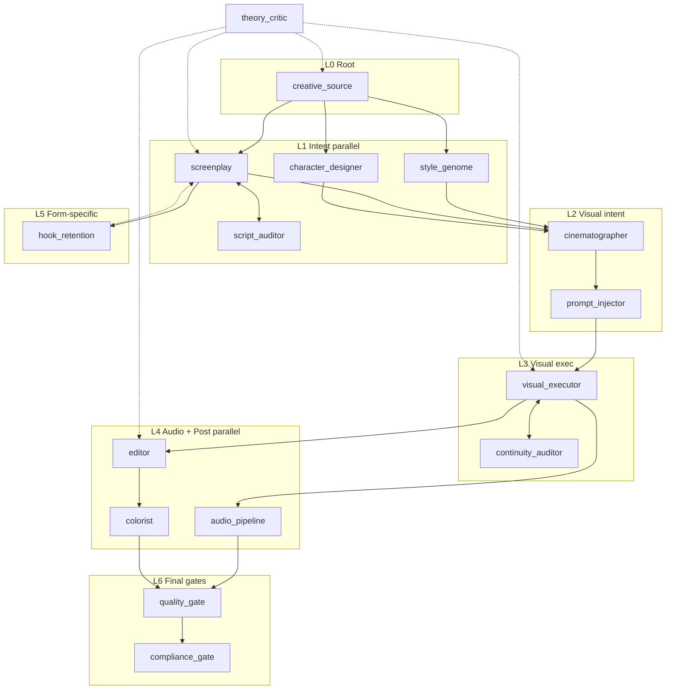

# Plan 08-01: C1-C7 Filter + Final DAG Node Set

<objective>
Apply the C1-C7 selection filter (FEATURES §5) to Phase 7's 16 candidate nodes, producing the final DAG node set (15 linear + 1 consultative). Initialize `nodes.yaml` + `edges.yaml` canonical structures and render `01-NODE-DAG.md` with topology diagram + C1-C7 audit log.
</objective>

<phase_goal>
**Plan 01's slice of Phase 8 goal:** A reader can read `01-NODE-DAG.md` and see the final DAG (which 15 nodes + topology + edges) AND the C1-C7 audit trail showing why each Phase 7 candidate passed or was rejected. The YAML canonical structures (`nodes.yaml`, `edges.yaml`) are initialized as the single source of truth that Plan 02-04 will fill in.
</phase_goal>

<context>
<files_to_read_first>
- .planning/phases/08-node-dag-and-per-node-specs/08-CONTEXT.md (locked decisions: pragmatic C1-C7, 15+1 count, hybrid topology, 2 loops, 2 human gates, 4 edge types)
- .planning/research/v2-pipeline-design/00-FIRST-PRINCIPLES.md §4 (16 candidate nodes with full per-node rigor)
- .planning/research/v2-pipeline-design/00-FIRST-PRINCIPLES.md §3.5 (10 structural properties the DAG must satisfy)
- .planning/research/FEATURES.md §5 (C1-C7 selection criteria definitions)
- .planning/research/PITFALLS.md §2.1 (over-decompression) + §2.5 (critic pairing) + §2.6 (count ≠ rigor)
</files_to_read_first>

<interfaces>
This plan produces the **skeleton** that Plans 02-04 fill in:
- `nodes.yaml` with 15 node ID stubs (Plan 02 fills 15 fields per node)
- `edges.yaml` with edge topology (Plan 03 cross-references for Mermaid)
- `01-NODE-DAG.md` with topology + C1-C7 audit log (Plan 03 appends rendered spec table; Plan 04 appends per-node spec sheets)
</interfaces>
</context>

<tasks>

<task type="auto">
  <name>Task 1: Apply C1-C7 filter to Phase 7's 16 candidates; produce final DAG node set + rejection log</name>
  <read_first>
    - .planning/research/v2-pipeline-design/00-FIRST-PRINCIPLES.md §4 (16 candidate nodes — read all 16 §4.1-§4.16 entries)
    - .planning/research/FEATURES.md §5 (C1-C7 definitions)
    - .planning/phases/08-node-dag-and-per-node-specs/08-CONTEXT.md (decisions: pragmatic, keep merges, exclude theory_critic from count)
    - .planning/research/PITFALLS.md §2.6 (count ≠ rigor warning)
  </read_first>
  <files>.planning/research/v2-pipeline-design/01-NODE-DAG.md</files>
  <action>
Create `.planning/research/v2-pipeline-design/01-NODE-DAG.md` with:

**Document frontmatter:**
```
> **Document status:** design-2026-06-16-prfp · supersedes: none · superseded_by: TBD
> **Phase:** 8 of v2.0 PRFP · **Source:** derives from `00-FIRST-PRINCIPLES.md` §4 candidate set
> **Stability:** stable (per Phase 7 §1.7 — final DAG topology is stable; per-node specs in §02 are evolving)
```

**§1.0 — Reading guide** (~0.5 page): explain this doc contains (a) final DAG topology, (b) C1-C7 audit log, (c) per-node ID map to Phase 7 derivation; per-node full specs in `02-NODE-SPECS.md`.

**§1.1 — Final DAG node set:**

State the **15 linear nodes + 1 consultative vertical** final set:
1. `creative_source` (root)
2. `style_genome`
3. `screenplay`
4. `script_auditor` (critic paired with screenplay)
5. `character_designer`
6. `cinematographer`
7. `prompt_injector` (AI-native)
8. `visual_executor` (drawer+animator merged)
9. `audio_pipeline` (voicer+composer+foley+mixer+lip_sync merged)
10. `continuity_auditor` (cross-shot critic)
11. `editor`
12. `colorist`
13. `hook_retention` (短剧 commercial engine — form-specific)
14. `quality_gate` (final multi-dim scorer)
15. `compliance_gate` (CN platform — pre_check + final merged)

Plus consultative vertical:
- `theory_critic` (creator-pulled per META-06, not in linear sequence)

Total: **15 linear + 1 consultative = 16 pipeline-roles**, with theory_critic excluded from the 8-15 linear node count per CONTEXT.md Area 1/4.

**§1.2 — C1-C7 Audit Log:**

For each Phase 7 candidate (16), apply C1-C7 (FEATURES §5):

| Candidate | C1 (user-value-anchored) | C2 (AIGC measurability) | C3 (compression/expansion justified) | C4 (independent evaluability) | C5 (single ownership) | C6 (decoupled I/O) | C7 (loop placement explicit) | Verdict |
|---|---|---|---|---|---|---|---|---|
| `creative_source` | PASS | PASS | PASS (expansion: root produces intent) | PASS | PASS | PASS | N/A (no loop) | IN |
| `style_genome` | PASS | PASS | PASS | PASS | PASS | PASS | N/A | IN |
| ... (all 16) | ... | ... | ... | ... | ... | ... | ... | IN/OUT |

Document marginal cases (any PASS with caveat) inline; document OUT candidates with reason.

**Per CONTEXT.md Area 1/4:** All 16 candidates expected to pass C1-C7 (Phase 7 derivation already does the heavy lifting; C1-C7 is filter confirmation not deep re-derivation). If any candidate fails, document rejection + decide whether to merge / drop / re-derive (Phase 7 §5.2 over-target justification may need update).

**§1.3 — DAG Topology:**

Write the topology description: hybrid (not strict linear, not hub-spoke):
- **Layer 0 (Root):** `creative_source`
- **Layer 1 (Intent parallel):** `style_genome` + `screenplay` (→ `script_auditor` loop) + `character_designer`
- **Layer 2 (Visual intent):** `cinematographer` + `prompt_injector`
- **Layer 3 (Visual execution):** `visual_executor` (→ `continuity_auditor` loop)
- **Layer 4 (Audio + Post parallel):** `audio_pipeline` + `editor` + `colorist`
- **Layer 5 (Form-specific):** `hook_retention` (短剧 only — gates pacing intent back to screenplay)
- **Layer 6 (Final gates):** `quality_gate` + `compliance_gate`
- **Vertical:** `theory_critic` (consultative — creator-pulled at any layer)

**§1.4 — Edges:**

Document the edges (formal edge list lives in `edges.yaml`, this section is human-readable summary):
- **Linear edges:** connect layers as above
- **Loop edges (2 explicit per CONTEXT.md Area 3/4):**
  - `screenplay ↔ script_auditor` (low-cost text loop; exit: script_auditor score ≥ threshold OR max 3 iterations)
  - `visual_executor ↔ continuity_auditor` (high-cost visual loop; exit: continuity score ≥ threshold OR max 2 iterations + cost ceiling per iteration)
- **Human-gate edges (2 explicit):**
  - `screenplay → human_review` (narrative intent checkpoint, <5 min budget)
  - `editor → human_review` (final cut checkpoint, <5 min budget)
- **Consultative edge:**
  - `theory_critic` from any layer (creator-pulled trigger, not auto-invoked)
- **Cross-cutting invariant edges:**
  - `style_genome → all-downstream-nodes` (style ownership)
  - `character_designer → all-downstream-nodes` (identity ownership)

**§1.5 — Mermaid topology diagram:**

Include a Mermaid diagram in TD orientation with LR subgraphs for parallel branches. Show:
- All 15 linear nodes + 1 consultative
- Edge types visually distinguished (linear = solid, loop = dashed, human-gate = bold, consultative = dotted, cross-cutting = dot-dot-dash)
- Branch convergence points clearly marked

Example skeleton (executor fills actual rendering):

  </action>
  <verify>
    - `test -f .planning/research/v2-pipeline-design/01-NODE-DAG.md` returns true
    - `grep -c 'design-2026-06-16-prfp' .planning/research/v2-pipeline-design/01-NODE-DAG.md` returns ≥1
    - `grep -c '## §1' .planning/research/v2-pipeline-design/01-NODE-DAG.md` returns ≥1
    - `grep -cE 'creative_source|style_genome|screenplay|script_auditor|character_designer|cinematographer|prompt_injector|visual_executor|audio_pipeline|continuity_auditor|editor|colorist|hook_retention|quality_gate|compliance_gate|theory_critic' .planning/research/v2-pipeline-design/01-NODE-DAG.md` returns ≥15
    - `grep -c 'C1-C7\|C1.*C7\|C1.*C2.*C3' .planning/research/v2-pipeline-design/01-NODE-DAG.md` returns ≥1
    - `grep -c 'loop_with_critic\|loop' .planning/research/v2-pipeline-design/01-NODE-DAG.md` returns ≥2 (2 loops documented)
    - `grep -c 'human_gate\|human-review\|human_review' .planning/research/v2-pipeline-design/01-NODE-DAG.md` returns ≥2 (2 human gates)
    - `grep -c 'consultative' .planning/research/v2-pipeline-design/01-NODE-DAG.md` returns ≥1 (theory_critic)
    - `grep -c 'mermaid' .planning/research/v2-pipeline-design/01-NODE-DAG.md` returns ≥1 (Mermaid diagram present)
  </verify>
  <done>
- 01-NODE-DAG.md exists with version frontmatter
- §1.1 final DAG node set (15 linear + 1 consultative) declared
- §1.2 C1-C7 audit log covers all 16 Phase 7 candidates with verdicts
- §1.3 topology described (6 layers + vertical)
- §1.4 edges documented (linear + 2 loops + 2 human-gates + 1 consultative + 2 cross-cutting)
- §1.5 Mermaid topology diagram present
  </done>
</task>

<task type="auto">
  <name>Task 2: Initialize nodes.yaml + edges.yaml canonical structures</name>
  <read_first>
    - .planning/research/v2-pipeline-design/01-NODE-DAG.md (Task 1 output — final node set + edge topology)
    - .planning/phases/08-node-dag-and-per-node-specs/08-CONTEXT.md (Area 2/4: single nodes: mapping, separate edges.yaml, 4 edge types)
    - .planning/research/v2-pipeline-design/00-FIRST-PRINCIPLES.md §4 (Phase 7 per-node fields that nodes.yaml inherits)
  </read_first>
  <files>.planning/research/v2-pipeline-design/nodes.yaml, .planning/research/v2-pipeline-design/edges.yaml</files>
  <action>
Create two YAML files as the canonical single-source-of-truth:

**`nodes.yaml`:**
```yaml
# nodes.yaml — Canonical node definitions for kais-movie-agent v2.0 pipeline
# Source of truth: 00-FIRST-PRINCIPLES.md §4 (Phase 7 derivation) + 01-NODE-DAG.md (Phase 8 topology)
# Rendered as Markdown in 02-NODE-SPECS.md (Plan 08-04)
# Lint script: scripts/validate_design.py (Phase 12 GOV-02)
# Stability: stable (per Phase 7 §1.7)

schema_version: design-2026-06-16-prfp
total_nodes: 16  # 15 linear + 1 consultative
linear_node_count: 15
consultative_node_count: 1

nodes:
  - id: creative_source
    name: Creative Source (创意源)
    layer: 0
    location: linear  # linear | consultative
    role: root
    # Plan 08-02 fills 15 spec fields below:
    # core_task, io_contract, aigc_transformation, traditional_anchor,
    # success_criteria, fail_modes, fallback_strategy, dependencies,
    # complexity_class, ai_capability_assumption, non_ai_alternative,
    # rationale_for_existence, cost_budget, latency_budget, model_horizon,
    # current_instantiation (dated annex)
    v1_expert_id: creative_source
    phase7_derivation_ref: "00-FIRST-PRINCIPLES.md §4.1 (D1.1+D1.2+D1.3+D1.5+D4.1)"

  - id: style_genome
    name: Style Genome (风格基因组)
    layer: 1
    location: linear
    role: intent_parallel
    v1_expert_id: style_genome
    phase7_derivation_ref: "00-FIRST-PRINCIPLES.md §4.2 (D2.3+D2.4)"

  # ... (continue for all 15 linear nodes) ...

  - id: theory_critic
    name: Theory Critic (理论批评)
    layer: vertical
    location: consultative  # NOT in linear sequence
    role: consultative_vertical
    trigger_mode: creator_pulled  # META-06
    v1_expert_id: theory_critic
    phase7_derivation_ref: "00-FIRST-PRINCIPLES.md §4.16 (D4.2+D4.4)"
```

Include all 16 nodes (15 linear + 1 consultative) with: id, name, layer, location, role, v1_expert_id, phase7_derivation_ref. Plan 08-02 will fill the 15 spec fields per node.

**`edges.yaml`:**
```yaml
# edges.yaml — Canonical edge definitions for kais-movie-agent v2.0 pipeline DAG
# Source of truth: 01-NODE-DAG.md §1.4 (Phase 8 topology)
# Edge types: linear | loop_with_critic | human_gate | consultative | cross_cutting_invariant

schema_version: design-2026-06-16-prfp
total_edges: 25  # approximate; actual count after enumeration

edges:
  # Linear edges (main DAG sequence)
  - from: creative_source
    to: style_genome
    type: linear
    description: "Intent propagation: root → style genome"

  - from: creative_source
    to: screenplay
    type: linear
    description: "Intent propagation: root → narrative"

  # ... (continue for all linear edges per §1.3 topology) ...

  # Loop_with_critic edges (2 explicit)
  - from: screenplay
    to: script_auditor
    type: loop_with_critic
    description: "Narrative consistency loop"
    exit_condition: "script_auditor.score ≥ 0.75 across 5 dimensions"
    max_iterations: 3
    cost_ceiling_per_iteration_yuan: 5  # META-05 within ¥1000-10000/episode

  - from: visual_executor
    to: continuity_auditor
    type: loop_with_critic
    description: "Cross-shot consistency loop"
    exit_condition: "continuity_auditor.identity_match ≥ 0.85 AND axis_compliance = 100%"
    max_iterations: 2
    cost_ceiling_per_iteration_yuan: 50

  # Human_gate edges (2 explicit)
  - from: screenplay
    to: human_review_gate
    type: human_gate
    description: "Narrative intent checkpoint (PITFALLS §2.9)"
    review_budget_minutes: 5
    reviewer: "Director or assigned reviewer"

  - from: editor
    to: human_review_gate
    type: human_gate
    description: "Final cut checkpoint"
    review_budget_minutes: 5
    reviewer: "Director or assigned reviewer"

  # Consultative edge (theory_critic, creator-pulled)
  - from: any_layer_node
    to: theory_critic
    type: consultative
    description: "Theory critique consultation (META-06: creator-pulled)"
    trigger: "Creator manual invoke; not auto-triggered"
    scope: "Any layer; creator decides when artistic-vs-commercial tension needs consultation"

  # Cross_cutting_invariant edges (style + identity ownership)
  - from: style_genome
    to: all_downstream_nodes  # syntactic placeholder; Plan 08-03 enumerates
    type: cross_cutting_invariant
    description: "Style ownership: style_genome output consumed by all visual/audio nodes"
    invariant: "5D style genome vector"

  - from: character_designer
    to: all_downstream_visual_nodes  # placeholder
    type: cross_cutting_invariant
    description: "Character identity ownership"
    invariant: "Character asset (face, body, wardrobe, voice profile)"
```

Enumerate ALL edges (not placeholders) — the actual count will be ~25-30 (15 linear sequence edges + parallel branch edges + 2 loops + 2 human-gates + cross-cutting expanded to per-target).
  </action>
  <verify>
    - `test -f .planning/research/v2-pipeline-design/nodes.yaml` returns true
    - `test -f .planning/research/v2-pipeline-design/edges.yaml` returns true
    - `grep -c 'schema_version: design-2026-06-16-prfp' .planning/research/v2-pipeline-design/nodes.yaml` returns 1
    - `grep -c 'schema_version: design-2026-06-16-prfp' .planning/research/v2-pipeline-design/edges.yaml` returns 1
    - `grep -c 'id: ' .planning/research/v2-pipeline-design/nodes.yaml` returns 16 (15 linear + 1 consultative)
    - `grep -c 'location: linear' .planning/research/v2-pipeline-design/nodes.yaml` returns 15
    - `grep -c 'location: consultative' .planning/research/v2-pipeline-design/nodes.yaml` returns 1
    - `grep -c 'v1_expert_id: ' .planning/research/v2-pipeline-design/nodes.yaml` returns 16
    - `grep -c 'phase7_derivation_ref: ' .planning/research/v2-pipeline-design/nodes.yaml` returns 16
    - `grep -c 'type: linear' .planning/research/v2-pipeline-design/edges.yaml` returns ≥10
    - `grep -c 'type: loop_with_critic' .planning/research/v2-pipeline-design/edges.yaml` returns 2
    - `grep -c 'type: human_gate' .planning/research/v2-pipeline-design/edges.yaml` returns 2
    - `grep -c 'type: consultative' .planning/research/v2-pipeline-design/edges.yaml` returns ≥1
    - `grep -c 'type: cross_cutting_invariant' .planning/research/v2-pipeline-design/edges.yaml` returns ≥2
    - YAML is valid: `python3 -c "import yaml; yaml.safe_load(open('.planning/research/v2-pipeline-design/nodes.yaml'))"` succeeds
    - YAML is valid: `python3 -c "import yaml; yaml.safe_load(open('.planning/research/v2-pipeline-design/edges.yaml'))"` succeeds
  </verify>
  <done>
- nodes.yaml exists with 16 node entries (15 linear + 1 consultative)
- Each node has: id, name, layer, location, role, v1_expert_id, phase7_derivation_ref
- edges.yaml exists with ~25-30 edges across 4 types
- Both YAML files parse as valid YAML
- 2 loops + 2 human-gates + 1 consultative + cross-cutting invariants present
  </done>
</task>

</tasks>

<verification>
**Plan 08-01 completion criteria:**
- [ ] 01-NODE-DAG.md exists with §1.0-§1.5 (reading guide, final set, C1-C7 audit, topology, edges, Mermaid)
- [ ] nodes.yaml has 16 entries with structural fields (Plan 02 fills spec fields)
- [ ] edges.yaml has ~25-30 edges across 4 types
- [ ] Both YAML files valid
- [ ] C1-C7 audit log covers all 16 Phase 7 candidates
- [ ] Mermaid diagram present in 01-NODE-DAG.md
</verification>

<success_criteria>
A reader can read 01-NODE-DAG.md and identify (a) which 15+1 nodes are in the final DAG, (b) the topology (6 layers + vertical), (c) which edges are linear vs loop vs human-gate vs consultative vs cross-cutting, (d) why each Phase 7 candidate passed or failed C1-C7.

Plans 02-04 inherit nodes.yaml + edges.yaml as the canonical structure.
</success_criteria>
