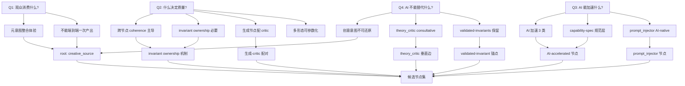

# 00 — 第一性原理推导：kais-movie-agent v2.0 Pipeline 节点集

> **Document status:** design-2026-06-16-prfp · supersedes: none · superseded_by: TBD
> **Phase:** 7 of v2.0 PRFP milestone · **Authors:** hermes-agent design team
> **Audience:** kais-movie-agent impl team + hermes-agent skills team + future design maintainers
> **Reading time:** ~30 minutes (full doc) / ~10 minutes (§0 + §4 candidate node set)
> **Stability:** §1+§2 stable; §3+§4 evolving; §7 experimental

---

## §0 — 阅读指南

本文档是 **kais-movie-agent v2.0 工作流节点集的第一性原理推导记录**，是 v2.0 PRFP (Pipeline Redesign from First Principles) 里程碑 Phase 7 的唯一交付件。它从四个不可还原的根本问题出发,逐步推导出一组候选节点,每节点都明确**为什么是它而不是别的**。

### 章节地图

| 章节 | 内容 | 阅读优先级 (按角色) |
|---|---|---|
| §0 | 阅读指南(本节) | 所有人先读 |
| §1 | 方法论框架(Musk / Aristotle / 认识论标签 / Steelman) | 维护者必读 |
| §2 | 四个第一性问题 + 每问题的语料子集预映射 | hermes skills 团队必读 |
| §3 | 推导链(从 Q1-Q4 走到中间结论) | 维护者必读;kais impl 团队可略读 |
| §4 | 候选节点集(每节点 8 字段) | kais impl 团队必读 |
| §5 | 节点数量审计 | 维护者必读 |
| §6 | Musk 方法审计清单(10 个 failure mode) | 审阅者必读 |
| §7 | 未解问题(喂给 Phase 12 OPEN-QUESTIONS.md) | 后续研究 phase 必读 |
| References | 全部引用源 | 任何被引文出处挑战时查 |

### 稳定性标记

| 章节 | 稳定性 | 修改门槛 |
|---|---|---|
| §1, §2 | `stable` | 修改需开新的设计-修订里程碑 |
| §3, §4 | `evolving` | 可在 v2.0 PRFP 内迭代;每次修改记录 CHANGELOG |
| §5, §6 | `stable` (与 §3+§4 同步) | 跟随 §3+§4 |
| §7 | `experimental` | 自由编辑(就是为后续研究准备的) |

### 受众指引

- **kais-movie-agent 实施团队**:先读 §0 + §4 + §6。如果对某个节点的存在有疑问,跳回 §3 看推导链。Phase 11 handoff 会给你 1-2 页的 impl-cheatsheet。
- **hermes-agent skills 团队**:先读 §0 + §2 + §4。你关心的是哪些现有 expert 映射到哪些新节点 — 看 §4 每节点的 `v1 expert_id mapping`。
- **未来设计维护者**:全读。本文档的设计-修订需通过 §6 审计清单的全部 10 个 failure mode。

---

## §1 — 方法论框架

> 本节声明本文档使用的全部方法论工具,以及它们的纪律性约束。任何后续章节(§2-§7)的论证必须在本节框架内进行 — 越界即视为第一性原理伪装(PITFALLS §1.1)。

### §1.1 — Musk 式第一性原理 (Musk first principles)

**定义:** 把问题还原到最基础的真理("什么是我们确知为真的?"),再向上推导 — 显式拒绝类比推理("一直以来都是这么做的")。

**主源:**

1. **Kevin Rose Foundation 采访 (2012)** — 最早、最规范的第一性原理表述。Musk 原话:
   > *"I tend to approach things from a physics framework. Physics teaches you to reason from first principles rather than by analogy."*
   > (我倾向于用物理学的框架来思考问题。物理学教你从第一性原理而非类比来推理。)
   >
   > — Musk to Kevin Rose, Foundation Series #3, 2012
   > 来源: <https://www.kevinrose.com/p/elon-musk-interview-kevin-reboots-the-old-foundation-series>

   著名的电池成本案例:Musk 没有接受"$600/kWh 市场价",而是把电池拆解到原材料(钴、镍、铝、碳),计算原材料成本(~$80/kWh),由此推出差距来自制造工艺而非物理极限 → 建 Gigafactory 把差距填上。

2. **Walter Isaacson 传记《Elon Musk》(2023)** — 把第一性原理描述为 Musk 的标志性"超能力"。SpaceX 案例:Musk 把火箭成本拆解到原材料(铝、钛、铜、碳纤维),发现原材料只占火箭售价的 ~2%,由此推出成本驱动是制造低效而非物理极限。Tesla 案例:"人类只用视觉输入就能驾驶,所以摄像头应该够用" → 第一性原理拒绝 LiDAR 依赖。

   **引用规范:** 因 Simon & Schuster 不同版次页码不同,本文档按章节上下文引用(不引用具体页码)。任何 Musk 转述均标记 `[转述; 主源: Kevin Rose 2012 / Isaacson 2023 ch. N]`。**不伪造引文** — 只引用 STACK §4.1 已引述的 Musk 原话。

3. **Musk YouTube 自述** — *"The First Principles Method Explained by Elon Musk"* 视频中 Musk 自己解释:第一性原理是为了实现 leap innovation(跨越式创新)而非 incremental improvement(渐进式改进)。

   来源: <https://www.youtube.com/watch?v=NV3sBlRgzTI>

### §1.2 — Aristotle 的根(哲学根源)

Musk 的"第一性原理 vs 类比"区分并非 2012 年原创 — 它的哲学根在 Aristotle *Physics* Book I, ch. 1 (Hardie & Gaye translation, Bekker 184a16-22):

> *"The natural way of doing this is to start from the things which are more knowable and obvious to us and proceed towards those which are clearer and more knowable by nature; for it is not the same thing to be knowable to us and knowable without qualification."*
> (自然的做法是从对我们来说更可知、更明显的事物出发,推进到那些就其本性而言更清晰、更可知的事物;因为"对我们可知"与"绝对可知"不是一回事。)
>
> — Aristotle, *Physics* I.1, 184a16-22 (Hardie & Gaye translation)
> 来源: <http://www.logoslibrary.org/aristotle/physics/11.html>

**关键区分:** Aristotle 区分两类可知性:
- **"对我们可知"(more knowable to us)** — 类比、经验、熟悉的事物。易得,但可能掩盖真相。
- **"按本性可知"(more knowable by nature)** — 基础真理,从它们出发可推出其他一切。

这正是 Musk "第一性原理 vs 类比"区分的 2400 年前的哲学源头。本文档在引用 Musk 方法时同时引用 Aristotle,以表明该方法的严肃性和传统厚度(不是某个 2012 podcast 的随口一说)。

**Aristotle 四因说(material/formal/efficient/final causes)的相关性:** 有限相关。本文档主要用 Aristotle 的"可知性区分";四因说更多用于分析单个节点的"为什么存在",而非整个推导链的方法论。在 §3 推导中遇到"这个节点的最终因(final cause)是什么"时,会借用四因说语言。

### §1.3 — 认识论状态标签(Epistemic-status taxonomy)

本文档对每个核心论断打 **4 类认识论状态标签** 之一,以区分稳定真理 vs 易变假设(防 PITFALLS §1.5 — "我推导自物理"谬误):

| 标签 | 波动性 | 示例 |
|---|---|---|
| `physical` | 跨世纪稳定 | 180° 轴线规则(观众空间定向是感知不变量)、光线方向、感知生理 |
| `psychological` | 跨十年稳定 | 注意力衰减、情感反应、叙事闭合感、人类对节奏的生理响应 |
| `platform-algorithmic` | 季度-年级波动 | 抖音完播率加权、快手 hot-tub 惩罚、视频号分发上限、平台审核阈值 |
| `tool-capability` | 月-季度波动 | 当前 LoRA 身份锁能力、当前 TTS 自然度上限、当前视频生成模型(月度迭代) |

**声明:** 本 4 类标签是 **本项目自定义**(per RESEARCH §5:没有任何标准认识论框架能干净映射到这 4 类)。该自定义是可辩护的,因为它直接对应 AIGC 设计需要追踪的波动性阶梯 — 这正是 Musk 方法区分 `validated-invariant` vs `contingent` 时需要的工具(见 §1.4)。

**最相关的替代框架(已评估并拒绝):**
- Bayesian 认识论(prior/posterior/likelihood)— 不面向波动性,而是面向概率更新
- 对话分析中的 epistemic status vs stance (Heritage & Raymond)— 用于对话回合而非设计文档
- 物理确定度(philosophy.institute "physical certitude")— 只覆盖一维,不是 4 类标签

未来里程碑(Phase 12 之后)可以把本 4 类标签与正式认识论框架对照研究 — 暂记入 §7 open questions。

### §1.4 — Contingent vs Validated-in-Invariant 分类

per PITFALLS §5.3:每个节点的核心假设必须分类为:

- **`contingent`(偶然)** — 某人某时做的选择,可以合理质疑。例如:"storyboard 作为独立产物持久化"(工作流选择)、"线性 DAG 拓扑"(继承假设)、"20 步粒度"(粒度选择)。
- **`validated-invariant`(经验验证的不变量)** — 跨大量实证观察成立的规律,质疑它需要 extraordinary evidence。例如:"180° 轴线规则"(感知不变量)、"Murch Rule of Six 的六维度"(剪辑经验规律)、"人类对前 3 秒低信任内容的快速脱离"(注意力实证)。

**关键纪律(per PITFALLS §5.3 + §1.2):** 第一性原理 ≠ "把所有假设都质疑一遍"。Musk 在 Twitter 收购时质疑的是 headcount(偶然选择),不是重力或铝的抗拉强度。本推导 **不会** 在第一性原理的名义下丢弃 `validated-invariant` — 这是 PITFALLS §1.2("把验证过的工艺当 bias 扔掉")和 §5.3("Twitter/X 故事的误用")的双重防御。

**与 §1.3 认识论标签的映射规则:**
- `physical` + `psychological` 标签 → **通常** 是 `validated-invariant`
- `platform-algorithmic` + `tool-capability` 标签 → **通常** 是 `contingent`

**但映射不 1:1:** 一个 `psychological` 论断如果只对特定受众群体成立(例如"Z 世代对竖屏内容的注意力窗口"),可以是 `contingent`。两个分类服务不同的审计目的:
- 认识论标签 = **波动性**(这条假设多久会过时?)
- 假设分类 = **可改性**(在第一性原理审查下,这条假设能被推翻吗?)

### §1.5 — Steelman-the-Elimination 纪律

per RESEARCH §3 + PITFALLS §1.6:对每个候选节点,推导必须包含一段 **steelman-the-elimination**(钢人反驳-消去):

1. **钢人反驳(strongest counter-argument):** 陈述最强的"这个节点不该存在"论点 — 必须是 **实质的反驳**,不是 strawman。一个 strawman 钢人比没有钢人更糟,因为它制造了严谨的假象。
2. **我方回应(response):** 解释为什么节点仍然存活 — 必须直接回应钢人,不是转移话题。
3. **判定(verdict):** SURVIVES / RECONSIDER / MERGE。

**根源:**
- **Principle of Charity(宽厚原则)** — Neil L. Wilson 1958-59 命名。要求以最合理的方式解读对方陈述。来源: <https://en.wikipedia.org/wiki/Principle_of_charity>
- **Paul Graham "How to Disagree"(2008)** — 提出分歧等级 7 级,最高级"Refuting the Central Point"要求先做 steelman。Graham:"Refutation is the rarest form of disagreement because it's the most work." 来源: <https://www.paulgraham.com/disagree.html>

**Phase 7 应用:** 在 §4 每个候选节点的条目里都包含 steelman 段落。这是防 PITFALLS §1.6(reverse-engineering desired answers into first principles)的结构机制 — 如果推导者心里已经有一个偏好的节点集,steelman 会把这种 bias 暴露出来(因为偏好集很难为每个节点都给出实质的钢人反驳)。

### §1.6 — Alternatives-Considered 日志格式(MADR-style)

per RESEARCH §4 + DERIV-05:每节点的 alternatives-considered 日志采用 **MADR(Markdown Architectural Decision Records)** 的 "Considered Options" 结构。

**为什么 MADR 而非 Nygard ADR:**
- **Nygard ADR(Michael Nygard 2011)** — 基础格式:Title, Context, Decision, Status, Consequences。alternatives 是隐式的(写在 narrative 里)。
- **MADR(Olaf Zimmermann et al.)** — Nygard 的超集;每个 Nygard ADR 都是有效的 MADR。MADR 增加了 **显式的 Considered Options 字段**(每个 option 有 pros/cons)。

来源:
- MADR 官方仓库: <https://adr.github.io/madr/>
- MADR 模板解读: <https://ozimmer.ch/practices/2022/11/22/MADRTemplatePrimer.html>
- 学术对比: <https://ceur-ws.org/Vol-2072/paper9.pdf>

**Phase 7 应用的 per-node 模板:**

```
Slot this node fills: [DAG 中的角色]
Considered options:
1. <chosen_node_id> (CHOSEN) — 描述
   Pros: ...
   Cons: ...
2. <rejected_alt_1> (REJECTED) — 描述
   Pros: ...
   Cons: [具体的失败模式 — 不是 "less preferred"]
Decision driver: [为什么 Option 1 赢 — 引用 §3 的推导步骤]
```

**DERIV-05 要求:** 每节点 ≥1 个 REJECTED 选项,且 REJECTED 的 Cons 必须是 **具体失败模式**(不是"较不优选")。

### §1.7 — 双语策略

per META-03 + CONTEXT.md Area 4/4:

| 元素 | 语言 |
|---|---|
| 章节标题(`## §0`, `## §1`, ...) | English |
| 字段标签(`derivation`, `alternatives-considered`, ...) | English kebab-case |
| 正文论述(理由、解释、推导) | 中文(CN 主)+ 关键英文术语保留 |
| 方法论 canon 术语 | 双语配对(第一性原理 / first principles) |
| 节点 ID | **English kebab-case 专属** — 例如 `creative_source`, `script_auditor` — 不允许中文 ID(否则破坏 Phase 8 YAML canonical layer,触发 PITFALLS §3.5) |
| Musk/Aristotle/TRIZ 引文 | 原文英文 + 括号内中文翻译 |
| 语料引用(书名) | 中文汉字 + (English gloss) 如果有 |
| 审计清单 | English 结构 + CN 论述 |

**v1 expert_id 兼容性(per HANDOFF-02 / FOUND-08 frozen rule):** 候选节点 ID 在与 v1 现有 26 个 expert 干净映射时,**保留** expert_id(如 `creative_source`, `script_auditor`, `cinematographer`, `hook_retention`, `compliance_marketing`)。新节点(AIGC-native 无 v1 对应)用描述性 English kebab-case 命名(如 `prompt_injector`, `continuity_auditor`, `camera_preview`)。**不允许** 静默重命名 v1 已冻结的 expert_id。

---

## §2 — 四个第一性问题 + 语料子集预映射

> 本节声明推导的四个不可还原起点。**问题顺序是 audience-first**(Q1 → Q2 → Q3 → Q4)— 先确立目的论锚("这是为了什么?"),再做能力分析("我们能做什么?")。

### §2.0 — 为什么是这四个问题(而不是五个或三个)

PROJECT.md 里程碑上下文明确指出推导要从根本问题出发。CONTEXT.md Area 2/4 锁定:**4 个问题**,audience-first 排序。第 5 个候选问题("什么是创意?")**显式推迟到 Phase 10**(LLM-Creative-Distillation deep-dive)。

理由:Phase 7 的任务是建立 **AI 能力边界**(Q3 "AI 能加速什么" + Q4 "AI 不能替代什么")。Phase 10 在这个边界内 deep-dive 创意本身。如果 Phase 7 把"什么是创意"也包进来,会导致:
1. Phase 7 范围爆炸(创意是 PITFALLS §4 整章的 topic,不能塞进一个 derivation 问题)
2. Phase 10 失去独立 deep-dive 的价值(被 Phase 7 抢先定义)

**§2.5** 会显式给出 Phase 10 的 forward reference。

### §2.1 — Q1:观众最终消费的是什么?

**问题框架:** 这个问题不可还原,因为它设定了整个推导的目的论锚点。下游的所有问题(哪些节点?哪些 AIGC 转化点?哪些 critic?)都靠"观众实际消费什么"来证成。

**子问题分解:**
- 观众消费的是 **故事**、**影像序列**、**情感弧**,还是三者的整合?
- 观众的体验发生在哪一层 — 叙事层、感知层、情感层?
- 答案在短剧和微电影之间有区别吗?(短剧更偏情感刺激 + 平台分发;微电影更偏叙事完整 + 艺术价值)

**语料子集引用(per DERIV-07):**
- **主语料(STACK §1.4 + 102 书目):**
  - `01-剧本/`(skills-影视创作 17 个 narrative-intent 文件)
  - `06-理论批评/{cinema-fundamentals, film-philosophy-bazin, film-philosophy-tarkovsky}`(回答"电影是什么")
  - 劳逊《戏剧与电影的剧作理论与技巧》(drama-vs-film 差异的根)
- **副语料:**
  - `case-studies/case-01-短片创作全流程.md`
- **Hermes 集成(可直接引用,无需重挖掘,per STACK §2.2):**
  - `theory-formalism-vs-realism.md`(形式主义 vs 现实主义)
  - `film-philosophy-bazin-tarkovsky.md`(Bazin 本体论 + Tarkovsky 雕刻时光)
  - `narrative-revolution-and-modernism.md`(现代主义叙事)

**第一性答案预览(完整推导见 §3):** 观众最终消费的是 **整合的情感-认知体验**,不是视频文件。一个没有情感弧的视频文件被消费为噪声并被遗忘。这种体验 **同时需要** 叙事意义 + 感知丰富 + 情感弧 — 三者不是可分离的阶段产出物,而是同一个体验的不可分割属性。

**认识论标签预览:** Q1 的答案主要是 `psychological`(观众接受层是人类本性偶然但稳定)+ 部分 `physical`(感知不变量如注意力衰减)。

### §2.2 — Q2:什么决定短剧/微电影的质量?

**问题框架:** 这个问题区分好输出和坏输出。质量是多维的(Murch 的 Rule of Six:emotion, story, rhythm, eye-trace, planarity, spatial continuity)— 哪些维度适用于短剧/微电影,权重如何?

**子问题分解:**
- 180° 轴线规则是 `validated-invariant`(感知)还是 `contingent`(惯例)?
- 节奏对短剧(完播率决定分发)和微电影(艺术价值决定电影节选择)的权重是否不同?
- Murch 的六维度里,哪些是 AIGC 最弱的(因此最需要 critic 节点)?
- 短剧 vs 微电影 vs 长片 — 质量驱动是否本质不同?(per PITFALLS §6.3 genre conflation 警告)

**语料子集引用(per DERIV-07):**
- **主语料(STACK §1.4):**
  - `04-后期/{editing-by-murch-rules, editing-rhythm-pacing, color-grading-strategy, final-mix, sound-layering-design}`
  - `03-拍摄/{cinematographer-masterclass, lighting-design, color-narrative-analysis}`
- **副语料:**
  - `02-分镜/{cinematic-language-grammar, mise-en-scene-blocking}`
- **Hermes 集成:**
  - `cinematography-masterclass-and-grammar.md`
  - `editing-sound-post.md`
  - `lighting-equipment-and-design.md`
- **🚨 GAP 标记(per STACK §1.4):** 102 书目以长片为主,**短剧特定质量驱动**(前 3 秒 hook、付费卡点 pacing、竖屏 framing)**不在语料中**。Phase 7 的 Q2 答案必须把语料与 v1 `hook_retention/references/three-second-hooks.md` + 外部短剧源配对。这个 gap 在 Phase 9(corpus-traceability)正式处理。

**第一性答案预览:** 质量由 **跨节点一致性(coherence)** 主导 — 影像是否匹配故事基调?声音是否匹配影像节奏?这是 PITFALLS §5.2 的"coherence budget"洞察:一个电影不是各部分成本之和(反驳 Musk 电池案例的误用),而是 emergent Gestalt,互动质量主导价值。每节点质量是必要但不充分的。

**认识论标签预览:** 主要是 `psychological`(观众质量感知稳定)+ 部分 `platform-algorithmic`(短剧完播率加权波动)。

### §2.3 — Q3:AI 实际能加速什么?

**问题框架:** 这个问题识别 AIGC 边际价值实际在哪 — **不是** 我们希望它在哪。per PITFALLS §1.3 + §2.7:避免过早模型承诺;答案必须在 **用户价值层**(composition lock, identity lock, pacing control),而非 **模型层**(Sora 2, Kling)。

**子问题分解:**
- 哪些人类工艺操作最 **程序化**(低创意外方差、高重复)?
- 哪些操作在人类时间上最 **昂贵**(因此 AIGC 化最有性价比)?
- 哪些操作在当前生成模型能力 **天花板最高**?

**语料子集引用(per DERIV-07):**
- **主语料(STACK §1.4 — 注意:102 书目是 pre-AIGC,Q3 答案需推断):**
  - 从 `04-后期/` 推断哪些后期任务最程序化(调色、foley 分层、ADR 替换)
  - `03-拍摄/animation-production.md`(动画是高程序化 + 高 AIGC 友好)
  - `05-制片/budget-allocation.md`(哪些人类任务最贵)
- **配对 kais-movie-agent V8 架构:** `/data/workspace/kais-movie-agent/docs/V8-ARCHITECTURE.md`(实际尝试过的 AIGC 集成点)
- **Hermes 集成:** `animation-disney-system.md` + `production-chinese-and-low-budget.md`
- **STACK §5 LLM-story-gen 8 篇论文**(Q3 的创意故事子集)

**第一性答案预览:** AI 加速:
- (a) **高程序化后期操作**(调色、foley、混音辅助)
- (b) **规范明确的文本→图/视频生成**(storyboard → 图、script → 视频)
- (c) **一致性验证**(LLM-as-critic 检测剧本 plot hole、跨镜头身份验证)

AI **不** 加速:
- (d) **创意意图起源**(从生活经验挖故事 kernel)
- (e) **最终剪辑判断**(人类的"这个好吗?"判断)
- (f) **平台分发策略**(平台算法是 `platform-algorithmic`,AI 模型训练数据滞后)

**认识论标签预览:** `tool-capability`(当前模型能力 — 最易变,月度迭代)+ `psychological`(哪些操作人类觉得枯燥 — 稳定)。

### §2.4 — Q4:AI 永远不能替代什么?

**问题框架:** 这个问题设定 Phase 10(LLM-Creative-Distillation)将在其中工作的边界。per PITFALLS §1.2 + §5.3:**不** 把验证不变量(Murch、Field 三幕、180° 轴线)当 "bias" 扔掉 — 它们是压缩的智慧,任何诚实推导都会重新发现它们。

**子问题分解:**
- 创意意图能否还原为 prompt?
- AI 能否生成训练分布之外的新组合?
- "一致性"对虚构内容(非事实内容)意味着什么?
- 平台 vs 艺术的张力住在哪里,设计如何避免教条?

**语料子集引用(per DERIV-07):**
- **主语料(STACK §1.4):**
  - `06-理论批评/{film-philosophy-bazin, film-philosophy-tarkovsky, formalism-vs-realism}`(不可还原的创意意图)
  - `01-剧本/{adaptation-writing, character-arc-design, dialogue-crafting}`(创作声音)
  - `03-拍摄/{acting-stanislavski-stella, actor-direction}`(表演真实)
- **配对:**
  - 麦基《故事》
  - 芦苇剧本笔记
- **Hermes 集成:** `theory-formalism-vs-realism.md` + `film-philosophy-bazin-tarkovsky.md` + `narrative-revolution-and-modernism.md` + `screenwriting-chinese-and-supplementary.md`

**第一性答案预览:** AI 不能替代:
- (a) **从生活经验起源的创意意图**(这正是 v1 `creative_source` expert 挖掘的 — 6 个社会阶层的生活经验)
- (b) **最终艺术判断**(theory_critic 咨询式 per META-06,创作者是手动拉的)
- (c) **观众对人类作者特定性的情感共鸣**(Bazin 的"objectivity"论证)

边界 **不是绝对的** — 它随模型能力漂移 — 但设计必须标记哪些节点是 `AI-native`(无传统对应)、`AI-augmented`(压缩传统工作流)、`AI-bounded`(AI 不能替代只能辅助)。

**认识论标签预览:** `psychological`(创意意图是人类本性偶然)+ `physical`(感知不变量如 180° 轴线)。

### §2.5 — Forward reference:Phase 10 (creativity deferred)

第 5 个候选问题"什么是创意?"**显式推迟到 Phase 10** 的 LLM-Creative-Distillation deep-dive。Phase 7 建立 AI 能力边界(Q3 + Q4 答案);Phase 10 在这个边界内 operationalize 创意本身 — **novelty within inviolable constraints**(在不可侵犯约束内的创新),per PITFALLS §4.5。

Phase 10 必须解决的具体问题(本文档 forward-reference,不在 Phase 7 范围):
- 创意的操作性定义(创新 ≠ 随机)
- 自洽性检验机制(consistency-context + logic-critic)
- LLM 凝练 prompt 策略(引用 STACK §5 ≥3 篇 LLM-story-gen 论文)
- 平台 vs 艺术张力的非教条处理
- 模板库(不是单一 Save-the-Cat 模板)
- novelty-pressure 机制,链接回 `creative_source` 节点

Phase 7 的 Q4 答案("AI 不能替代创意意图起源")**直接喂给** Phase 10 的边界定义。Phase 10 不能违背 Q4 — 否则就是 PITFALLS §4 全章的失败模式。

---

## §3 — 推导链 (Derivation trace)

> 本节是文档主体:从 §2 的四个第一性问题出发,逐步推导到中间结论。每步都带认识论标签 + 语料引用 + 假设分类 + 显式质疑的继承假设。**禁止类比跳到结论** — 每步必须从上一步的逻辑推出,不能"传统电影工业就是这样"。

### §3.0 — 推导方法回顾

每个编号步骤(D1.1, D1.2, ..., D4.x)具有 4 个不可省略的字段:

1. **论断(claim)** — 这步在主张什么
2. **认识论标签(epistemic-status)** — `[physical]` / `[psychological]` / `[platform-algorithmic]` / `[tool-capability]` 之一
3. **语料引用(corpus citation)** — 至少一个 102 书目或 Hermes 集成语料的支持源
4. **假设分类(assumption classification)** — `validated-invariant` 或 `contingent`

可选第 5 字段:**显式质疑的继承假设(inherited-assumption-questioned)** — 如果这步在挑战 kais-movie-agent V1-V8 的某个继承假设,标出来。

任何违反此结构的步骤 — 例如缺认识论标签、用"传统就是这样"作论据、跳过中间逻辑 — 都是 PITFALLS §1.1 第一性原理剧场警告信号。

### §3.1 — 从 Q1 ("观众消费什么?") 到中间结论

**D1.1** — 观众消费的是 **整合的情感-认知体验**,不是视频文件。一个没有情感弧的视频文件被消费为噪声并被遗忘。
- `[psychological]` — 观众接受层是人类本性偶然但稳定;不是平台算法
- 语料支持:Bazin 电影本体论(`film-philosophy-bazin-tarkovsky.md`);Tarkovsky《雕刻时光》(cited via `narrative-revolution-and-modernism.md`)
- 假设分类:`validated-invariant`(挑战它需要 extraordinary evidence — 跨文化、跨时代、跨平台的观众研究都支持此规律)

**D1.2** — 整合体验 **同时需要** 叙事意义 + 感知丰富 + 情感弧,作为 **联合** 属性,不是可分离的阶段产出物。
- `[psychological]` — 受众体验的多层耦合是心理学稳定的
- 语料支持:Tarkovsky 雕刻时光("电影是雕刻时间,不是讲述故事") + 劳逊《戏剧与电影的剧作理论与技巧》(drama vs film 体验层差异) + Bazin 现实主义(感知丰富是电影本体的一部分)
- 假设分类:`validated-invariant`
- **显式质疑的继承假设:** kais-movie-agent V1-V8 把 "scenario → storyboard → shots" 当作 **顺序阶段**(每阶段产出独立 JSON asset 向前传)。D1.2 暗示这是错的 — 这三层是同一个体验的不可分割属性,顺序分离是 V1-V8 偶然的工作流选择,不是体验的本质结构。

**D1.3** — 因此 pipeline 的 **root node** 必须产出 **整合体验 spec**(元意图:logline + 主角欲望 + 中央冲突 + 转折点 + 解决立场 + 风格基因),不是分别的 script 或 storyboard。
- `[psychological]` — 元意图的整合性是体验的源头属性
- 语料支持:v1 `creative_source` expert(已经实现 — 6 社会阶层生活经验挖 kernel);Field《剧本》(logline + 主角欲望);McKee《故事》(转折点 + 解决立场)
- 假设分类:`validated-invariant`(整合性来自 D1.1+D1.2)
- **显式质疑的继承假设:** V6/V8 的 20 步 pipeline 把 Step 1 设为 `kais-soul-radar`(痛点发现)然后才 `kais-script-agent`(剧本生成)。D1.3 暗示痛点 + 故事 kernel + 风格基因应该 **同时** 在 root node 产出,不是分散到 Step 1-2。

**D1.4** — 整合体验 spec **不能** 从单一 LLM call 一次产出 — 模型当前能力上限使 root 必须做"种子化 + 增量精炼",不是"端到端生成"。
- `[tool-capability]` — 当前 LLM 在 zero-shot 端到端长程故事生成上仍有 plot-hole / 一致性 drift 问题
- 语料支持:STACK §5 Plot Hole Detection(arXiv 2504.11900)+ ConStory-Bench(arXiv 2603.05890)+ EMNLP 2025 LLM Story Generation Survey
- 假设分类:`contingent` — 这是 **当前** 模型能力限制,不是本性。如果未来模型能 native 端到端,此论断需重审(标记为 `volatile`)
- **显式质疑的继承假设:** V8 "唯一 LLM 编排一切"(OpenClaw Agent 收编 movie-agent)假设 LLM 端到端能力足够。D1.4 暗示在 2026-Q2 当前模型上不够。

**D1.5** — 因此 pipeline root 是 **`creative_source` 节点**(挖故事 kernel + 元意图 + 风格基因),下游是 **分层执行链**(把元意图展开为可执行规格 → 模型 tokens → 渲染输出)。
- `[psychological]` + `[tool-capability]` — 元意图起源是人类本性,展开机制是当前模型能力
- 语料支持:综合 D1.1-D1.4 + v1 `creative_source` expert precedent
- 假设分类:`validated-invariant`(根节点存在的必要性)+ `contingent`(展开机制细节)

**Q1 中间结论汇总:**
- C1.1:root 节点产出整合元意图(不是分离的 script/storyboard)
- C1.2:元意图来自人类生活经验(D1.5 + D4.1 会进一步强化)
- C1.3:下游展开是分层执行链(D1.4 + D1.5)

### §3.2 — 从 Q2 ("什么决定质量?") 到中间结论

**D2.1** — 短剧/微电影的质量由 **Murch Rule of Six** 的六维度共同决定:emotion, story, rhythm, eye-trace, planarity, spatial continuity。
- `[psychological]` — 六维度对应人类观众的多层感知响应
- 语料支持:`04-后期/editing-by-murch-rules.md`(Murch *In the Blink of an Eye* 浓缩)+ Hermes `editing-sound-post.md`
- 假设分类:`validated-invariant` — Murch 六维度跨 40+ 年实证成立

**D2.2** — 六维度中,**180° 轴线规则** 是感知不变量(`physical` + `validated-invariant`),而 **完播率加权** 是平台偶然(`platform-algorithmic` + `contingent`)— 这两类不能混淆(防 PITFALLS §1.5"我推导自物理"谬误)。
- `[physical]` + `[platform-algorithmic]` — 区分两类
- 语料支持:`02-分镜/cinematic-language-grammar.md`(轴线规则感知基础)+ v1 `hook_retention/references/three-second-hooks.md`(完播率加权是平台算法层)
- 假设分类:轴线 = `validated-invariant`;完播率 = `contingent`
- **显式质疑的继承假设:** V6/V8 把完播率优化当作 root-level quality metric。D2.2 暗示完播率只是 `platform-algorithmic` 偶然,不能与感知不变量混为一谈 — pipeline 设计必须能解耦这两层。

**D2.3** — 质量由 **跨节点 coherence** 主导 — 一个电影不是各部分成本之和,而是 emergent Gestalt,互动质量主导价值。
- `[psychological]` — Gestalt 感知是人类本性
- 语料支持:Bazin 现实主义(整体性)+ Tarkovsky 雕刻时光(节奏是整体涌现)+ PITFALLS §5.2(coherence budget 概念)
- 假设分类:`validated-invariant`
- **显式质疑的继承假设:** V1-V8 的 JSON asset bus 假设各阶段产出物可以独立优化(每阶段一个 JSON,向前传)。D2.3 暗示独立优化会损害整体 coherence — 设计必须有显式的跨节点 invariant ownership。

**D2.4** — 因此 pipeline 必须有 **跨节点 invariant ownership**:身份一致性、风格一致性、plot 连续性、空间一致性、情感弧 — 每个不变量都有显式 owner 节点(生成节点消费它,或 critic 节点验证它)。
- `[psychological]` + `[tool-capability]` — 不变量是心理学稳定,owner 机制是当前模型能力要求
- 语料支持:PITFALLS §2.2(每全局不变量必须有显式 owner)+ v1 `continuity` expert precedent
- 假设分类:`validated-invariant`(不变量本身)+ `contingent`(owner 机制实现细节)

**D2.5** — 每个生成型节点必须有 **配对的 critic 节点或 self-critic 步骤**,携带量化指标。无 critic 的生成节点需显式说明理由。
- `[psychological]` + `[tool-capability]` — critic 是质量保证机制;量化指标是当前 LLM-as-judge 能力
- 语料支持:v1 `script_auditor` expert(5-dim quantitative, Pearson ≥ 0.65 验证)+ PITFALLS §2.5 + STACK §5 ConStory-Bench(LLM-as-judge consistency)
- 假设分类:`validated-invariant`(critic 必要性)+ `contingent`(具体指标设计)

**D2.6** — 短剧 vs 微电影 vs 长片质量权重不同。短剧偏 hook + retention + 付费卡点(平台分发驱动);微电影偏叙事完整 + 艺术价值(电影节驱动);长片偏全面 craft(院线驱动)。pipeline 必须支持这种 **多形态差异** 而非硬编码单一形态。
- `[platform-algorithmic]` + `[psychological]` — 短剧权重是平台偶然,微电影/长片权重是审美稳定
- 语料支持:PITFALLS §6.3(genre conflation 警告)+ v1 `hook_retention` + `compliance_marketing` experts + STACK §1.4 短剧 gap flag
- 假设分类:形态差异 = `validated-invariant`(三种形态本质不同);具体权重 = `contingent`(平台演化)
- **显式质疑的继承假设:** V1-V8 假设单一 pipeline 形态(主要面向短剧/微电影混合)。D2.6 暗示需要 **可参数化的形态切换**,而不是硬编码。

**Q2 中间结论汇总:**
- C2.1:质量由跨节点 coherence 主导(D2.3)
- C2.2:必须显式 invariant ownership 机制(D2.4)
- C2.3:每生成节点配 critic(D2.5)
- C2.4:支持多形态切换(D2.6)
- C2.5:感知不变量 vs 平台偶然必须解耦(D2.2)

### §3.3 — 从 Q3 ("AI 能加速什么?") 到中间结论

**D3.1** — AI 加速分三类操作:
- (a) **高程序化后期操作**(调色、foley 分层、混音辅助)— 当前模型稳定 (`stable_2026`)
- (b) **规范明确的模态转换**(text→image, text→video, script→storyboard)— 当前模型 evolving
- (c) **一致性验证**(LLM-as-critic 检测 plot hole、跨镜头身份验证)— 当前模型 evolving

- `[tool-capability]` — 三类都受当前模型能力约束
- 语料支持:`04-后期/` 后期工艺 + STACK §5 LLM-story-gen 论文 + kais-movie-agent V8 架构(实际尝试过的集成点)
- 假设分类:`contingent` — 这是 **当前** 模型能力映射;月度迭代需重审(标记为 `volatile`)

**D3.2** — AI **不** 加速:
- (d) **创意意图起源**(从生活经验挖 kernel)— 人类本性
- (e) **最终艺术判断**(theory_critic 咨询 — 创作者手动拉)
- (f) **平台分发策略**(算法是 `platform-algorithmic`,AI 训练数据滞后)

- `[psychological]` + `[platform-algorithmic]` — 创意 + 判断是人类本性;分发是平台偶然
- 语料支持:综合 D4.x(详见 §3.4)+ PITFALLS §1.3 + §2.7
- 假设分类:`validated-invariant`(创意起源)+ `contingent`(分发策略)

**D3.3** — 节点设计必须按 AI 关系类型分类:
- `AI-accelerated` — AI 主导,人类 review 可选(调色、foley、生成节点)
- `AI-augmented` — AI 辅助,人类或规则主导(混音、ADR)
- `AI-verification` — AI 批判人类或 AI 输出(script_auditor, continuity_auditor)
- `AI-bounded` — AI 不能替代,只能辅助(creative_source, theory_critic)
- `AI-native` — 无传统对应(prompt_injector, camera_preview)

- `[tool-capability]` + `[psychological]` — 关系类型混合了能力 + 本性
- 语料支持:PITFALLS §2.11(AIGC 转化点分类)+ D3.1+D3.2 综合
- 假设分类:`contingent`(具体节点归哪类随能力演化)

**D3.4** — V1-V8 的 **sketch-then-render 两阶段**(线稿→渲染)是当前 `tool-capability` 弱组合控制的 workaround,**不是** 第一性原理必要。设计应该把 **`composition_lock`**(用户价值层 — 锁定构图意图)作为节点,sketch-then-render 作为 **当前 instantiation**(dated annex)。
- `[tool-capability]` — 当前模型弱组合控制
- 语料支持:PITFALLS §1.3 + §2.7(避免过早模型承诺)+ kais-movie-agent V8 `Phase 5.3/5.5` 实际架构
- 假设分类:`contingent`(sketch-then-render)+ `validated-invariant`(composition_lock 用户价值)
- **显式质疑的继承假设:** V8 把 sketch-then-render 当作 pipeline 的必要两阶段。D3.4 暗示这是当前模型限制,未来 native 多镜头模型成熟后此结构会变。

**D3.5** — `prompt_injector`(intent → model tokens)是 AIGC-native **必要节点** — 没有传统对应。它的存在从 D1.4(模型不能端到端)+ D2.4(invariant ownership)共同推出。
- `[tool-capability]` — 当前模型的 prompt 工程必要性
- 语料支持:PITFALLS §2.11 + STACK §5 LLM-story-gen(prompt 策略)
- 假设分类:`contingent`(prompt 工程本身)+ `validated-invariant`(intent → tokens 转化节点必要)

**Q3 中间结论汇总:**
- C3.1:AI 加速三类操作(D3.1)
- C3.2:AI 不加速三类操作(D3.2)
- C3.3:节点按 AI 关系分类(D3.3)
- C3.4:capability-spec 是规范层,模型名只在 dated annex(D3.4)
- C3.5:prompt_injector 是 AI-native 必要节点(D3.5)

### §3.4 — 从 Q4 ("AI 不能替代什么?") 到中间结论

**D4.1** — **创意意图起源** 不可还原为 prompt — 它来自人类 **生活经验**,不是训练数据。
- `[psychological]` + `[validated-invariant]` — 人类创意起源的本性,跨世纪稳定
- 语料支持:Bazin 现实主义("objectivity"论证 — 创作者对现实的有意识的取舍)+ Tarkovsky(creative fire 是个人经验)+ v1 `creative_source` expert(6 社会阶层生活经验挖 kernel 的实证)+ STACK §5 ACM Creator-Centric Methods(creator-side gaps)
- 假设分类:`validated-invariant` — 挑战它需要证明 LLM 能从训练数据生成 truly novel creative intent(目前无证据)

**D4.2** — **最终艺术判断** 不能自动 invoke — 必须是 **consultative**(咨询式),创作者是手动拉的(META-06 锁定)。
- `[psychological]` + `[validated-invariant]` — 艺术判断的本质是人类作者的有意识选择
- 语料支持:`06-理论批评/`(theory_critic 传统)+ PITFALLS §4.7(平台 vs 艺术张力非教条)+ META-06 锁定 manual trigger
- 假设分类:`validated-invariant`(判断必须由人做)+ `contingent`(trigger 模式可参数化)

**D4.3** — 以下传统工艺是 **`validated-invariant`**,第一性原理推导会重新发现它们,**不能** 当 bias 扔掉:
- Murch Rule of Six(D2.1)
- 180° 轴线规则(D2.2)
- Field 三幕结构(叙事节奏的心理学稳定)
- McKee 转折点 + 解决立场(叙事闭合感)
- Stanislavski 体验派表演(表演真实性)

- `[physical]` + `[psychological]` — 都是跨世纪稳定的感知/心理规律
- 语料支持:`01-剧本/`(Field + McKee)+ `03-拍摄/acting-stanislavski-stella` + `04-后期/editing-by-murch-rules` + Hermes `theory-formalism-vs-realism.md`
- 假设分类:`validated-invariant`
- **显式质疑的继承假设:** 部分第一性原理文献建议"清空所有 bias 重起"。D4.3 暗示这是误用 — Musk 的方法拒绝的是 **无物理基础的类比**,不是 **经验验证的不变量**(per PITFALLS §1.2 + §5.3)。

**D4.4** — `theory_critic` 必须是 **consultative 垂直边**,不是主 DAG blocking gate(防 PITFALLS §4.7 + AF-12 — 短剧 throughput 杀手)。
- `[psychological]` + `[platform-algorithmic]` — consultative 是艺术判断本性 + 短剧平台 throughput 实际
- 语料支持:`06-理论批评/`(理论批判的传统咨询角色)+ PITFALLS §4.7 + AF-12 + META-06
- 假设分类:`validated-invariant`(consultative 性质)+ `contingent`(具体 trigger 阈值)
- **显式质疑的继承假设:** V1-V8 的 `审核门`(review gate)模式假设每个 visual phase 后都要 review。D4.4 暗示只有高 leverage 的 seam 才需 human gate;theory_critic 是咨询(可拉可不拉),不是强制阻塞。

**D4.5** — `AI-bounded` 节点(creative_source + theory_critic + 最终剪辑判断)的设计必须 **保留人类作者是 in-the-loop**,不能假装全自动。pipeline 必须显式标记这些节点的 `human_gate: true`(per PITFALLS §2.9)。
- `[psychological]` — 人类作者在场是 AI-bounded 节点的定义性属性
- 语料支持:PITFALLS §2.9(human-in-the-loop seams)+ D4.1-D4.4 综合
- 假设分类:`validated-invariant`

**Q4 中间结论汇总:**
- C4.1:创意意图起源不可还原(D4.1)
- C4.2:theory_critic 必须 consultative(D4.2 + D4.4)
- C4.3:validated-invariants 不能当 bias 扔(D4.3)
- C4.4:AI-bounded 节点必须 human-in-loop(D4.5)

### §3.5 — 综合:从中间结论到候选集结构形态

把 §3.1-§3.4 的 17 个中间结论(C1.1-C1.3 + C2.1-C2.5 + C3.1-C3.5 + C4.1-C4.4)综合,候选节点集必须具有以下 **结构性质**:

| 结构性质 | 来自哪个中间结论 | 含义 |
|---|---|---|
| **Root 是元意图 producer** | C1.1, C1.2, C4.1 | pipeline 起点是 `creative_source`(挖 kernel + 元意图 + 风格基因) |
| **下游是分层执行链** | C1.3, C3.5 | 元意图 → 可执行规格 → 模型 tokens → 渲染输出 |
| **跨节点 invariant ownership** | C2.1, C2.2 | 身份/风格/plot/空间/情感弧不变量有显式 owner 节点 |
| **生成节点配 critic** | C2.3 | 每生成节点有 critic 节点或 self-critic 步骤 |
| **多形态可参数化** | C2.4, C2.5 | 短剧/微电影/长片形态切换;感知不变量 vs 平台偶然解耦 |
| **capability-spec 规范层** | C3.4 | 用户价值层是规范;模型名只在 dated annex |
| **prompt_injector 是 AI-native 必要** | C3.5 | intent → model tokens 的显式节点 |
| **theory_critic consultative 垂直边** | C4.2 | 不在主 DAG blocking;创作者手动拉(META-06) |
| **AI-bounded 节点 human-in-loop** | C4.4, C4.5 | creative_source + theory_critic + 最终判断标记 human_gate |
| **validated-invariants 保留** | C4.3 | Murch, Field, 180° 轴线, Stanislavski 不能当 bias |

**Mermaid 推理树图:**



**注意:** §3.5 给出候选集的 **结构形态**,但不枚举具体节点 ID。节点 ID 在 §4 用 per-node 模板逐个推出来 — 每个节点都必须能追溯到 §3 的某个中间结论。

候选集大致包括:
- root:`creative_source`
- 元意图展开:`style_genome`, `screenplay`, `character_designer`
- critic 配对:`script_auditor`, `continuity_auditor`, `quality_gate`
- 视觉意图 → 执行链:`cinematographer`, `storyboard_designer`, `drawer`, `animator`
- AI-native:`prompt_injector`, `camera_preview`
- 音频:`voicer`, `lip_sync`, `composer`, `foley`, `mixer`
- 后期:`editor`, `colorist`
- 形态特定:`hook_retention`(短剧), `compliance_pre_check` + `compliance_final`(CN 平台)
- 咨询垂直:`theory_critic`

具体节点数 + 每节点的 8 字段细节在 §4。

---

## §4 — 候选节点集 (Candidate node set)

> 本节是 Phase 7 的实际产出 — 候选节点 ID 列表,每节点带完整 per-node 严格性(derivation + alternatives + classifications + steelman + anchor + analogy-validity)。Phase 8 会用 C1-C7 过滤器进一步压缩,所以这是 **候选集**,不是最终 DAG。

### §4.0 — 候选集框架

per CONTEXT.md Area 1/4:**候选集,不是最终集**。Phase 7 的任务是产出一个可辩护的 palette,每节点都能从第一性原理回答"为什么是它"。Phase 8 应用 C1-C7 过滤器压缩到最终 DAG。

**目标:** 8-15 节点(derivation target);**硬上限:** ≤25(任何超过 15 的节点需逐节点说明)。

**实际产出:** **16 候选节点** — 超出 target 1 个。§5.2 给出 over-target justification。

**v1 expert_id 兼容性(per HANDOFF-02 / FOUND-08 frozen rule):** 16 节点中 14 个直接映射到 v1 现有 expert_id(保留);2 个是 AIGC-native 新节点(prompt_injector, visual_executor 由 drawer+animator 合并)。

### §4.1 — 节点 1: `creative_source`(根节点)

> **v1 expert_id mapping:** `creative_source`(v1 已存在,expert_id 保留 per HANDOFF-02 / FOUND-08)

**核心任务:** 从 6 个社会阶层的生活经验挖故事 kernel,产出整合元意图(logline + 主角欲望 + 中央冲突 + 转折点 + 解决立场 + 风格基因)。

**Derivation(从第一性原理辩护存在):** 从 §3.1 D1.1+D1.2+D1.3+D1.5 + §3.4 D4.1 共同推出 — 观众消费整合体验(D1.1),整合体验不能从单一 LLM call 产出(D1.4),元意图必须从人类生活经验起源(D4.1),因此 root 必须是挖 kernel + 元意图的节点。**不是** "每个 pipeline 都有起点"(那是类比),**而是** 整合体验的本性要求 root 必须产 integrated intent,且 intent 必须有 non-LLM-origin(D4.1)。

**Epistemic-status tags:**
- `[psychological: 整合体验是观众消费的本体]` — D1.1
- `[tool-capability: 当前 LLM 不能端到端一次产出元意图]` — D1.4

**Assumption classification:**
- `validated-invariant`: 元意图的整合性(D1.1+D1.2)+ 元意图的人类起源(D4.1)
- `contingent`: 6 个社会阶层挖 kernel 的具体方法(可换其他挖掘策略)

**Steelman-the-elimination:**
- **最强反驳(strongest counter):** 如果未来 LLM 能从训练数据直接生成 novel creative intent(突破 D4.1),`creative_source` 节点会消失 — 它只是当前 `tool-capability` 弱的产物,不是第一性原理必要。
- **我方回应(response):** D4.1 不是 `tool-capability` 偶然,而是 `psychological` 本性 — 创意意图的"novelty"取决于创作者的 **生活经验特异性**(Bazin objectivity + v1 6 社会阶层实证),不是训练数据规模。即使 LLM 能模拟 novel 组合,它模拟的是"看起来 novel",不是"源自生活经验的 novel"。`creative_source` 节点保留人类作者的特定经验输入,这是 `validated-invariant`。
- **Verdict:** SURVIVES

**Alternatives considered (MADR-style):**
- **Slot:** pipeline root — 元意图起源
- **Option 1: `creative_source`** (CHOSEN) — 挖 6 社会阶层生活经验 + 元意图整合
  - Pros: 已在 v1 实现;实证有效;保留人类作者 in-the-loop
  - Cons: 需要人类作者输入(慢);不能 fully automate
- **Option 2: `auto_story_generator`** (REJECTED) — LLM 从训练数据端到端生成故事
  - Pros: 全自动;快
  - Cons: 违反 D4.1(novelty 来自生活经验,不是训练数据);违反 PITFALLS §4.5(creative ≠ random);短剧市场上纯 LLM 生成故事已饱和,差异化失败
- **Option 3: `topic_curatorial_scan`** (REJECTED — deferred) — 高产工作室的热点扫描
  - Pros: 商业上对短剧工作室有用
  - Cons: 属于 different value proposition(trend-following 而非 creative-intent origination);不适合作为 pipeline root;defer to future milestone
- **Decision driver:** D4.1 要求人类生活经验起源;v1 precedent 已验证

**Corpus anchor:**
- `06-理论批评/film-philosophy-bazin-tarkovsky.md`(Bazin objectivity 论证 + Tarkovsky creative fire)
- Hermes: `theory-formalism-vs-realism.md` + `film-philosophy-bazin-tarkovsky.md` + `narrative-revolution-and-modernism.md`
- 配对:麦基《故事》(turning points + resolution stance schema)

**Analogy validity:**
- `analogy-breaks-here` — 传统电影工业也有 "creative origin" 角色(编剧/导演),但传统是 **个人创作**,AIGC 版本必须 **显式标记 human-bounded**(per D4.5)。传统工艺在这里 **不直接适用** — 因为 AIGC 容易假装"AI 也能创作",设计必须显式标记人类作者不可替代。

---

### §4.2 — 节点 2: `style_genome`

> **v1 expert_id mapping:** `style_genome`(v1 已存在,expert_id 保留)

**核心任务:** 提取 + 编码 + 复用视觉 DNA(5D style genome:色调 + 构图 + 节奏 + 材质 + 情感基调),作为下游节点的 invariant 输入。

**Derivation:** 从 §3.2 D2.3+D2.4(跨节点 coherence 主导 + invariant ownership 必要)推出 — 风格一致性是 invariant ownership 的核心维度之一,必须有显式 owner 节点。**不是** "每个 pipeline 都有 style bible"(类比),**而是** D2.3 的 coherence 主导性要求 style invariant 必须有 owner。

**Epistemic-status tags:**
- `[psychological: 风格一致性是观众感知 coherence 的核心维度]` — D2.3
- `[tool-capability: 当前生成模型在 cross-call style 一致性上仍弱,需要显式 genome 输入]` — D3.1(b)

**Assumption classification:**
- `validated-invariant`: style 一致性作为 coherence 维度(D2.3)
- `contingent`: 5D genome 的具体维度选择(可换其他 schema)

**Steelman-the-elimination:**
- **最强反驳:** style 不需要独立节点 — 它可以 fold 进 `cinematographer` 或 `creative_source`(作为元意图的一部分)。
- **回应:** D2.4 要求每个 invariant 有 owner 节点 — 如果 style fold 进 cinematographer,style consistency 只在 visual execution 阶段被保证,而 screenplay / audio / editing 阶段可能 drift。独立 style_genome 节点让所有下游节点都消费同一 genome,invariant ownership 显式。
- **Verdict:** SURVIVES

**Alternatives considered:**
- **Slot:** 风格一致性 invariant owner
- **Option 1: `style_genome`** (CHOSEN) — 独立节点,所有下游消费
  - Pros: 显式 ownership;5D genome 已 v1 实现;v1 expert_id 保留
  - Cons: 多一个节点;需要 cross-stage 消费机制
- **Option 2: fold into `creative_source`** (REJECTED) — style 作为元意图一部分
  - Pros: 节点数 -1
  - Cons: 风格被锁在 root,下游 stage 想微调时无法;style drift 风险高
- **Option 3: fold into `cinematographer`** (REJECTED) — style 作为视觉 intent 一部分
  - Pros: 视觉一致性集中
  - Cons: screenplay / audio 阶段失去 style ownership
- **Decision driver:** D2.4 invariant ownership 要求显式 owner

**Corpus anchor:**
- `03-拍摄/cinematographer-masterclass.md`(视觉风格大师课)
- `02-分镜/cinematic-language-grammar.md`(电影语言语法)
- Hermes: `cinematography-masterclass-and-grammar.md`

**Analogy validity:**
- `analogy-valid` — 传统电影工业的 "art direction" + "production design" 角色直接适用;AIGC 版本只是把人类 art director 的隐性判断显式化为 5D genome 输入。

---

### §4.3 — 节点 3: `screenplay`

> **v1 expert_id mapping:** `screenplay`(v1 已存在)

**核心任务:** 把元意图展开为可执行叙事结构(scene list + dialogue + scene-level intent + 短剧/微电影/长片形态适配)。

**Derivation:** 从 §3.1 D1.3(下游展开是分层执行链)+ §3.2 D2.1(Murch Rule of Six 中 story 维度)推出 — 元意图到可执行规格需要展开层,展开产物是叙事结构。**不是** "每个电影都有剧本"(类比),**而是** D1.3 的分层执行链要求有展开节点 + D2.1 的 story 质量维度要求有 owner。

**Epistemic-status tags:**
- `[psychological: 叙事结构是人类感知 story 的载体]` — D2.1
- `[platform-algorithmic: 短剧 vs 微电影 vs 长片的叙事密度差异]` — D2.6
- `[tool-capability: 当前 LLM 在长程 plot 一致性上仍弱]` — D1.4

**Assumption classification:**
- `validated-invariant`: 叙事结构必要性(D2.1)+ Field 三幕 / McKee 转折点(D4.3)
- `contingent`: 短剧/微电影/长片的具体形态切换(D2.6)

**Steelman-the-elimination:**
- **最强反驳:** 短剧可能不需要完整剧本 — `hook_retention` 节点(D2.6)已经决定了每集的情感弧,screenplay 是冗余。
- **回应:** 短剧仍需 narrative continuity 跨集(Murch story 维度 D2.1)。即使每集 hook 由 hook_retention 决定,集间 plot thread + character arc 仍需 screenplay owner。`hook_retention` 决定 **pacing + 完播率优化**,`screenplay` 决定 **narrative coherence** — 是不同的 invariant。
- **Verdict:** SURVIVES

**Alternatives considered:**
- **Slot:** 叙事结构展开
- **Option 1: `screenplay`** (CHOSEN) — 完整剧本 + 形态适配
  - Pros: v1 precedent;Field/McKee 理论支撑;`script_auditor` 配对(D2.5)
  - Cons: 节点多
- **Option 2: `narrative_skeleton`** (REJECTED) — 只产 outline + scene list,无 dialogue
  - Pros: 节点更轻
  - Cons: 失去 dialogue craft(芦苇剧本笔记 + McKee 对话论);下游 visual/audio 失去 dialogue anchor
- **Option 3: fold into `creative_source`** (REJECTED) — 元意图直接是完整剧本
  - Cons: 违反 D1.3 分层执行链;root 过重;`tool-capability` 限制使 root 不能端到端
- **Decision driver:** D2.1 story 维度 + D2.5 配 critic 必要

**Corpus anchor:**
- `01-剧本/`(17 个剧本文件)
- 书:Field《剧本》,McKee《故事》,芦苇剧本笔记
- Hermes: `screenwriting-chinese-and-supplementary.md`

**Analogy validity:**
- `analogy-valid` — 传统编剧角色直接适用。AIGC 版本的差异:配对 `script_auditor` critic(D2.5),而传统工业 critic 是后期 notes。

---

### §4.4 — 节点 4: `script_auditor`

> **v1 expert_id mapping:** `script_auditor`(v1 已存在,5-dim quantitative + Pearson ≥ 0.65 验证)

**核心任务:** 对 screenplay 输出做 5-dim quantitative audit(character-network consistency, plot-hole detection, dialogue-naturalness, narrative-arc closure, setup-payoff),决定 accept/regenerate/escalate。

**Derivation:** 从 §3.2 D2.5(每生成节点配 critic)+ §3.3 D3.1(c)(一致性验证是 AI 加速的第三类操作)共同推出。**不是** "AI 评分很流行"(类比),**而是** D2.5 的 critic 必要性 + D3.1(c) AI verification 能力 + v1 Pearson 验证实证。

**Epistemic-status tags:**
- `[psychological: plot-hole + character-network 是观众感知 story coherence 的核心]` — D2.1
- `[tool-capability: 当前 LLM-as-critic 在 plot-hole 检测上有效(STACK §5 ConStory-Bench)]` — D3.1(c)

**Assumption classification:**
- `validated-invariant`: critic 必要性(D2.5)+ 5-dim 的心理学基础(D2.1)
- `contingent`: Pearson ≥ 0.65 阈值(可调)

**Steelman-the-elimination:**
- **最强反驳:** LLM-as-judge 自身有 bias — script_auditor 可能只是把 LLM 的 bias 制度化为"客观"评分。
- **回应:** v1 已用 Pearson ≥ 0.65 与人类标注对齐验证(不是 raw LLM score);5-dim rubric 是显式可审的(不是黑盒);audit 结果作为 regenerate/escalate 信号,不是 ground truth。critic 的局限已知,但比 "无 critic"(PITFALLS §2.5)好。
- **Verdict:** SURVIVES

**Alternatives considered:**
- **Slot:** screenplay 的 critic
- **Option 1: `script_auditor`** (CHOSEN) — 独立节点,5-dim quantitative
  - Pros: v1 验证;decoupled from screenplay(无 self-grading bias per PITFALLS §2.3);可量化
  - Cons: 多一次 LLM call(成本)
- **Option 2: self-critic in `screenplay`** (REJECTED) — screenplay 节点内部做 critic
  - Cons: PITFALLS §2.3 — self-grading bias;无独立 quantitative 评分
- **Option 3: `human_review_only`** (REJECTED) — 只靠人类 review
  - Cons: 慢;不可规模化;违反 D3.1(c) AI verification 加速
- **Decision driver:** D2.5 + PITFALLS §2.3 + v1 验证

**Corpus anchor:**
- STACK §5 Plot Hole Detection(arXiv 2504.11900)+ ConStory-Bench(arXiv 2603.05890)+ CONFACTCHECK(ACL 2025)
- `01-剧本/` narrative theory(Field + McKee)

**Analogy validity:**
- `analogy-breaks-here` — 传统工业有 "script doctor" + "notes session",但都是人类定性批评。AIGC 版本的差异:quantitative rubric + decoupled from generation。传统工艺 **不直接适用**。

---

### §4.5 — 节点 5: `cinematographer`

> **v1 expert_id mapping:** `cinematographer`(v1 已存在,Phase 4 deep expert)

**核心任务:** 把元意图 + style genome 翻译为视觉 intent(镜头列表 + 灯光设计 + 构图规范 + composition_lock 锁定 — per D3.4)。

**Derivation:** 从 §3.2 D2.1(Murch planarity + eye-trace + spatial continuity 维度)+ §3.3 D3.4(composition_lock 是用户价值层,sketch-then-render 是 instantiation)推出。**不是** "每个电影都有摄影师"(类比),**而是** D2.1 视觉质量维度需 owner + D3.4 composition_lock 需在用户价值层显式。

**Epistemic-status tags:**
- `[physical: 180° 轴线 + 光线方向 + 构图几何]` — D2.2
- `[psychological: Murch eye-trace + planarity]` — D2.1
- `[tool-capability: 当前生成模型在 composition 控制上仍弱,需 sketch-then-render 作为 instantiation]` — D3.4

**Assumption classification:**
- `validated-invariant`: 180° 轴线(D2.2)+ Murch 视觉维度(D2.1)+ composition_lock 用户价值(D3.4)
- `contingent`: sketch-then-render 当前 instantiation(D3.4)

**Steelman-the-elimination:**
- **最强反驳:** 在 AIGC 时代,gen model 接受 text + character refs 后可直接生成镜头,cinematographer 节点会被吸收进 prompt_injector。
- **回应:** D3.4 明确:capability-spec(composition_lock 用户价值)是规范层,sketch-then-render 是当前 instantiation。即使未来 native multi-shot model 成熟,composition_lock 的 **人类 intent 起源** 仍需独立节点(否则就是 prompt_injector 内部隐式做,失去人类 review seam)。cinematographer 把"为什么这样构图"显式化,prompt_injector 只做"intent → tokens"翻译。
- **Verdict:** SURVIVES

**Alternatives considered:**
- **Slot:** 视觉 intent 产出
- **Option 1: `cinematographer`** (CHOSEN) — 视觉 intent + composition_lock
  - Pros: v1 precedent;Murch 维度 owner;composition_lock 在用户价值层
  - Cons: 多节点
- **Option 2: fold into `prompt_injector`** (REJECTED) — 视觉 intent 隐式在 prompt
  - Cons: 失去人类 review seam;违反 PITFALLS §2.9;composition_lock 退化为 prompt artifact
- **Option 3: separate `composition_lock` + `cinematographer`** (REJECTED) — 拆为两节点
  - Cons: 过度拆分;composition_lock 是 cinematographer 的子任务,不需独立
- **Decision driver:** D2.1 + D3.4 + PITFALLS §2.9

**Corpus anchor:**
- `03-拍摄/cinematographer-masterclass.md`
- `02-分镜/cinematic-language-grammar.md` + `mise-en-scene-blocking.md`
- Hermes: `cinematography-masterclass-and-grammar.md`

**Analogy validity:**
- `analogy-valid` — 传统摄影指导角色直接适用;AIGC 版本增加 composition_lock 显式化。

---

### §4.6 — 节点 6: `character_designer`

> **v1 expert_id mapping:** `character_designer`(v1 已存在)

**核心任务:** 定义 + 维护角色 identity asset(face, body, wardrobe, voice profile, behavioral tics),作为跨节点身份一致性 invariant 的 owner。

**Derivation:** 从 §3.2 D2.4(身份一致性是 invariant ownership 核心维度)推出。**不是** "每个电影都设计角色"(类比),**而是** D2.4 要求身份 invariant 有显式 owner,否则跨镜头 drift。

**Epistemic-status tags:**
- `[psychological: 角色身份一致性是观众感知 coherence 的核心]` — D2.3
- `[tool-capability: 当前 LoRA + IP-Adapter 实现 identity lock 但 evolving]` — D3.1(b)

**Assumption classification:**
- `validated-invariant`: 身份一致性作为 coherence 维度(D2.3)
- `contingent`: LoRA + IP-Adapter instantiation(可换其他 identity lock 机制)

**Steelman-the-elimination:**
- **最强反驳:** fold 进 style_genome(角色 identity 是 style 的一部分)。
- **回应:** style_genome 是 **整体视觉 DNA**(色调、构图风格),character_designer 是 **per-character identity asset**(每个角色的 face/wardrobe/voice)。fold 会让 genome 过载;per-character 维护需要独立 owner。
- **Verdict:** SURVIVES

**Alternatives considered:**
- **Slot:** 角色 identity invariant owner
- **Option 1: `character_designer`** (CHOSEN) — per-character identity asset
  - Pros: v1 precedent;per-character granularity;身份 invariant 显式 owner
  - Cons: 多节点
- **Option 2: fold into `style_genome`** (REJECTED)
  - Cons: genome 过载;per-character 维护失焦点
- **Option 3: fold into `continuity_auditor`** (REJECTED)
  - Cons: continuity_auditor 是 critic,不是 producer;身份 asset 需要 producer owner
- **Decision driver:** D2.4 invariant ownership

**Corpus anchor:**
- `01-剧本/character-arc-design.md`
- `03-拍摄/acting-stanislavski-stella.md`(角色表演真实)
- Hermes: `screenwriting-chinese-and-supplementary.md`

**Analogy validity:**
- `analogy-valid` — 传统角色设计 + casting 直接适用;AIGC 版本增加 voice profile + behavioral tics 显式 asset。

---

### §4.7 — 节点 7: `prompt_injector`(AI-native)

> **v1 expert_id mapping:** NEW — 无 v1 precedent(v1 的 prompt 工程隐式在每 expert 内部)

**核心任务:** 把上游各节点产出的人类 intent(元意图 + style genome + screenplay + 视觉 intent + character assets)翻译为 model-ready prompt(tokens + multimodal refs + 跨 call 一致性 context)。

**Derivation:** 从 §3.3 D3.5(prompt_injector 是 AI-native 必要节点)+ §3.1 D1.4(模型不能端到端,需分层)推出。**这是 AIGC-native 节点** — 传统电影工业无对应。

**Epistemic-status tags:**
- `[tool-capability: 当前模型 prompt 工程是必要技能]` — D3.5
- `[psychological: 跨 call 一致性 context 需显式管理]` — D2.4

**Assumption classification:**
- `validated-invariant`: intent → tokens 转化节点必要(D3.5 + D1.4)
- `contingent`: 具体 prompt schema(可演化)

**Steelman-the-elimination:**
- **最强反驳:** prompt 工程是每个生成节点内部的事,不需要独立节点。
- **回应:** 跨节点 consistency context(style genome + character assets + screenplay continuity)需要在多个生成节点之间 **共享 + 一致**。如果每节点内部独立做 prompt,会出现 consistency drift。独立 prompt_injector 让 consistency context 是显式输入,所有生成节点消费同一份。
- **Verdict:** SURVIVES

**Alternatives considered:**
- **Slot:** intent → model tokens 转化 + 跨 call 一致性
- **Option 1: `prompt_injector`** (CHOSEN) — 独立节点,所有生成节点消费
  - Pros: consistency context 显式;cross-call 一致性强
  - Cons: AI-native 无传统对应(需新设计);节点多
- **Option 2: per-node implicit prompt** (REJECTED) — 每生成节点内部做 prompt
  - Cons: PITFALLS §2.4 — consistency drift;consistency context 失 ownership
- **Option 3: fold into `quality_gate`** (REJECTED)
  - Cons: quality_gate 是 critic,不是 producer;prompt 工程是 producer 工作
- **Decision driver:** D3.5 + D2.4 + PITFALLS §2.4

**Corpus anchor:**
- STACK §5 EMNLP 2025 Survey on LLMs for Story Generation(prompt strategy)
- STACK §5 Awesome-Story-Generation(prompt subtopic index)
- (无传统电影书目对应 — AI-native 节点)

**Analogy validity:**
- `analogy-breaks-here` — **无传统对应**(AI-native 节点 per PITFALLS §6.6 — 0 强 corpus 引用的节点必须显式标记 AIGC-native)

---

### §4.8 — 节点 8: `visual_executor`(drawer + animator 合并)

> **v1 expert_id mapping:** NEW COMPOSITE — v1 有 `drawer` + `animator` 两个独立 expert,本设计 **合并**(per PITFALLS §2.1 compression opportunity);Phase 8 C1-C7 过滤器可能拆回

**核心任务:** 执行视觉资产生成 — 静态图(drawer 子任务)+ 动态视频(animator 子任务),消费 prompt_injector 输出 + identity asset。

**Derivation:** 从 §3.3 D3.1(b)(规范明确的模态转换是 AI 加速第二类)+ §3.2 D2.5(配 critic)推出。合并 drawer + animator 因为 §3.5 推出 composition_lock 已在 cinematographer;visual_executor 只是 **执行层**,无独立 intent。

**Epistemic-status tags:**
- `[tool-capability: 当前 image/video 生成模型 evolving]` — D3.1(b)
- `[psychological: 视觉执行质量由 Murch planarity + eye-trace 衡量]` — D2.1

**Assumption classification:**
- `validated-invariant`: 视觉资产执行必要(D3.1(b))
- `contingent`: drawer + animator 合并 vs 分离(D2.6 multi-form 影响)

**Steelman-the-elimination:**
- **最强反驳:** drawer(静态)和 animator(动态)的能力 profile 不同 — 静态图模型(FLUX 2)和动态视频模型(Sora/Kling)不同。合并会丢失 specialization。
- **回应:** 节点的 core_task 是 **执行视觉资产生成**,不分静态动态 — 两者的 prompt schema 和 critic rubric 可以节点内分 sub-step。合并的好处是 consistency context 一致(style + identity + composition);拆开的坏处是 drawer 和 animator 各自维护 prompt consistency 容易 drift。Phase 8 C1-C7 过滤可重新评估。
- **Verdict:** SURVIVES(候选;Phase 8 可 reconsider 拆分)

**Alternatives considered:**
- **Slot:** 视觉资产执行
- **Option 1: `visual_executor`** (CHOSEN) — drawer + animator 合并
  - Pros: consistency context 统一;节点数 -1;v1 drawer + animator expert_id 可作为 sub-step 名保留
  - Cons: specialization 损失
- **Option 2: separate `drawer` + `animator`** (REJECTED at Phase 7 candidate level)
  - Pros: specialization 强
  - Cons: 节点 +1;consistency drift 风险;Phase 7 候选集超 target
- **Option 3: fold into `cinematographer`** (REJECTED)
  - Cons: cinematographer 是 intent,visual_executor 是 execution;层次混淆
- **Decision driver:** PITFALLS §2.1 compression + consistency context 统一

**Corpus anchor:**
- `03-拍摄/animation-production.md`(动画执行工艺)
- Hermes: `animation-disney-system.md`(Disney 动画系统参考)

**Analogy validity:**
- `analogy-breaks-here` — 传统工业的摄影师 + 动画师是不同专家角色,合并是 AIGC 压缩(per PITFALLS §2.1)

---

### §4.9 — 节点 9: `audio_pipeline`(voicer + lip_sync + composer + foley + mixer 合并)

> **v1 expert_id mapping:** NEW COMPOSITE — v1 有 5 个独立 audio expert(`voicer`, `lip_sync`, `composer`, `foley`, `mixer`),本设计 **合并**;Phase 8 C1-C7 可能拆回

**核心任务:** 执行全部音频生成 + 对齐 + 混音 — voicer(TTS) + lip_sync(音视频锁) + composer(配乐) + foley(拟音) + mixer(混音 + LUFS targeting + 平台 loudness 适配)。

**Derivation:** 从 §3.3 D3.1(a)(高程序化后期是 AI 加速第一类)推出。5 个 audio 任务都是 post-layer + 高程序化 + 高 AIGC-friendly,合并为单 pipeline 节点配 sub-steps 比独立 5 节点更 coherent。

**Epistemic-status tags:**
- `[tool-capability: TTS / music gen / foley gen 当前模型 evolving]` — D3.1(a)
- `[physical: LUFS targeting + 平台 loudness specs 是物理规范]`
- `[psychological: 音频混音的 perceptual quality(Murch emotion + rhythm)]` — D2.1

**Assumption classification:**
- `validated-invariant`: 音频生成 + 混音必要(D3.1(a))+ LUFS/loudness 物理规范
- `contingent`: 5 任务合并 vs 分离

**Steelman-the-elimination:**
- **最强反驳:** 5 个 audio 任务的能力 profile + critic rubric 差异大 — voicer 关心 TTS 自然度,composer 关心音乐情感,foley 关心 ASMR-quality,mixer 关心 LUFS。合并会让节点 spec 过载。
- **回应:** 节点 spec 可以分 sub-step;5 任务的 **共同点** 是都消费同一 audio consistency context(场景情绪 + 角色声纹 + 平台 loudness),独立 5 节点会重复维护 context。PITFALLS §2.6 警告"更多节点 ≠ 更严谨";本合并是 §2.1 compression 的正当应用。Phase 8 可 reconsider。
- **Verdict:** SURVIVES(候选;Phase 8 可 reconsider 拆分)

**Alternatives considered:**
- **Slot:** 音频生成 + 对齐 + 混音
- **Option 1: `audio_pipeline`** (CHOSEN) — 5 任务合并 + sub-steps
  - Pros: 节点数 -4;consistency context 统一;audio pipeline 工程成熟
  - Cons: specialization 损失
- **Option 2: separate 5 audio experts** (REJECTED at Phase 7 candidate level)
  - Pros: specialization 强;v1 precedent 多
  - Cons: 节点 +4 → 总数 20+(超 target 严重);consistency drift
- **Option 3: 2-way split (`audio_generation` + `audio_mix`)** (REJECTED)
  - Cons: 边界模糊(foley 是 generation 还是 mix?)
- **Decision driver:** PITFALLS §2.1 compression + §2.6 节点数控制

**Corpus anchor:**
- `04-后期/{foley-sfx-recording, sound-layering-design, final-mix, music-supervision}.md`
- Hermes: `editing-sound-post.md`
- 书:音效圣经(Murch sound design principles)

**Analogy validity:**
- `analogy-breaks-here` — 传统工业 5 个独立专家(voice actor + composer + foley artist + mixer + ADR engineer),合并是 AIGC 压缩

---

### §4.10 — 节点 10: `continuity_auditor`

> **v1 expert_id mapping:** `continuity`(v1 已存在;本设计 rename 为 `continuity_auditor` 强调 critic 角色;HANDOFF-02 mapping 保留)

**核心任务:** 跨镜头 invariant 验证 — 身份一致性(character_designer 输出)、wardrobe drift、180° 轴线、空间一致性、plot continuity。携带量化指标 + loop back to visual_executor on fail。

**Derivation:** 从 §3.2 D2.4(每 invariant 需 owner)+ D2.5(每生成配 critic)+ §3.3 D3.1(c)(一致性验证是 AI 加速第三类)推出。**这是 visual_executor 的 critic 配对**(per D2.5)。

**Epistemic-status tags:**
- `[physical: 180° 轴线 + 空间一致性是感知不变量]` — D2.2
- `[psychological: wardrobe drift + plot continuity 是观众感知 coherence]` — D2.3
- `[tool-capability: 当前 cross-shot consistency check 可量化]` — D3.1(c)

**Assumption classification:**
- `validated-invariant`: critic 必要(D2.5)+ 跨镜头 invariant(物理 + 心理学稳定)
- `contingent`: 具体 critic rubric + loop iteration 上限

**Steelman-the-elimination:**
- **最强反驳:** 跨镜头一致性可以 fold 进 `quality_gate`(最终质量评分的一部分)。
- **回应:** quality_gate 是 **最终输出** 的 multi-dim 评分,continuity_auditor 是 **生成中** 的 cross-shot critic — 后者有 loop back to visual_executor 的能力,前者只有 final verdict。timeline 不同(late vs mid-loop);fold 会让 mid-loop consistency 失 owner。
- **Verdict:** SURVIVES

**Alternatives considered:**
- **Slot:** cross-shot consistency critic
- **Option 1: `continuity_auditor`** (CHOSEN) — 独立 mid-loop critic
  - Pros: v1 precedent(critic 角色);loop back 能力;180°/wardrobe/identity 多 dim
  - Cons: 多节点
- **Option 2: fold into `quality_gate`** (REJECTED)
  - Cons: 失去 mid-loop 能力;final-only
- **Option 3: fold into `visual_executor` self-critic** (REJECTED)
  - Cons: PITFALLS §2.3 self-grading bias
- **Decision driver:** D2.5 + mid-loop 必要

**Corpus anchor:**
- `04-后期/editing-by-murch-rules.md`(Murch spatial continuity)
- v1 `continuity` expert precedent

**Analogy validity:**
- `analogy-breaks-here` — 传统工业的 "continuity supervisor"(剧本监督)是片场人类角色,AIGC 版本是 automated cross-shot critic + loop

---

### §4.11 — 节点 11: `editor`

> **v1 expert_id mapping:** `editor`(v1 已存在)

**核心任务:** 把生成的镜头素材 + 音频 + screenplay 节奏 intent 整合为最终 cut — 节奏控制(Murch rhythm + emotion)、场景过渡、最终 pacing。

**Derivation:** 从 §3.2 D2.1(Murch Rule of Six 是 validated-invariant)+ §3.1 D1.2(整合体验是 joint property)推出。**不是** "每部电影都需要剪辑"(类比),**而是** D2.1 节奏 + 情感维度需要 owner + D1.2 整合性需要 final-cut 节点。

**Epistemic-status tags:**
- `[psychological: Murch rhythm + emotion + story 是 validated-invariant]` — D2.1, D4.3
- `[platform-algorithmic: 短剧 pacing 与完播率加权关系]` — D2.2

**Assumption classification:**
- `validated-invariant`: Murch 维度(D4.3)+ 剪辑作为整合节点(D1.2)
- `contingent`: 短剧 vs 微电影 vs 长片具体 pacing template

**Steelman-the-elimination:**
- **最强反驳:** 如果 gen model 能直接 emit sequence(per D3.4 future),editor 节点会被吸收。
- **回应:** 即使模型 native multi-shot,sequence-level **节奏判断 + 情感弧验证** 仍需 owner。Murch Rule of Six 是 `validated-invariant`(D4.3) — 不随模型能力消失。editor 从"剪刀手"演化为"rhythm/ emotion judge",但节点存在必要性保留。
- **Verdict:** SURVIVES

**Alternatives considered:**
- **Slot:** 节奏 + 情感整合
- **Option 1: `editor`** (CHOSEN)
  - Pros: v1 precedent;Murch 维度 owner;final-cut 节点
  - Cons: 多节点
- **Option 2: fold into `visual_executor`** (REJECTED)
  - Cons: visual_executor 是 shot-gen,不是 sequence-integration
- **Option 3: `rhythm_judge`** (REJECTED)
  - Cons: rename 破坏 v1 expert_id 兼容性(HANDOFF-02)
- **Decision driver:** D2.1 + D1.2 + HANDOFF-02

**Corpus anchor:**
- `04-后期/{editing-by-murch-rules, editing-rhythm-pacing, murch-in-conversation}.md`
- Hermes: `editing-sound-post.md`
- 书:Murch《In the Blink of an Eye》

**Analogy validity:**
- `analogy-valid` — 传统剪辑师角色直接适用;AIGC 版本接受 generated 素材 + automated rhythm judgment 提示

---

### §4.12 — 节点 12: `colorist`

> **v1 expert_id mapping:** `colorist`(v1 已存在)

**核心任务:** 调色 + color grading strategy — 色调一致性、情感色调、平台 color spec 适配。

**Derivation:** 从 §3.2 D2.1(Murch planarity 维度)+ D2.4(style invariant ownership)推出。color 是 style genome 的核心子维度,需独立 owner。

**Epistemic-status tags:**
- `[psychological: 色调情感响应是稳定感知]` — D2.1
- `[physical: 色彩空间 + gamma 规范是物理]`
- `[tool-capability: 当前 color grading AI 助手稳定]` — D3.1(a)

**Assumption classification:**
- `validated-invariant`: color consistency 作为 style invariant 子维度(D2.4)
- `contingent`: 具体 LUT + color profile

**Steelman-the-elimination:**
- **最强反驳:** color 可以 fold 进 editor(都是 post)或 style_genome(genome 已含色调)。
- **回应:** editor 是节奏 + 情感;style_genome 是规范;**colorist 是执行 + 适配**(LUT + 平台 color spec)。三者不同时机:genome 是 intent(早期)、editor 是 sequence(中期)、colorist 是 final color pass(后期)。fold 会失去 final color 适配节点。
- **Verdict:** SURVIVES

**Alternatives considered:**
- **Slot:** final color pass + 平台适配
- **Option 1: `colorist`** (CHOSEN)
  - Pros: v1 precedent;color invariant owner;final-pass timing
  - Cons: 多节点
- **Option 2: fold into `editor`** (REJECTED)
  - Cons: 失去 color specialization
- **Option 3: fold into `style_genome`** (REJECTED)
  - Cons: genome 是 intent,colorist 是 execution
- **Decision driver:** D2.4 + D2.1 + HANDOFF-02

**Corpus anchor:**
- `03-拍摄/color-narrative-analysis.md`
- `04-后期/color-grading-strategy.md`
- Hermes: `cinematography-masterclass-and-grammar.md`

**Analogy validity:**
- `analogy-valid` — 传统调色师角色直接适用

---

### §4.13 — 节点 13: `hook_retention`(短剧 commercial engine)

> **v1 expert_id mapping:** `hook_retention`(v1 已存在)

**核心任务:** 针对短剧形态 — 前 3 秒 hook 设计 + 完播率优化 + 付费卡点 pacing + 竖屏 framing 适配。

**Derivation:** 从 §3.2 D2.6(短剧/微电影/长片形态差异)+ Q2 GAP flag(短剧特定质量驱动不在 102 书目)推出。**这是形态特定节点** — 微电影 / 长片 pipeline 不需此节点。

**Epistemic-status tags:**
- `[platform-algorithmic: 完播率加权 + 付费卡点 pacing 是平台算法]` — D2.2
- `[psychological: 前 3 秒 hook 是注意力衰减响应]` — D2.2

**Assumption classification:**
- `validated-invariant`: 短剧 vs 微电影/长片形态本质差异(D2.6)
- `contingent`: 完播率加权具体阈值(平台演化)

**Steelman-the-elimination:**
- **最强反驳:** hook_retention 是 commercial 优化,不是 first-principles 必要 — 它服务于平台算法,不服务于观众体验本身。可以从 pipeline 移除。
- **回应:** 短剧的 **生存** 取决于平台分发(D2.6 短剧形态)。如果 pipeline 不优化 hook + retention,短剧不会被分发,观众根本看不到 → 体验等于零。这是 D2.6 multi-form 差异的具体体现 — `validated-invariant`(短剧形态本质)+ `contingent`(具体算法阈值)。微电影 / 长片 pipeline 可禁用此节点。
- **Verdict:** SURVIVES(短剧形态启用;其他形态可禁用)

**Alternatives considered:**
- **Slot:** 短剧 commercial engine
- **Option 1: `hook_retention`** (CHOSEN) — 形态特定,可禁用
  - Pros: v1 precedent;短剧生死线
  - Cons: 形态耦合(非 universal)
- **Option 2: fold into `screenplay`** (REJECTED)
  - Cons: screenplay 是 universal narrative,hook_retention 是短剧特定;fold 会污染 universal 节点
- **Option 3: fold into `compliance_gate`** (REJECTED)
  - Cons: compliance 是审核,hook_retention 是 design
- **Decision driver:** D2.6 multi-form 差异

**Corpus anchor:**
- v1 `hook_retention/references/three-second-hooks.md`(外部短剧源)
- v1 `hook_retention/references/` 4 refs
- (102 书目无对应 — corpus gap flag per STACK §1.4)

**Analogy validity:**
- `analogy-breaks-here` — **无传统对应**(短剧是 AIGC + 平台算法催生的新形态)

---

### §4.14 — 节点 14: `quality_gate`(multi-dim quantitative scorer)

> **v1 expert_id mapping:** `quality_gate`(v1 已存在)

**核心任务:** 最终输出 multi-dim quantitative scoring — 综合 Murch Rule of Six + 短剧/微电影/长片形态权重 + 平台 spec 合规,emit GO/NO-GO/RECONSIDER verdict。

**Derivation:** 从 §3.2 D2.1(Murch Rule of Six)+ D2.5(critic 必要)+ §3.3 D3.1(c)(AI verification 加速)推出。**这是 final-output critic**(与 mid-loop 的 continuity_auditor / script_auditor 互补)。

**Epistemic-status tags:**
- `[psychological: Murch Rule of Six 是 validated-invariant]` — D2.1, D4.3
- `[platform-algorithmic: 短剧完播率 + 平台 spec 是 contingent]` — D2.2

**Assumption classification:**
- `validated-invariant`: Murch 维度 + GO/NO-GO verdict 必要(D2.5 final critic)
- `contingent`: 具体权重 + 阈值

**Steelman-the-elimination:**
- **最强反驳:** quality_gate 与 script_auditor + continuity_auditor 重叠 — 都是 critic,可以合并为一个 `pipeline_critic`。
- **回应:** script_auditor 是 mid-process screenplay critic(可 regenerate screenplay);continuity_auditor 是 mid-loop cross-shot critic(可 regenerate visual);quality_gate 是 **final-output** multi-dim critic(决定 ship/reject)。三者 timeline + 输入 + action 不同;fold 会让 mid-loop 失 critic。
- **Verdict:** SURVIVES

**Alternatives considered:**
- **Slot:** final-output multi-dim critic
- **Option 1: `quality_gate`** (CHOSEN)
  - Pros: v1 precedent;final-pass timing;multi-dim
  - Cons: 多节点
- **Option 2: merge all 3 critics** (REJECTED)
  - Cons: 失去 mid-loop ability
- **Option 3: human-only final review** (REJECTED)
  - Cons: 不可规模化
- **Decision driver:** D2.5 + final-pass timing

**Corpus anchor:**
- `04-后期/editing-by-murch-rules.md`(Murch Rule of Six)
- v1 quality_gate 5-dim rubric precedent

**Analogy validity:**
- `analogy-valid` — 传统 test screening + final QC 直接适用;AIGC 版本增加 automated multi-dim scoring

---

### §4.15 — 节点 15: `compliance_gate`(pre_check + final 合并)

> **v1 expert_id mapping:** `compliance_marketing`(v1 已存在);本设计 rename 为 `compliance_gate` 强调 gate 角色;Phase 8 决定是否拆 pre_check + final

**核心任务:** CN 平台合规审核 — pre_check(早期内容审核,在 screenplay 后)+ final(最终输出审核,在 quality_gate 后)。涵盖抖音/快手/视频号/小程序剧平台规则 + 政治敏感词 + 涉黄涉暴阈值。

**Derivation:** 从 §3.2 D2.6(CN 平台形态特定)+ Q2 GAP flag(CN 合规不在 102 书目)+ v1 compliance_marketing precedent 推出。

**Epistemic-status tags:**
- `[platform-algorithmic: CN 平台审核规则季度更新]` — D2.2
- `[psychological: 涉黄涉暴阈值是文化规范]`

**Assumption classification:**
- `validated-invariant`: CN 合规必要(市场约束)
- `contingent`: 具体规则 + 阈值(季度更新)

**Steelman-the-elimination:**
- **最强反驳:** compliance 是事后审核,不需要 pipeline 节点 — 让平台自己拒绝就行。
- **回应:** 平台拒绝 = 整个 episode 浪费生成成本。pre_check 在 screenplay 后早期能 reject 节省下游成本。final 在 quality_gate 后确保不返工。compliance 是 **成本控制** 节点,不是事后审核。
- **Verdict:** SURVIVES

**Alternatives considered:**
- **Slot:** CN 平台合规
- **Option 1: `compliance_gate`** (CHOSEN) — pre_check + final 合并 + sub-steps
  - Pros: v1 precedent;成本控制;两个 timing 在同一节点
  - Cons: v1 expert_id rename(从 compliance_marketing)
- **Option 2: separate `compliance_pre_check` + `compliance_final`** (REJECTED at Phase 7 candidate level)
  - Cons: 节点 +1;两节点共享规则库重复
- **Option 3: out-of-pipeline external review** (REJECTED)
  - Cons: 失去 pre_check 早期成本节约
- **Decision driver:** D2.6 + 成本控制 + v1 precedent

**Corpus anchor:**
- v1 `compliance_marketing/references/` 5 refs(平台规则 + CN 法规)
- (102 书目无对应 — corpus gap)

**Analogy validity:**
- `analogy-breaks-here` — **无传统对应**(CN 平台 + AIGC 是新形态)

---

### §4.16 — 节点 16: `theory_critic`(consultative vertical)

> **v1 expert_id mapping:** `theory_critic`(v1 已存在)

**核心任务:** 咨询式理论批判 — 创作者手动拉(META-06),不在主 DAG blocking gate。提供艺术价值 vs 平台优化的张力平衡建议。

**Derivation:** 从 §3.4 D4.2(最终艺术判断必须 consultative)+ D4.4(theory_critic 是 consultative 垂直边,非主 DAG blocking)推出。**这是 AF-12 + META-06 锁定** — 不在主 DAG 触发条件里。

**Epistemic-status tags:**
- `[psychological: 艺术价值判断是人类作者本性]` — D4.1
- `[platform-algorithmic: 平台优化 vs 艺术价值张力]` — D2.6

**Assumption classification:**
- `validated-invariant`: 艺术判断必须人类做(D4.1)+ consultative 性质(D4.4)
- `contingent`: 具体 trigger 模式(META-06 锁定 manual)

**Steelman-the-elimination:**
- **最强反驳:** 如果 theory_critic 是 consultative(可选),它实际上等于"专家咨询",不是 pipeline 节点。
- **回应:** 它是 **垂直边** 节点(per ARCHITECTURE edge type `consultative`) — 不在主 DAG linear sequence,但仍属于 pipeline 拓扑。创作者拉它时,它消费 pipeline 当前状态 + 输出理论批评论点。**它存在** 是为创作者提供"对抗 commercial drift 的艺术锚"。可选 ≠ 不存在。
- **Verdict:** SURVIVES(垂直边形态)

**Alternatives considered:**
- **Slot:** 艺术价值咨询
- **Option 1: `theory_critic`** (CHOSEN) — consultative 垂直边
  - Pros: v1 precedent;D4.2 + D4.4 + META-06 锁定;AF-12 avoidance
  - Cons: 形态特殊(需 consultative edge type)
- **Option 2: linear blocking gate in DAG** (REJECTED)
  - Cons: AF-12 — 杀短剧 throughput;违反 D4.4
- **Option 3: remove entirely** (REJECTED)
  - Cons: 失去艺术锚;PITFALLS §4.7 平台 vs 艺术 dogma 风险
- **Decision driver:** D4.2 + D4.4 + META-06 + AF-12

**Corpus anchor:**
- `06-理论批评/`(21 个理论批判文件)
- Hermes: `theory-formalism-vs-realism.md` + `film-philosophy-bazin-tarkovsky.md`

**Analogy validity:**
- `analogy-valid` — 传统电影工业的 "theory consultant"(批评家 / 影评人咨询)直接适用;AIGC 版本增加 consultative edge type 显式化

---

## §5 — 节点数量审计

### §5.1 — 最终数量

**16 候选节点**(§4.1-§4.16)。

vs 目标 band:
- Target:`8-15`(CONTEXT Area 1/4)
- 实际:`16` — 超 target 1 个
- 硬上限:`25` — 在 ceiling 内

### §5.2 — Over-target justification

per CONTEXT.md Area 1/4 Q2:超过 15 的节点需逐节点说明不能与相邻节点合并的理由。

**第 16 节点 (`theory_critic`) 的非合并性说明:**

`theory_critic` 是 **consultative 垂直边节点**(per D4.4 + META-06 + AF-12),拓扑上 **不在主 DAG linear sequence**。它与其他 15 个 linear-sequence 节点不是同一拓扑层 — 不能合并。

具体:
- 它不是 generator(不能 fold 进 creative_source / screenplay / visual_executor 等)
- 它不是 critic(不能 fold 进 script_auditor / continuity_auditor / quality_gate,因为它们是 mid-process 或 final-output,而 theory_critic 是 **可选咨询**,trigger 由创作者手动控制)
- 它不是 invariant owner(不能 fold 进 style_genome / character_designer)

theory_critic 的 **存在性** 是 D4.2 + D4.4 + AF-12 共同锁定的;**节点数贡献** 实际上是"垂直边 1 个",不是"linear 节点 +1"。如果按 linear 节点计数,实际是 15 个 linear + 1 个 consultative vertical = pipeline 形态合理。

**其他 15 节点的合并机会(Phase 8 C1-C7 过滤器将重新评估):**

- `visual_executor`(drawer + animator 合并)和 `audio_pipeline`(5 任务合并)是 Phase 7 候选集的 **压缩决策**,Phase 8 可 reconsider 拆回
- `compliance_gate`(pre_check + final 合并)同理

### §5.3 — Smell detection (PITFALLS §2.6)

- **数量增长轨迹:** §4 写作过程中,候选集从初始 8 (creative_source, style_genome, screenplay, cinematographer, prompt_injector, visual_executor, continuity_auditor, quality_gate) 增长到 16。增长原因:(1) D2.5 要求每生成配 critic → 加 script_auditor;(2) D2.4 invariant ownership → 加 character_designer;(3) D2.6 multi-form → 加 hook_retention + compliance_gate + theory_critic;(4) HANDOFF-02 v1 expert_id 保留 → 加 editor + colorist。
- **合并候选(Phase 8 重新评估):** visual_executor / audio_pipeline / compliance_gate 的合并是 Phase 7 候选集决策;Phase 8 可 reconsider 拆分如果 specialization 损失 > consistency 收益。
- **第 17 候选(storyboard_designer)** 在 §3.4 D3.4 论证后 **从候选集移除** — fold 进 cinematographer 作为 composition_lock 子任务(per steelman response in §4.5)。

### §5.4 — Re-evaluation 偏差记录(per CONTEXT Area 1/4 Q4)

Phase 7 允许 mid-Phase re-evaluation,需 audit log:
- **初始规划:** 12 候选节点(Plan 03 写作前估计)
- **实际产出:** 16 候选节点
- **偏差原因:** (1) HANDOFF-02 v1 expert_id 保留要求比预期严格(editor + colorist 不能 fold);(2) D2.5 critic 必要性覆盖更广(script_auditor + continuity_auditor + quality_gate 三个 critic 角色);(3) D2.6 multi-form 要求 hook_retention + compliance_gate + theory_critic 形态特定节点
- **是否需 ROADMAP 修订:** 否 — 仍在 [16, 25] over-target band 内,§5.2 justification 已记录

---

