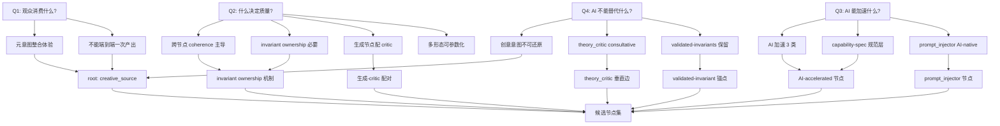

# 00 — 第一性原理推导：kais-movie-agent v2.0 Pipeline 节点集

> **Document status:** design-2026-06-16-prfp · supersedes: none · superseded_by: TBD
> **Phase:** 7 of v2.0 PRFP milestone · **Authors:** hermes-agent design team
> **Audience:** kais-movie-agent impl team + hermes-agent skills team + future design maintainers
> **Reading time:** ~30 minutes (full doc) / ~10 minutes (§0 + §4 candidate node set)
> **Stability:** §1+§2 stable; §3+§4 evolving; §7 experimental

---

## §0 — 阅读指南

本文档是 **kais-movie-agent v2.0 工作流节点集的第一性原理推导记录**，是 v2.0 PRFP (Pipeline Redesign from First Principles) 里程碑 Phase 7 的唯一交付件。它从四个不可还原的根本问题出发,逐步推导出一组候选节点,每节点都明确**为什么是它而不是别的**。

### 章节地图

| 章节 | 内容 | 阅读优先级 (按角色) |
|---|---|---|
| §0 | 阅读指南(本节) | 所有人先读 |
| §1 | 方法论框架(Musk / Aristotle / 认识论标签 / Steelman) | 维护者必读 |
| §2 | 四个第一性问题 + 每问题的语料子集预映射 | hermes skills 团队必读 |
| §3 | 推导链(从 Q1-Q4 走到中间结论) | 维护者必读;kais impl 团队可略读 |
| §4 | 候选节点集(每节点 8 字段) | kais impl 团队必读 |
| §5 | 节点数量审计 | 维护者必读 |
| §6 | Musk 方法审计清单(10 个 failure mode) | 审阅者必读 |
| §7 | 未解问题(喂给 Phase 12 OPEN-QUESTIONS.md) | 后续研究 phase 必读 |
| References | 全部引用源 | 任何被引文出处挑战时查 |

### 稳定性标记

| 章节 | 稳定性 | 修改门槛 |
|---|---|---|
| §1, §2 | `stable` | 修改需开新的设计-修订里程碑 |
| §3, §4 | `evolving` | 可在 v2.0 PRFP 内迭代;每次修改记录 CHANGELOG |
| §5, §6 | `stable` (与 §3+§4 同步) | 跟随 §3+§4 |
| §7 | `experimental` | 自由编辑(就是为后续研究准备的) |

### 受众指引

- **kais-movie-agent 实施团队**:先读 §0 + §4 + §6。如果对某个节点的存在有疑问,跳回 §3 看推导链。Phase 11 handoff 会给你 1-2 页的 impl-cheatsheet。
- **hermes-agent skills 团队**:先读 §0 + §2 + §4。你关心的是哪些现有 expert 映射到哪些新节点 — 看 §4 每节点的 `v1 expert_id mapping`。
- **未来设计维护者**:全读。本文档的设计-修订需通过 §6 审计清单的全部 10 个 failure mode。

---

## §1 — 方法论框架

> 本节声明本文档使用的全部方法论工具,以及它们的纪律性约束。任何后续章节(§2-§7)的论证必须在本节框架内进行 — 越界即视为第一性原理伪装(PITFALLS §1.1)。

### §1.1 — Musk 式第一性原理 (Musk first principles)

**定义:** 把问题还原到最基础的真理("什么是我们确知为真的?"),再向上推导 — 显式拒绝类比推理("一直以来都是这么做的")。

**主源:**

1. **Kevin Rose Foundation 采访 (2012)** — 最早、最规范的第一性原理表述。Musk 原话:
   > *"I tend to approach things from a physics framework. Physics teaches you to reason from first principles rather than by analogy."*
   > (我倾向于用物理学的框架来思考问题。物理学教你从第一性原理而非类比来推理。)
   >
   > — Musk to Kevin Rose, Foundation Series #3, 2012
   > 来源: <https://www.kevinrose.com/p/elon-musk-interview-kevin-reboots-the-old-foundation-series>

   著名的电池成本案例:Musk 没有接受"$600/kWh 市场价",而是把电池拆解到原材料(钴、镍、铝、碳),计算原材料成本(~$80/kWh),由此推出差距来自制造工艺而非物理极限 → 建 Gigafactory 把差距填上。

2. **Walter Isaacson 传记《Elon Musk》(2023)** — 把第一性原理描述为 Musk 的标志性"超能力"。SpaceX 案例:Musk 把火箭成本拆解到原材料(铝、钛、铜、碳纤维),发现原材料只占火箭售价的 ~2%,由此推出成本驱动是制造低效而非物理极限。Tesla 案例:"人类只用视觉输入就能驾驶,所以摄像头应该够用" → 第一性原理拒绝 LiDAR 依赖。

   **引用规范:** 因 Simon & Schuster 不同版次页码不同,本文档按章节上下文引用(不引用具体页码)。任何 Musk 转述均标记 `[转述; 主源: Kevin Rose 2012 / Isaacson 2023 ch. N]`。**不伪造引文** — 只引用 STACK §4.1 已引述的 Musk 原话。

3. **Musk YouTube 自述** — *"The First Principles Method Explained by Elon Musk"* 视频中 Musk 自己解释:第一性原理是为了实现 leap innovation(跨越式创新)而非 incremental improvement(渐进式改进)。

   来源: <https://www.youtube.com/watch?v=NV3sBlRgzTI>

### §1.2 — Aristotle 的根(哲学根源)

Musk 的"第一性原理 vs 类比"区分并非 2012 年原创 — 它的哲学根在 Aristotle *Physics* Book I, ch. 1 (Hardie & Gaye translation, Bekker 184a16-22):

> *"The natural way of doing this is to start from the things which are more knowable and obvious to us and proceed towards those which are clearer and more knowable by nature; for it is not the same thing to be knowable to us and knowable without qualification."*
> (自然的做法是从对我们来说更可知、更明显的事物出发,推进到那些就其本性而言更清晰、更可知的事物;因为"对我们可知"与"绝对可知"不是一回事。)
>
> — Aristotle, *Physics* I.1, 184a16-22 (Hardie & Gaye translation)
> 来源: <http://www.logoslibrary.org/aristotle/physics/11.html>

**关键区分:** Aristotle 区分两类可知性:
- **"对我们可知"(more knowable to us)** — 类比、经验、熟悉的事物。易得,但可能掩盖真相。
- **"按本性可知"(more knowable by nature)** — 基础真理,从它们出发可推出其他一切。

这正是 Musk "第一性原理 vs 类比"区分的 2400 年前的哲学源头。本文档在引用 Musk 方法时同时引用 Aristotle,以表明该方法的严肃性和传统厚度(不是某个 2012 podcast 的随口一说)。

**Aristotle 四因说(material/formal/efficient/final causes)的相关性:** 有限相关。本文档主要用 Aristotle 的"可知性区分";四因说更多用于分析单个节点的"为什么存在",而非整个推导链的方法论。在 §3 推导中遇到"这个节点的最终因(final cause)是什么"时,会借用四因说语言。

### §1.3 — 认识论状态标签(Epistemic-status taxonomy)

本文档对每个核心论断打 **4 类认识论状态标签** 之一,以区分稳定真理 vs 易变假设(防 PITFALLS §1.5 — "我推导自物理"谬误):

| 标签 | 波动性 | 示例 |
|---|---|---|
| `physical` | 跨世纪稳定 | 180° 轴线规则(观众空间定向是感知不变量)、光线方向、感知生理 |
| `psychological` | 跨十年稳定 | 注意力衰减、情感反应、叙事闭合感、人类对节奏的生理响应 |
| `platform-algorithmic` | 季度-年级波动 | 抖音完播率加权、快手 hot-tub 惩罚、视频号分发上限、平台审核阈值 |
| `tool-capability` | 月-季度波动 | 当前 LoRA 身份锁能力、当前 TTS 自然度上限、当前视频生成模型(月度迭代) |

**声明:** 本 4 类标签是 **本项目自定义**(per RESEARCH §5:没有任何标准认识论框架能干净映射到这 4 类)。该自定义是可辩护的,因为它直接对应 AIGC 设计需要追踪的波动性阶梯 — 这正是 Musk 方法区分 `validated-invariant` vs `contingent` 时需要的工具(见 §1.4)。

**最相关的替代框架(已评估并拒绝):**
- Bayesian 认识论(prior/posterior/likelihood)— 不面向波动性,而是面向概率更新
- 对话分析中的 epistemic status vs stance (Heritage & Raymond)— 用于对话回合而非设计文档
- 物理确定度(philosophy.institute "physical certitude")— 只覆盖一维,不是 4 类标签

未来里程碑(Phase 12 之后)可以把本 4 类标签与正式认识论框架对照研究 — 暂记入 §7 open questions。

### §1.4 — Contingent vs Validated-in-Invariant 分类

per PITFALLS §5.3:每个节点的核心假设必须分类为:

- **`contingent`(偶然)** — 某人某时做的选择,可以合理质疑。例如:"storyboard 作为独立产物持久化"(工作流选择)、"线性 DAG 拓扑"(继承假设)、"20 步粒度"(粒度选择)。
- **`validated-invariant`(经验验证的不变量)** — 跨大量实证观察成立的规律,质疑它需要 extraordinary evidence。例如:"180° 轴线规则"(感知不变量)、"Murch Rule of Six 的六维度"(剪辑经验规律)、"人类对前 3 秒低信任内容的快速脱离"(注意力实证)。

**关键纪律(per PITFALLS §5.3 + §1.2):** 第一性原理 ≠ "把所有假设都质疑一遍"。Musk 在 Twitter 收购时质疑的是 headcount(偶然选择),不是重力或铝的抗拉强度。本推导 **不会** 在第一性原理的名义下丢弃 `validated-invariant` — 这是 PITFALLS §1.2("把验证过的工艺当 bias 扔掉")和 §5.3("Twitter/X 故事的误用")的双重防御。

**与 §1.3 认识论标签的映射规则:**
- `physical` + `psychological` 标签 → **通常** 是 `validated-invariant`
- `platform-algorithmic` + `tool-capability` 标签 → **通常** 是 `contingent`

**但映射不 1:1:** 一个 `psychological` 论断如果只对特定受众群体成立(例如"Z 世代对竖屏内容的注意力窗口"),可以是 `contingent`。两个分类服务不同的审计目的:
- 认识论标签 = **波动性**(这条假设多久会过时?)
- 假设分类 = **可改性**(在第一性原理审查下,这条假设能被推翻吗?)

### §1.5 — Steelman-the-Elimination 纪律

per RESEARCH §3 + PITFALLS §1.6:对每个候选节点,推导必须包含一段 **steelman-the-elimination**(钢人反驳-消去):

1. **钢人反驳(strongest counter-argument):** 陈述最强的"这个节点不该存在"论点 — 必须是 **实质的反驳**,不是 strawman。一个 strawman 钢人比没有钢人更糟,因为它制造了严谨的假象。
2. **我方回应(response):** 解释为什么节点仍然存活 — 必须直接回应钢人,不是转移话题。
3. **判定(verdict):** SURVIVES / RECONSIDER / MERGE。

**根源:**
- **Principle of Charity(宽厚原则)** — Neil L. Wilson 1958-59 命名。要求以最合理的方式解读对方陈述。来源: <https://en.wikipedia.org/wiki/Principle_of_charity>
- **Paul Graham "How to Disagree"(2008)** — 提出分歧等级 7 级,最高级"Refuting the Central Point"要求先做 steelman。Graham:"Refutation is the rarest form of disagreement because it's the most work." 来源: <https://www.paulgraham.com/disagree.html>

**Phase 7 应用:** 在 §4 每个候选节点的条目里都包含 steelman 段落。这是防 PITFALLS §1.6(reverse-engineering desired answers into first principles)的结构机制 — 如果推导者心里已经有一个偏好的节点集,steelman 会把这种 bias 暴露出来(因为偏好集很难为每个节点都给出实质的钢人反驳)。

### §1.6 — Alternatives-Considered 日志格式(MADR-style)

per RESEARCH §4 + DERIV-05:每节点的 alternatives-considered 日志采用 **MADR(Markdown Architectural Decision Records)** 的 "Considered Options" 结构。

**为什么 MADR 而非 Nygard ADR:**
- **Nygard ADR(Michael Nygard 2011)** — 基础格式:Title, Context, Decision, Status, Consequences。alternatives 是隐式的(写在 narrative 里)。
- **MADR(Olaf Zimmermann et al.)** — Nygard 的超集;每个 Nygard ADR 都是有效的 MADR。MADR 增加了 **显式的 Considered Options 字段**(每个 option 有 pros/cons)。

来源:
- MADR 官方仓库: <https://adr.github.io/madr/>
- MADR 模板解读: <https://ozimmer.ch/practices/2022/11/22/MADRTemplatePrimer.html>
- 学术对比: <https://ceur-ws.org/Vol-2072/paper9.pdf>

**Phase 7 应用的 per-node 模板:**

```
Slot this node fills: [DAG 中的角色]
Considered options:
1. <chosen_node_id> (CHOSEN) — 描述
   Pros: ...
   Cons: ...
2. <rejected_alt_1> (REJECTED) — 描述
   Pros: ...
   Cons: [具体的失败模式 — 不是 "less preferred"]
Decision driver: [为什么 Option 1 赢 — 引用 §3 的推导步骤]
```

**DERIV-05 要求:** 每节点 ≥1 个 REJECTED 选项,且 REJECTED 的 Cons 必须是 **具体失败模式**(不是"较不优选")。

### §1.7 — 双语策略

per META-03 + CONTEXT.md Area 4/4:

| 元素 | 语言 |
|---|---|
| 章节标题(`## §0`, `## §1`, ...) | English |
| 字段标签(`derivation`, `alternatives-considered`, ...) | English kebab-case |
| 正文论述(理由、解释、推导) | 中文(CN 主)+ 关键英文术语保留 |
| 方法论 canon 术语 | 双语配对(第一性原理 / first principles) |
| 节点 ID | **English kebab-case 专属** — 例如 `creative_source`, `script_auditor` — 不允许中文 ID(否则破坏 Phase 8 YAML canonical layer,触发 PITFALLS §3.5) |
| Musk/Aristotle/TRIZ 引文 | 原文英文 + 括号内中文翻译 |
| 语料引用(书名) | 中文汉字 + (English gloss) 如果有 |
| 审计清单 | English 结构 + CN 论述 |

**v1 expert_id 兼容性(per HANDOFF-02 / FOUND-08 frozen rule):** 候选节点 ID 在与 v1 现有 26 个 expert 干净映射时,**保留** expert_id(如 `creative_source`, `script_auditor`, `cinematographer`, `hook_retention`, `compliance_marketing`)。新节点(AIGC-native 无 v1 对应)用描述性 English kebab-case 命名(如 `prompt_injector`, `continuity_auditor`, `camera_preview`)。**不允许** 静默重命名 v1 已冻结的 expert_id。

---

## §2 — 四个第一性问题 + 语料子集预映射

> 本节声明推导的四个不可还原起点。**问题顺序是 audience-first**(Q1 → Q2 → Q3 → Q4)— 先确立目的论锚("这是为了什么?"),再做能力分析("我们能做什么?")。

### §2.0 — 为什么是这四个问题(而不是五个或三个)

PROJECT.md 里程碑上下文明确指出推导要从根本问题出发。CONTEXT.md Area 2/4 锁定:**4 个问题**,audience-first 排序。第 5 个候选问题("什么是创意?")**显式推迟到 Phase 10**(LLM-Creative-Distillation deep-dive)。

理由:Phase 7 的任务是建立 **AI 能力边界**(Q3 "AI 能加速什么" + Q4 "AI 不能替代什么")。Phase 10 在这个边界内 deep-dive 创意本身。如果 Phase 7 把"什么是创意"也包进来,会导致:
1. Phase 7 范围爆炸(创意是 PITFALLS §4 整章的 topic,不能塞进一个 derivation 问题)
2. Phase 10 失去独立 deep-dive 的价值(被 Phase 7 抢先定义)

**§2.5** 会显式给出 Phase 10 的 forward reference。

### §2.1 — Q1:观众最终消费的是什么?

**问题框架:** 这个问题不可还原,因为它设定了整个推导的目的论锚点。下游的所有问题(哪些节点?哪些 AIGC 转化点?哪些 critic?)都靠"观众实际消费什么"来证成。

**子问题分解:**
- 观众消费的是 **故事**、**影像序列**、**情感弧**,还是三者的整合?
- 观众的体验发生在哪一层 — 叙事层、感知层、情感层?
- 答案在短剧和微电影之间有区别吗?(短剧更偏情感刺激 + 平台分发;微电影更偏叙事完整 + 艺术价值)

**语料子集引用(per DERIV-07):**
- **主语料(STACK §1.4 + 102 书目):**
  - `01-剧本/`(skills-影视创作 17 个 narrative-intent 文件)
  - `06-理论批评/{cinema-fundamentals, film-philosophy-bazin, film-philosophy-tarkovsky}`(回答"电影是什么")
  - 劳逊《戏剧与电影的剧作理论与技巧》(drama-vs-film 差异的根)
- **副语料:**
  - `case-studies/case-01-短片创作全流程.md`
- **Hermes 集成(可直接引用,无需重挖掘,per STACK §2.2):**
  - `theory-formalism-vs-realism.md`(形式主义 vs 现实主义)
  - `film-philosophy-bazin-tarkovsky.md`(Bazin 本体论 + Tarkovsky 雕刻时光)
  - `narrative-revolution-and-modernism.md`(现代主义叙事)

**第一性答案预览(完整推导见 §3):** 观众最终消费的是 **整合的情感-认知体验**,不是视频文件。一个没有情感弧的视频文件被消费为噪声并被遗忘。这种体验 **同时需要** 叙事意义 + 感知丰富 + 情感弧 — 三者不是可分离的阶段产出物,而是同一个体验的不可分割属性。

**认识论标签预览:** Q1 的答案主要是 `psychological`(观众接受层是人类本性偶然但稳定)+ 部分 `physical`(感知不变量如注意力衰减)。

### §2.2 — Q2:什么决定短剧/微电影的质量?

**问题框架:** 这个问题区分好输出和坏输出。质量是多维的(Murch 的 Rule of Six:emotion, story, rhythm, eye-trace, planarity, spatial continuity)— 哪些维度适用于短剧/微电影,权重如何?

**子问题分解:**
- 180° 轴线规则是 `validated-invariant`(感知)还是 `contingent`(惯例)?
- 节奏对短剧(完播率决定分发)和微电影(艺术价值决定电影节选择)的权重是否不同?
- Murch 的六维度里,哪些是 AIGC 最弱的(因此最需要 critic 节点)?
- 短剧 vs 微电影 vs 长片 — 质量驱动是否本质不同?(per PITFALLS §6.3 genre conflation 警告)

**语料子集引用(per DERIV-07):**
- **主语料(STACK §1.4):**
  - `04-后期/{editing-by-murch-rules, editing-rhythm-pacing, color-grading-strategy, final-mix, sound-layering-design}`
  - `03-拍摄/{cinematographer-masterclass, lighting-design, color-narrative-analysis}`
- **副语料:**
  - `02-分镜/{cinematic-language-grammar, mise-en-scene-blocking}`
- **Hermes 集成:**
  - `cinematography-masterclass-and-grammar.md`
  - `editing-sound-post.md`
  - `lighting-equipment-and-design.md`
- **🚨 GAP 标记(per STACK §1.4):** 102 书目以长片为主,**短剧特定质量驱动**(前 3 秒 hook、付费卡点 pacing、竖屏 framing)**不在语料中**。Phase 7 的 Q2 答案必须把语料与 v1 `hook_retention/references/three-second-hooks.md` + 外部短剧源配对。这个 gap 在 Phase 9(corpus-traceability)正式处理。

**第一性答案预览:** 质量由 **跨节点一致性(coherence)** 主导 — 影像是否匹配故事基调?声音是否匹配影像节奏?这是 PITFALLS §5.2 的"coherence budget"洞察:一个电影不是各部分成本之和(反驳 Musk 电池案例的误用),而是 emergent Gestalt,互动质量主导价值。每节点质量是必要但不充分的。

**认识论标签预览:** 主要是 `psychological`(观众质量感知稳定)+ 部分 `platform-algorithmic`(短剧完播率加权波动)。

### §2.3 — Q3:AI 实际能加速什么?

**问题框架:** 这个问题识别 AIGC 边际价值实际在哪 — **不是** 我们希望它在哪。per PITFALLS §1.3 + §2.7:避免过早模型承诺;答案必须在 **用户价值层**(composition lock, identity lock, pacing control),而非 **模型层**(Sora 2, Kling)。

**子问题分解:**
- 哪些人类工艺操作最 **程序化**(低创意外方差、高重复)?
- 哪些操作在人类时间上最 **昂贵**(因此 AIGC 化最有性价比)?
- 哪些操作在当前生成模型能力 **天花板最高**?

**语料子集引用(per DERIV-07):**
- **主语料(STACK §1.4 — 注意:102 书目是 pre-AIGC,Q3 答案需推断):**
  - 从 `04-后期/` 推断哪些后期任务最程序化(调色、foley 分层、ADR 替换)
  - `03-拍摄/animation-production.md`(动画是高程序化 + 高 AIGC 友好)
  - `05-制片/budget-allocation.md`(哪些人类任务最贵)
- **配对 kais-movie-agent V8 架构:** `/data/workspace/kais-movie-agent/docs/V8-ARCHITECTURE.md`(实际尝试过的 AIGC 集成点)
- **Hermes 集成:** `animation-disney-system.md` + `production-chinese-and-low-budget.md`
- **STACK §5 LLM-story-gen 8 篇论文**(Q3 的创意故事子集)

**第一性答案预览:** AI 加速:
- (a) **高程序化后期操作**(调色、foley、混音辅助)
- (b) **规范明确的文本→图/视频生成**(storyboard → 图、script → 视频)
- (c) **一致性验证**(LLM-as-critic 检测剧本 plot hole、跨镜头身份验证)

AI **不** 加速:
- (d) **创意意图起源**(从生活经验挖故事 kernel)
- (e) **最终剪辑判断**(人类的"这个好吗?"判断)
- (f) **平台分发策略**(平台算法是 `platform-algorithmic`,AI 模型训练数据滞后)

**认识论标签预览:** `tool-capability`(当前模型能力 — 最易变,月度迭代)+ `psychological`(哪些操作人类觉得枯燥 — 稳定)。

### §2.4 — Q4:AI 永远不能替代什么?

**问题框架:** 这个问题设定 Phase 10(LLM-Creative-Distillation)将在其中工作的边界。per PITFALLS §1.2 + §5.3:**不** 把验证不变量(Murch、Field 三幕、180° 轴线)当 "bias" 扔掉 — 它们是压缩的智慧,任何诚实推导都会重新发现它们。

**子问题分解:**
- 创意意图能否还原为 prompt?
- AI 能否生成训练分布之外的新组合?
- "一致性"对虚构内容(非事实内容)意味着什么?
- 平台 vs 艺术的张力住在哪里,设计如何避免教条?

**语料子集引用(per DERIV-07):**
- **主语料(STACK §1.4):**
  - `06-理论批评/{film-philosophy-bazin, film-philosophy-tarkovsky, formalism-vs-realism}`(不可还原的创意意图)
  - `01-剧本/{adaptation-writing, character-arc-design, dialogue-crafting}`(创作声音)
  - `03-拍摄/{acting-stanislavski-stella, actor-direction}`(表演真实)
- **配对:**
  - 麦基《故事》
  - 芦苇剧本笔记
- **Hermes 集成:** `theory-formalism-vs-realism.md` + `film-philosophy-bazin-tarkovsky.md` + `narrative-revolution-and-modernism.md` + `screenwriting-chinese-and-supplementary.md`

**第一性答案预览:** AI 不能替代:
- (a) **从生活经验起源的创意意图**(这正是 v1 `creative_source` expert 挖掘的 — 6 个社会阶层的生活经验)
- (b) **最终艺术判断**(theory_critic 咨询式 per META-06,创作者是手动拉的)
- (c) **观众对人类作者特定性的情感共鸣**(Bazin 的"objectivity"论证)

边界 **不是绝对的** — 它随模型能力漂移 — 但设计必须标记哪些节点是 `AI-native`(无传统对应)、`AI-augmented`(压缩传统工作流)、`AI-bounded`(AI 不能替代只能辅助)。

**认识论标签预览:** `psychological`(创意意图是人类本性偶然)+ `physical`(感知不变量如 180° 轴线)。

### §2.5 — Forward reference:Phase 10 (creativity deferred)

第 5 个候选问题"什么是创意?"**显式推迟到 Phase 10** 的 LLM-Creative-Distillation deep-dive。Phase 7 建立 AI 能力边界(Q3 + Q4 答案);Phase 10 在这个边界内 operationalize 创意本身 — **novelty within inviolable constraints**(在不可侵犯约束内的创新),per PITFALLS §4.5。

Phase 10 必须解决的具体问题(本文档 forward-reference,不在 Phase 7 范围):
- 创意的操作性定义(创新 ≠ 随机)
- 自洽性检验机制(consistency-context + logic-critic)
- LLM 凝练 prompt 策略(引用 STACK §5 ≥3 篇 LLM-story-gen 论文)
- 平台 vs 艺术张力的非教条处理
- 模板库(不是单一 Save-the-Cat 模板)
- novelty-pressure 机制,链接回 `creative_source` 节点

Phase 7 的 Q4 答案("AI 不能替代创意意图起源")**直接喂给** Phase 10 的边界定义。Phase 10 不能违背 Q4 — 否则就是 PITFALLS §4 全章的失败模式。

---

## §3 — 推导链 (Derivation trace)

> 本节是文档主体:从 §2 的四个第一性问题出发,逐步推导到中间结论。每步都带认识论标签 + 语料引用 + 假设分类 + 显式质疑的继承假设。**禁止类比跳到结论** — 每步必须从上一步的逻辑推出,不能"传统电影工业就是这样"。

### §3.0 — 推导方法回顾

每个编号步骤(D1.1, D1.2, ..., D4.x)具有 4 个不可省略的字段:

1. **论断(claim)** — 这步在主张什么
2. **认识论标签(epistemic-status)** — `[physical]` / `[psychological]` / `[platform-algorithmic]` / `[tool-capability]` 之一
3. **语料引用(corpus citation)** — 至少一个 102 书目或 Hermes 集成语料的支持源
4. **假设分类(assumption classification)** — `validated-invariant` 或 `contingent`

可选第 5 字段:**显式质疑的继承假设(inherited-assumption-questioned)** — 如果这步在挑战 kais-movie-agent V1-V8 的某个继承假设,标出来。

任何违反此结构的步骤 — 例如缺认识论标签、用"传统就是这样"作论据、跳过中间逻辑 — 都是 PITFALLS §1.1 第一性原理剧场警告信号。

### §3.1 — 从 Q1 ("观众消费什么?") 到中间结论

**D1.1** — 观众消费的是 **整合的情感-认知体验**,不是视频文件。一个没有情感弧的视频文件被消费为噪声并被遗忘。
- `[psychological]` — 观众接受层是人类本性偶然但稳定;不是平台算法
- 语料支持:Bazin 电影本体论(`film-philosophy-bazin-tarkovsky.md`);Tarkovsky《雕刻时光》(cited via `narrative-revolution-and-modernism.md`)
- 假设分类:`validated-invariant`(挑战它需要 extraordinary evidence — 跨文化、跨时代、跨平台的观众研究都支持此规律)

**D1.2** — 整合体验 **同时需要** 叙事意义 + 感知丰富 + 情感弧,作为 **联合** 属性,不是可分离的阶段产出物。
- `[psychological]` — 受众体验的多层耦合是心理学稳定的
- 语料支持:Tarkovsky 雕刻时光("电影是雕刻时间,不是讲述故事") + 劳逊《戏剧与电影的剧作理论与技巧》(drama vs film 体验层差异) + Bazin 现实主义(感知丰富是电影本体的一部分)
- 假设分类:`validated-invariant`
- **显式质疑的继承假设:** kais-movie-agent V1-V8 把 "scenario → storyboard → shots" 当作 **顺序阶段**(每阶段产出独立 JSON asset 向前传)。D1.2 暗示这是错的 — 这三层是同一个体验的不可分割属性,顺序分离是 V1-V8 偶然的工作流选择,不是体验的本质结构。

**D1.3** — 因此 pipeline 的 **root node** 必须产出 **整合体验 spec**(元意图:logline + 主角欲望 + 中央冲突 + 转折点 + 解决立场 + 风格基因),不是分别的 script 或 storyboard。
- `[psychological]` — 元意图的整合性是体验的源头属性
- 语料支持:v1 `creative_source` expert(已经实现 — 6 社会阶层生活经验挖 kernel);Field《剧本》(logline + 主角欲望);McKee《故事》(转折点 + 解决立场)
- 假设分类:`validated-invariant`(整合性来自 D1.1+D1.2)
- **显式质疑的继承假设:** V6/V8 的 20 步 pipeline 把 Step 1 设为 `kais-soul-radar`(痛点发现)然后才 `kais-script-agent`(剧本生成)。D1.3 暗示痛点 + 故事 kernel + 风格基因应该 **同时** 在 root node 产出,不是分散到 Step 1-2。

**D1.4** — 整合体验 spec **不能** 从单一 LLM call 一次产出 — 模型当前能力上限使 root 必须做"种子化 + 增量精炼",不是"端到端生成"。
- `[tool-capability]` — 当前 LLM 在 zero-shot 端到端长程故事生成上仍有 plot-hole / 一致性 drift 问题
- 语料支持:STACK §5 Plot Hole Detection(arXiv 2504.11900)+ ConStory-Bench(arXiv 2603.05890)+ EMNLP 2025 LLM Story Generation Survey
- 假设分类:`contingent` — 这是 **当前** 模型能力限制,不是本性。如果未来模型能 native 端到端,此论断需重审(标记为 `volatile`)
- **显式质疑的继承假设:** V8 "唯一 LLM 编排一切"(OpenClaw Agent 收编 movie-agent)假设 LLM 端到端能力足够。D1.4 暗示在 2026-Q2 当前模型上不够。

**D1.5** — 因此 pipeline root 是 **`creative_source` 节点**(挖故事 kernel + 元意图 + 风格基因),下游是 **分层执行链**(把元意图展开为可执行规格 → 模型 tokens → 渲染输出)。
- `[psychological]` + `[tool-capability]` — 元意图起源是人类本性,展开机制是当前模型能力
- 语料支持:综合 D1.1-D1.4 + v1 `creative_source` expert precedent
- 假设分类:`validated-invariant`(根节点存在的必要性)+ `contingent`(展开机制细节)

**Q1 中间结论汇总:**
- C1.1:root 节点产出整合元意图(不是分离的 script/storyboard)
- C1.2:元意图来自人类生活经验(D1.5 + D4.1 会进一步强化)
- C1.3:下游展开是分层执行链(D1.4 + D1.5)

### §3.2 — 从 Q2 ("什么决定质量?") 到中间结论

**D2.1** — 短剧/微电影的质量由 **Murch Rule of Six** 的六维度共同决定:emotion, story, rhythm, eye-trace, planarity, spatial continuity。
- `[psychological]` — 六维度对应人类观众的多层感知响应
- 语料支持:`04-后期/editing-by-murch-rules.md`(Murch *In the Blink of an Eye* 浓缩)+ Hermes `editing-sound-post.md`
- 假设分类:`validated-invariant` — Murch 六维度跨 40+ 年实证成立

**D2.2** — 六维度中,**180° 轴线规则** 是感知不变量(`physical` + `validated-invariant`),而 **完播率加权** 是平台偶然(`platform-algorithmic` + `contingent`)— 这两类不能混淆(防 PITFALLS §1.5"我推导自物理"谬误)。
- `[physical]` + `[platform-algorithmic]` — 区分两类
- 语料支持:`02-分镜/cinematic-language-grammar.md`(轴线规则感知基础)+ v1 `hook_retention/references/three-second-hooks.md`(完播率加权是平台算法层)
- 假设分类:轴线 = `validated-invariant`;完播率 = `contingent`
- **显式质疑的继承假设:** V6/V8 把完播率优化当作 root-level quality metric。D2.2 暗示完播率只是 `platform-algorithmic` 偶然,不能与感知不变量混为一谈 — pipeline 设计必须能解耦这两层。

**D2.3** — 质量由 **跨节点 coherence** 主导 — 一个电影不是各部分成本之和,而是 emergent Gestalt,互动质量主导价值。
- `[psychological]` — Gestalt 感知是人类本性
- 语料支持:Bazin 现实主义(整体性)+ Tarkovsky 雕刻时光(节奏是整体涌现)+ PITFALLS §5.2(coherence budget 概念)
- 假设分类:`validated-invariant`
- **显式质疑的继承假设:** V1-V8 的 JSON asset bus 假设各阶段产出物可以独立优化(每阶段一个 JSON,向前传)。D2.3 暗示独立优化会损害整体 coherence — 设计必须有显式的跨节点 invariant ownership。

**D2.4** — 因此 pipeline 必须有 **跨节点 invariant ownership**:身份一致性、风格一致性、plot 连续性、空间一致性、情感弧 — 每个不变量都有显式 owner 节点(生成节点消费它,或 critic 节点验证它)。
- `[psychological]` + `[tool-capability]` — 不变量是心理学稳定,owner 机制是当前模型能力要求
- 语料支持:PITFALLS §2.2(每全局不变量必须有显式 owner)+ v1 `continuity` expert precedent
- 假设分类:`validated-invariant`(不变量本身)+ `contingent`(owner 机制实现细节)

**D2.5** — 每个生成型节点必须有 **配对的 critic 节点或 self-critic 步骤**,携带量化指标。无 critic 的生成节点需显式说明理由。
- `[psychological]` + `[tool-capability]` — critic 是质量保证机制;量化指标是当前 LLM-as-judge 能力
- 语料支持:v1 `script_auditor` expert(5-dim quantitative, Pearson ≥ 0.65 验证)+ PITFALLS §2.5 + STACK §5 ConStory-Bench(LLM-as-judge consistency)
- 假设分类:`validated-invariant`(critic 必要性)+ `contingent`(具体指标设计)

**D2.6** — 短剧 vs 微电影 vs 长片质量权重不同。短剧偏 hook + retention + 付费卡点(平台分发驱动);微电影偏叙事完整 + 艺术价值(电影节驱动);长片偏全面 craft(院线驱动)。pipeline 必须支持这种 **多形态差异** 而非硬编码单一形态。
- `[platform-algorithmic]` + `[psychological]` — 短剧权重是平台偶然,微电影/长片权重是审美稳定
- 语料支持:PITFALLS §6.3(genre conflation 警告)+ v1 `hook_retention` + `compliance_marketing` experts + STACK §1.4 短剧 gap flag
- 假设分类:形态差异 = `validated-invariant`(三种形态本质不同);具体权重 = `contingent`(平台演化)
- **显式质疑的继承假设:** V1-V8 假设单一 pipeline 形态(主要面向短剧/微电影混合)。D2.6 暗示需要 **可参数化的形态切换**,而不是硬编码。

**Q2 中间结论汇总:**
- C2.1:质量由跨节点 coherence 主导(D2.3)
- C2.2:必须显式 invariant ownership 机制(D2.4)
- C2.3:每生成节点配 critic(D2.5)
- C2.4:支持多形态切换(D2.6)
- C2.5:感知不变量 vs 平台偶然必须解耦(D2.2)

### §3.3 — 从 Q3 ("AI 能加速什么?") 到中间结论

**D3.1** — AI 加速分三类操作:
- (a) **高程序化后期操作**(调色、foley 分层、混音辅助)— 当前模型稳定 (`stable_2026`)
- (b) **规范明确的模态转换**(text→image, text→video, script→storyboard)— 当前模型 evolving
- (c) **一致性验证**(LLM-as-critic 检测 plot hole、跨镜头身份验证)— 当前模型 evolving

- `[tool-capability]` — 三类都受当前模型能力约束
- 语料支持:`04-后期/` 后期工艺 + STACK §5 LLM-story-gen 论文 + kais-movie-agent V8 架构(实际尝试过的集成点)
- 假设分类:`contingent` — 这是 **当前** 模型能力映射;月度迭代需重审(标记为 `volatile`)

**D3.2** — AI **不** 加速:
- (d) **创意意图起源**(从生活经验挖 kernel)— 人类本性
- (e) **最终艺术判断**(theory_critic 咨询 — 创作者手动拉)
- (f) **平台分发策略**(算法是 `platform-algorithmic`,AI 训练数据滞后)

- `[psychological]` + `[platform-algorithmic]` — 创意 + 判断是人类本性;分发是平台偶然
- 语料支持:综合 D4.x(详见 §3.4)+ PITFALLS §1.3 + §2.7
- 假设分类:`validated-invariant`(创意起源)+ `contingent`(分发策略)

**D3.3** — 节点设计必须按 AI 关系类型分类:
- `AI-accelerated` — AI 主导,人类 review 可选(调色、foley、生成节点)
- `AI-augmented` — AI 辅助,人类或规则主导(混音、ADR)
- `AI-verification` — AI 批判人类或 AI 输出(script_auditor, continuity_auditor)
- `AI-bounded` — AI 不能替代,只能辅助(creative_source, theory_critic)
- `AI-native` — 无传统对应(prompt_injector, camera_preview)

- `[tool-capability]` + `[psychological]` — 关系类型混合了能力 + 本性
- 语料支持:PITFALLS §2.11(AIGC 转化点分类)+ D3.1+D3.2 综合
- 假设分类:`contingent`(具体节点归哪类随能力演化)

**D3.4** — V1-V8 的 **sketch-then-render 两阶段**(线稿→渲染)是当前 `tool-capability` 弱组合控制的 workaround,**不是** 第一性原理必要。设计应该把 **`composition_lock`**(用户价值层 — 锁定构图意图)作为节点,sketch-then-render 作为 **当前 instantiation**(dated annex)。
- `[tool-capability]` — 当前模型弱组合控制
- 语料支持:PITFALLS §1.3 + §2.7(避免过早模型承诺)+ kais-movie-agent V8 `Phase 5.3/5.5` 实际架构
- 假设分类:`contingent`(sketch-then-render)+ `validated-invariant`(composition_lock 用户价值)
- **显式质疑的继承假设:** V8 把 sketch-then-render 当作 pipeline 的必要两阶段。D3.4 暗示这是当前模型限制,未来 native 多镜头模型成熟后此结构会变。

**D3.5** — `prompt_injector`(intent → model tokens)是 AIGC-native **必要节点** — 没有传统对应。它的存在从 D1.4(模型不能端到端)+ D2.4(invariant ownership)共同推出。
- `[tool-capability]` — 当前模型的 prompt 工程必要性
- 语料支持:PITFALLS §2.11 + STACK §5 LLM-story-gen(prompt 策略)
- 假设分类:`contingent`(prompt 工程本身)+ `validated-invariant`(intent → tokens 转化节点必要)

**Q3 中间结论汇总:**
- C3.1:AI 加速三类操作(D3.1)
- C3.2:AI 不加速三类操作(D3.2)
- C3.3:节点按 AI 关系分类(D3.3)
- C3.4:capability-spec 是规范层,模型名只在 dated annex(D3.4)
- C3.5:prompt_injector 是 AI-native 必要节点(D3.5)

### §3.4 — 从 Q4 ("AI 不能替代什么?") 到中间结论

**D4.1** — **创意意图起源** 不可还原为 prompt — 它来自人类 **生活经验**,不是训练数据。
- `[psychological]` + `[validated-invariant]` — 人类创意起源的本性,跨世纪稳定
- 语料支持:Bazin 现实主义("objectivity"论证 — 创作者对现实的有意识的取舍)+ Tarkovsky(creative fire 是个人经验)+ v1 `creative_source` expert(6 社会阶层生活经验挖 kernel 的实证)+ STACK §5 ACM Creator-Centric Methods(creator-side gaps)
- 假设分类:`validated-invariant` — 挑战它需要证明 LLM 能从训练数据生成 truly novel creative intent(目前无证据)

**D4.2** — **最终艺术判断** 不能自动 invoke — 必须是 **consultative**(咨询式),创作者是手动拉的(META-06 锁定)。
- `[psychological]` + `[validated-invariant]` — 艺术判断的本质是人类作者的有意识选择
- 语料支持:`06-理论批评/`(theory_critic 传统)+ PITFALLS §4.7(平台 vs 艺术张力非教条)+ META-06 锁定 manual trigger
- 假设分类:`validated-invariant`(判断必须由人做)+ `contingent`(trigger 模式可参数化)

**D4.3** — 以下传统工艺是 **`validated-invariant`**,第一性原理推导会重新发现它们,**不能** 当 bias 扔掉:
- Murch Rule of Six(D2.1)
- 180° 轴线规则(D2.2)
- Field 三幕结构(叙事节奏的心理学稳定)
- McKee 转折点 + 解决立场(叙事闭合感)
- Stanislavski 体验派表演(表演真实性)

- `[physical]` + `[psychological]` — 都是跨世纪稳定的感知/心理规律
- 语料支持:`01-剧本/`(Field + McKee)+ `03-拍摄/acting-stanislavski-stella` + `04-后期/editing-by-murch-rules` + Hermes `theory-formalism-vs-realism.md`
- 假设分类:`validated-invariant`
- **显式质疑的继承假设:** 部分第一性原理文献建议"清空所有 bias 重起"。D4.3 暗示这是误用 — Musk 的方法拒绝的是 **无物理基础的类比**,不是 **经验验证的不变量**(per PITFALLS §1.2 + §5.3)。

**D4.4** — `theory_critic` 必须是 **consultative 垂直边**,不是主 DAG blocking gate(防 PITFALLS §4.7 + AF-12 — 短剧 throughput 杀手)。
- `[psychological]` + `[platform-algorithmic]` — consultative 是艺术判断本性 + 短剧平台 throughput 实际
- 语料支持:`06-理论批评/`(理论批判的传统咨询角色)+ PITFALLS §4.7 + AF-12 + META-06
- 假设分类:`validated-invariant`(consultative 性质)+ `contingent`(具体 trigger 阈值)
- **显式质疑的继承假设:** V1-V8 的 `审核门`(review gate)模式假设每个 visual phase 后都要 review。D4.4 暗示只有高 leverage 的 seam 才需 human gate;theory_critic 是咨询(可拉可不拉),不是强制阻塞。

**D4.5** — `AI-bounded` 节点(creative_source + theory_critic + 最终剪辑判断)的设计必须 **保留人类作者是 in-the-loop**,不能假装全自动。pipeline 必须显式标记这些节点的 `human_gate: true`(per PITFALLS §2.9)。
- `[psychological]` — 人类作者在场是 AI-bounded 节点的定义性属性
- 语料支持:PITFALLS §2.9(human-in-the-loop seams)+ D4.1-D4.4 综合
- 假设分类:`validated-invariant`

**Q4 中间结论汇总:**
- C4.1:创意意图起源不可还原(D4.1)
- C4.2:theory_critic 必须 consultative(D4.2 + D4.4)
- C4.3:validated-invariants 不能当 bias 扔(D4.3)
- C4.4:AI-bounded 节点必须 human-in-loop(D4.5)

### §3.5 — 综合:从中间结论到候选集结构形态

把 §3.1-§3.4 的 17 个中间结论(C1.1-C1.3 + C2.1-C2.5 + C3.1-C3.5 + C4.1-C4.4)综合,候选节点集必须具有以下 **结构性质**:

| 结构性质 | 来自哪个中间结论 | 含义 |
|---|---|---|
| **Root 是元意图 producer** | C1.1, C1.2, C4.1 | pipeline 起点是 `creative_source`(挖 kernel + 元意图 + 风格基因) |
| **下游是分层执行链** | C1.3, C3.5 | 元意图 → 可执行规格 → 模型 tokens → 渲染输出 |
| **跨节点 invariant ownership** | C2.1, C2.2 | 身份/风格/plot/空间/情感弧不变量有显式 owner 节点 |
| **生成节点配 critic** | C2.3 | 每生成节点有 critic 节点或 self-critic 步骤 |
| **多形态可参数化** | C2.4, C2.5 | 短剧/微电影/长片形态切换;感知不变量 vs 平台偶然解耦 |
| **capability-spec 规范层** | C3.4 | 用户价值层是规范;模型名只在 dated annex |
| **prompt_injector 是 AI-native 必要** | C3.5 | intent → model tokens 的显式节点 |
| **theory_critic consultative 垂直边** | C4.2 | 不在主 DAG blocking;创作者手动拉(META-06) |
| **AI-bounded 节点 human-in-loop** | C4.4, C4.5 | creative_source + theory_critic + 最终判断标记 human_gate |
| **validated-invariants 保留** | C4.3 | Murch, Field, 180° 轴线, Stanislavski 不能当 bias |

**Mermaid 推理树图:**



**注意:** §3.5 给出候选集的 **结构形态**,但不枚举具体节点 ID。节点 ID 在 §4 用 per-node 模板逐个推出来 — 每个节点都必须能追溯到 §3 的某个中间结论。

候选集大致包括:
- root:`creative_source`
- 元意图展开:`style_genome`, `screenplay`, `character_designer`
- critic 配对:`script_auditor`, `continuity_auditor`, `quality_gate`
- 视觉意图 → 执行链:`cinematographer`, `storyboard_designer`, `drawer`, `animator`
- AI-native:`prompt_injector`, `camera_preview`
- 音频:`voicer`, `lip_sync`, `composer`, `foley`, `mixer`
- 后期:`editor`, `colorist`
- 形态特定:`hook_retention`(短剧), `compliance_pre_check` + `compliance_final`(CN 平台)
- 咨询垂直:`theory_critic`

具体节点数 + 每节点的 8 字段细节在 §4。

---

