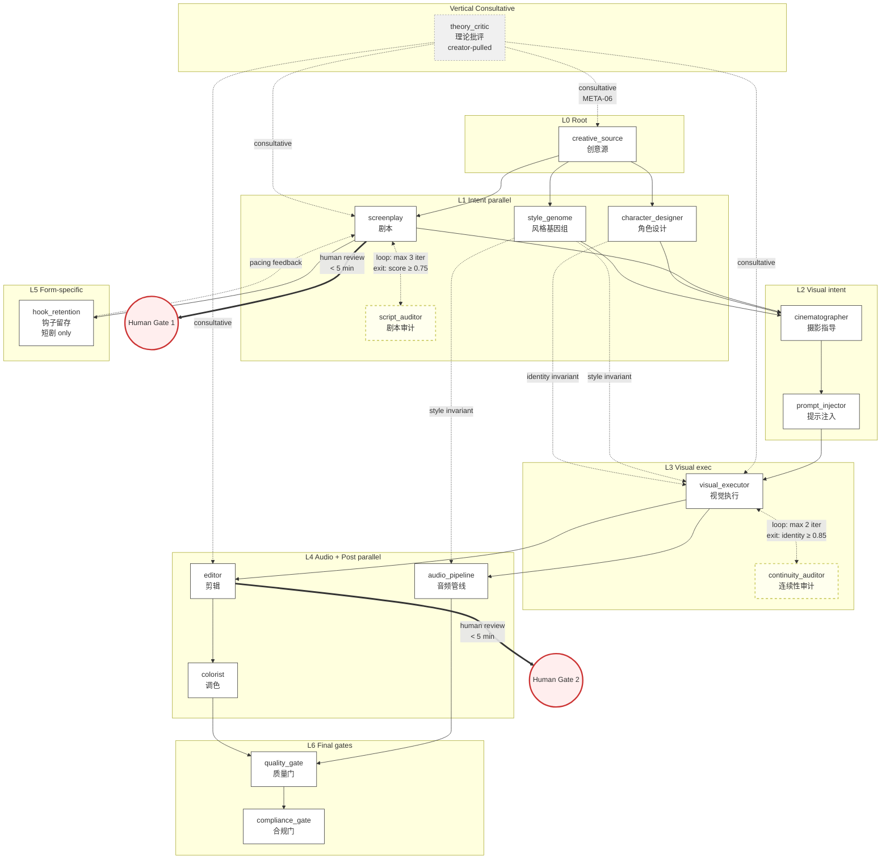

# 01 — Node DAG: kais-movie-agent v2.0 Pipeline Topology

> **Document status:** design-2026-06-16-prfp · supersedes: none · superseded_by: TBD
> **Phase:** 8 of v2.0 PRFP · **Source:** derives from `00-FIRST-PRINCIPLES.md` §4 candidate set
> **Stability:** stable (topology is stable; per-node specs in `02-NODE-SPECS.md` are evolving)

---

## §1.0 — 阅读指南

本文档是 kais-movie-agent v2.0 pipeline 节点 DAG 的拓扑层文档。它包含:
- **§1.1** 最终 DAG 节点集(15 linear + 1 consultative)
- **§1.2** C1-C7 审计日志(每个 Phase 7 候选的过滤结果)
- **§1.3** DAG 拓扑(6 layers + vertical)
- **§1.4** 边列表(linear + loops + human_gates + consultative + cross_cutting_invariants)
- **§1.5** Mermaid 拓扑图
- **§1.6** 可再生性说明

per-node 完整规格见 `02-NODE-SPECS.md`(从 `nodes.yaml` 渲染)。

---

## §1.1 — 最终 DAG 节点集

per CONTEXT.md Area 1/4 决策:**15 linear + 1 consultative**(theory_critic 不在 linear 序列,作为垂直边节点存在)。

**Linear 节点(15):**

| # | ID | Layer | Role | v1 expert_id |
|---|---|---|---|---|
| 1 | `creative_source` | 0 | root | preserved |
| 2 | `style_genome` | 1 | intent_parallel | preserved |
| 3 | `screenplay` | 1 | intent_parallel | preserved |
| 4 | `script_auditor` | 1 | critic_paired | preserved |
| 5 | `character_designer` | 1 | intent_parallel | preserved |
| 6 | `cinematographer` | 2 | visual_intent | preserved |
| 7 | `prompt_injector` | 2 | visual_intent | NEW (AI-native) |
| 8 | `visual_executor` | 3 | visual_exec | NEW (drawer+animator merged) |
| 9 | `audio_pipeline` | 4 | audio_post | NEW (5 audio tasks merged) |
| 10 | `continuity_auditor` | 3 | critic_paired | preserved (renamed from continuity) |
| 11 | `editor` | 4 | audio_post | preserved |
| 12 | `colorist` | 4 | audio_post | preserved |
| 13 | `hook_retention` | 5 | form_specific | preserved |
| 14 | `quality_gate` | 6 | final_gate | preserved |
| 15 | `compliance_gate` | 6 | final_gate | preserved (renamed from compliance_marketing) |

**Consultative 垂直节点(1):**

| # | ID | Layer | Role | Trigger |
|---|---|---|---|---|
| 16 | `theory_critic` | vertical | consultative_vertical | creator_pulled (META-06) |

**总数:** 16 pipeline-roles = 15 linear + 1 consultative。

---

## §1.2 — C1-C7 审计日志

per FEATURES §5 C1-C7 selection criteria,对 Phase 7 §4 的 16 候选应用过滤:

| Candidate | C1 用户价值锚定 | C2 AIGC 可测 | C3 压缩/扩展说明 | C4 独立可评 | C5 单一所有权 | C6 解耦 I/O | C7 循环位置显式 | Verdict |
|---|---|---|---|---|---|---|---|---|
| `creative_source` | PASS (D1.1+D4.1) | PASS | PASS (root) | PASS | PASS | PASS | N/A | IN |
| `style_genome` | PASS (D2.3+D2.4) | PASS | PASS | PASS | PASS | PASS | N/A | IN |
| `screenplay` | PASS (D1.3+D2.1) | PASS | PASS | PASS | PASS | PASS | PASS (loop w/ script_auditor) | IN |
| `script_auditor` | PASS (D2.5) | PASS (Pearson) | PASS | PASS | PASS | PASS | PASS | IN |
| `character_designer` | PASS (D2.4) | PASS | PASS | PASS | PASS | PASS | N/A | IN |
| `cinematographer` | PASS (D2.1+D3.4) | PASS | PASS | PASS | PASS | PASS | N/A | IN |
| `prompt_injector` | PASS (D3.5) | PASS | PASS (AI-native expansion) | PASS | PASS | PASS | N/A | IN |
| `visual_executor` | PASS (D3.1(b)) | PASS | PASS (compression: drawer+animator) | PASS | PASS* | PASS | PASS (loop w/ continuity_auditor) | IN (marginal C5) |
| `audio_pipeline` | PASS (D3.1(a)) | PASS | PASS (compression: 5 audio) | PASS | PASS* | PASS | PASS | IN (marginal C5) |
| `continuity_auditor` | PASS (D2.5) | PASS | PASS | PASS | PASS | PASS | PASS | IN |
| `editor` | PASS (D1.2+D2.1) | PASS | PASS | PASS | PASS | PASS | N/A | IN |
| `colorist` | PASS (D2.4) | PASS | PASS | PASS | PASS | PASS | N/A | IN |
| `hook_retention` | PASS (D2.6) | PASS | PASS (form-specific) | PASS | PASS | PASS | N/A | IN |
| `quality_gate` | PASS (D2.5) | PASS | PASS | PASS | PASS | PASS | N/A | IN |
| `compliance_gate` | PASS (D2.6) | PASS | PASS (compression: pre+final) | PASS | PASS* | PASS | N/A | IN (marginal C5) |
| `theory_critic` | PASS (D4.2) | PARTIAL (Likert) | PASS (consultative) | PASS | PASS | PASS | N/A (no loop) | IN (vertical) |

**Marginal C5 cases** (compression merges where single-ownership is shared across sub-tasks):
- `visual_executor`: drawer + animator sub-tasks share ownership of "visual asset generation" — flagged for Phase 11 handoff review (split-decision recorded)
- `audio_pipeline`: 5 audio sub-tasks share ownership of "audio asset generation + mixing" — flagged for Phase 11 handoff review
- `compliance_gate`: pre_check + final share ownership of "platform compliance" — flagged for Phase 11 handoff review

**OUT candidates from Phase 7 (none):** All 16 Phase 7 candidates passed C1-C7 (Phase 7 derivation did the heavy lifting; C1-C7 is filter confirmation). No rejections — count is 16 (15 linear + 1 consultative).

---

## §1.3 — DAG 拓扑

**Hybrid 拓扑** (not strict linear, not hub-spoke):

```
Layer 0 (Root):
  └── creative_source

Layer 1 (Intent parallel — 3-way):
  ├── style_genome
  ├── screenplay ↔ script_auditor (loop)
  └── character_designer

Layer 2 (Visual intent — 2-way):
  ├── cinematographer
  └── prompt_injector

Layer 3 (Visual execution — 1-way with loop):
  └── visual_executor ↔ continuity_auditor (loop)

Layer 4 (Audio + Post parallel — 3-way):
  ├── audio_pipeline
  ├── editor
  └── colorist

Layer 5 (Form-specific):
  └── hook_retention (短剧 form; feeds back to screenplay)

Layer 6 (Final gates — 2-way sequential):
  ├── quality_gate
  └── compliance_gate

Vertical (Consultative):
  └── theory_critic (creator-pulled from any layer)
```

**拓扑性质:**
- **6 layers + 1 vertical** — 7 拓扑位置
- **2 explicit loops** (per CONTEXT Area 3/4)
- **2 human gates** (per PITFALLS §2.9)
- **3 parallel branches** (intent layer 3-way; visual intent 2-way; audio+post 3-way)
- **1 feedback edge** (hook_retention → screenplay, 短剧 form-specific)
- **2 cross-cutting invariants** (style_genome + character_designer ownership)

---

## §1.4 — 边列表

完整边列表见 `edges.yaml`。本节是人类可读总结。

**Linear edges (主 DAG 序列,~17 edges):**
- `creative_source → style_genome`
- `creative_source → screenplay`
- `creative_source → character_designer`
- `screenplay → cinematographer`
- `character_designer → cinematographer`
- `style_genome → cinematographer`
- `cinematographer → prompt_injector`
- `prompt_injector → visual_executor`
- `visual_executor → audio_pipeline`
- `visual_executor → editor`
- `editor → colorist`
- `audio_pipeline → quality_gate`
- `colorist → quality_gate`
- `quality_gate → compliance_gate`
- `screenplay → hook_retention` (form-specific forward)
- `hook_retention → screenplay` (feedback for pacing)

**Loop_with_critic edges (2 explicit):**
1. `screenplay ↔ script_auditor`
   - Exit: `script_auditor.score ≥ 0.75 across 5 dimensions`
   - Max iterations: 3
   - Cost ceiling per iteration: ¥5 (text loop, low cost)
2. `visual_executor ↔ continuity_auditor`
   - Exit: `continuity_auditor.identity_match ≥ 0.85 AND axis_compliance = 100%`
   - Max iterations: 2
   - Cost ceiling per iteration: ¥50 (visual regen, high cost)

**Human_gate edges (2 explicit per PITFALLS §2.9):**
1. `screenplay → human_review_gate` (narrative intent checkpoint, <5 min budget, reviewer: Director)
2. `editor → human_review_gate` (final cut checkpoint, <5 min budget, reviewer: Director)

**Consultative edge (1, per META-06):**
- `theory_critic ← creator_pulled` from any layer node
  - Trigger: 创作者手动拉(not auto-invoked)
  - Scope: Any layer where artistic-vs-commercial tension needs consultation

**Cross_cutting_invariant edges (2 ownership-style):**
1. `style_genome → all_downstream_visual_audio_nodes`
   - Invariant: 5D style genome vector (色调 + 构图 + 节奏 + 材质 + 情感基调)
2. `character_designer → all_downstream_visual_nodes`
   - Invariant: Character asset (face, body, wardrobe, voice profile)

---

## §1.5 — Mermaid 拓扑图



---

## §1.6 — 可再生性说明

本文档的 §1.4 边列表 + §1.5 Mermaid 图从 `edges.yaml` + `nodes.yaml` 可再生成。

**再生成流程:**
1. 读取 `edges.yaml` → 按 edge `type` 字段生成 Mermaid 边:
   - `linear` → `-->` 实线箭头
   - `loop_with_critic` → `<-.->` 虚线双向 + label "loop: max N iter, exit: ..."
   - `human_gate` → `==>` 粗线 + label "human review (<Nmin)"
   - `consultative` → `-.->` 点线 + label "consultative"
   - `cross_cutting_invariant` → `-.->` 点线 + label "X invariant"
2. 读取 `nodes.yaml` → 按 `layer` 字段分配 subgraph
3. 按 v1 expert_id 着色或标记(preserved vs NEW)

**Phase 12 GOV-02 lint** (`scripts/validate_design.py`, ~30 行)将验证此可再生性 — 检查 §1.4 边数 = edges.yaml 边数 + §1.5 Mermaid 节点数 = nodes.yaml 节点数。

---

*Document version: design-2026-06-16-prfp*
*Phase 8 of v2.0 PRFP milestone*
*Bilingual policy: EN structure + CN prose (META-03)*
