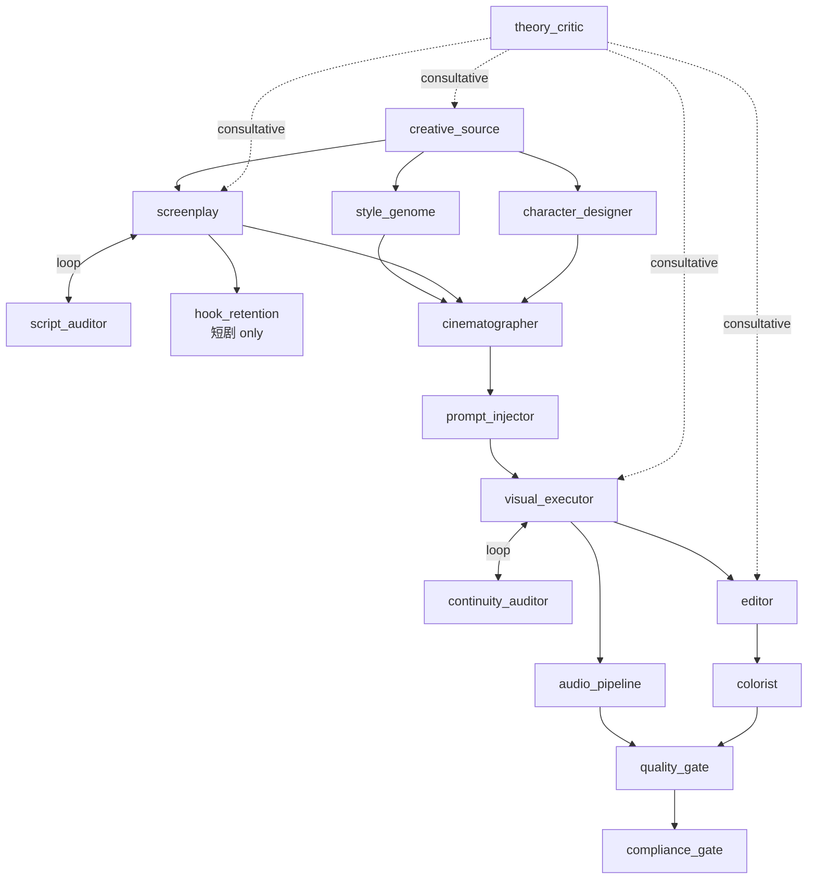

# 07 — Dual-Repo Handoff Plan

> **Document status:** design-2026-06-16-prfp · supersedes: none · superseded_by: TBD
> **Phase:** 11 of v2.0 PRFP
> **Binding:** `non_binding_recommendation` per HANDOFF-01
> **Stability:** stable

---

## §0 — 阅读指南

本文档是 v2.0 PRFP 设计套件向两个下游 repo(hermes-agent skills + kais-movie-agent impl)的 **非约束性交接契约**。per HANDOFF-01:design 永远不强制 impl;design 的价值是让下游团队 **want** 实施,不是 **must** 实施。

**前置阅读:** `05-COMPARISON-VS-8-PHASES.md` + `06-COMPARISON-VS-26-SKILLS.md` + `skills-mapping.yaml` + `kais-migration-matrix.yaml`

---

## §1 — 交接契约

### §1.1 — Binding status

```yaml
binding: non_binding_recommendation
design_version: design-2026-06-16-prfp
supersedes: none
superseded_by: TBD
```

design 不修改 hermes-agent/skills/ 或 kais-movie-agent/lib/ 任何文件(META-01 + META-02 锁定)。设计是 **建议**,impl 是 **决定**。

### §1.2 — Baseline references (per HANDOFF-04)

```yaml
hermes_agent_baseline_ref: 85965c393f44deae29a833f2ae98af66d26548ce
hermes_agent_baseline_date: 2026-06-16
kais_movie_agent_baseline_ref: 734dc71c9d5ff20d55dbd0255f367030962cf329
kais_movie_agent_baseline_date: 2026-06-16
```

实施开始时,impl 团队必须 verify baseline 仍有效;若 repo 演化导致 baseline 过期,需 design 重新验证。

---

## §2 — Ownership Matrix (per HANDOFF-05)

per PITFALLS §3.3:DAG 不能在两 repo 间 fork。明确所有权:

| 层 | Owner | 修改门槛 |
|---|---|---|
| **Design-intent layer** | hermes-agent(.planning/research/v2-pipeline-design/) | 修改需开新 design-revision milestone + sign-off from both repos |
| **Implementation layer** | kais-movie-agent(lib/) | 自由修改(capability-spec 范围内);不破坏 canonical interface |
| **Co-owned DAG** | both repos(structural changes) | 加/删/重排节点需双方 sign-off,记录为 cross-repo ADR |

**关键规则:**
- hermes-agent skills 团队 **可以** 在 v2.1+ milestone 内 deprecate experts(per FUTURE-02),但必须 sign-off 与 kais 团队协调
- kais-movie-agent impl 团队 **可以** 选择不实施 v2.0 设计,但选择实施必须遵守 capability-spec
- **任何** structural DAG change(add/remove/reorder nodes)需双方 sign-off,记录为 cross-repo ADR(hermes-agent/.planning/ + kais-movie-agent/.planning/ 都有副本)

---

## §3 — Versioning Scheme (per HANDOFF-06)

per PITFALLS §3.4:使用 **date-stamped versions** 而非 sequential numbering。

```yaml
# v2.0 PRFP 设计套件版本
design_version: design-2026-06-16-prfp
supersedes: none
superseded_by: TBD  # filled when next design revision occurs
frozen_when: TBD  # filled when impl targets this version

# kais-movie-agent impl 必须声明它 targets 的 design 版本
impl_targets_design: design-2026-06-16-prfp  # set when impl milestone starts
```

**Rules:**
- Design version 一旦 impl target 它,即 `frozen` — 修改需新 dated version
- Impl 不 target frozen design = 自由迭代 design
- 多个 impl milestone 可能 target 不同 design versions — 各自记录

---

## §4 — Impl-Cheatsheet Annex (per HANDOFF-07, 1-2 pages)

> **给 kais-movie-agent impl 团队的 1-2 页快速入门。**
> 完整 spec 见 `00-FIRST-PRINCIPLES.md` + `01-NODE-DAG.md` + `02-NODE-SPECS.md`;本文档是 cheatsheet。

### §4.1 — DAG 形态(一图)



### §4.2 — 关键节点(16)

| Node | Core task | Cost | Model horizon |
|---|---|---|---|
| creative_source | 挖 kernel + 元意图(human-bounded) | ¥150/ep | stable |
| style_genome | 5D visual-DNA invariant owner | ¥300/ep | stable |
| screenplay | 元意图 → 叙事结构 | ¥400/ep | evolving |
| script_auditor | 5-dim critic (loop with screenplay) | ¥100/ep | stable |
| character_designer | identity asset owner | ¥300/ep | evolving |
| cinematographer | visual intent + composition_lock | ¥300/ep | evolving |
| prompt_injector | intent → model prompts + consistency context | ¥50/ep | stable |
| visual_executor | image + video generation (most expensive) | ¥3500/ep | evolving |
| continuity_auditor | cross-shot critic (loop with visual_executor) | ¥600/ep | stable |
| audio_pipeline | TTS + music + foley + mix | ¥1000/ep | evolving |
| editor | rhythm + emotional arc + sequence | ¥400/ep | evolving |
| colorist | final color pass + platform spec | ¥300/ep | stable |
| hook_retention | 短剧 commercial engine | ¥200/ep | evolving |
| quality_gate | final multi-dim scorer | ¥150/ep | stable |
| compliance_gate | CN platform compliance | ¥200/ep | stable |
| theory_critic | consultative vertical (creator-pulled) | ¥50/ep | evolving |

**Total:** ¥8000/episode (within META-05 ceiling)

### §4.3 — 关键 edges(2 loops + 2 human gates + 1 consultative)

- **Loop 1:** screenplay ↔ script_auditor (max 3 iter, ¥5/iter, exit: score ≥ 0.75)
- **Loop 2:** visual_executor ↔ continuity_auditor (max 2 iter, ¥50/iter, exit: identity ≥ 0.85)
- **Human gate 1:** post-screenplay (< 5 min, Director review)
- **Human gate 2:** post-editor (< 5 min, Director review)
- **Consultative:** theory_critic (creator-pulled, any layer)

### §4.4 — 5 个最重要的 PITFALLS 避免

1. **不要硬编码模型名** — model names 在 `02-NODE-SPECS.md §2.17` dated annex,不在 canonical spec
2. **theory_critic 不能 block linear DAG** — META-06 + AF-12
3. **每生成节点必须有 critic** — Phase 7 §3.2 D2.5
4. **consistency_context 必须显式** — Phase 10 §2.1 schema
5. **novelty_constraint 必须从 creative_source 流出** — Phase 10 §7

### §4.5 — Implementation 第一周建议

1. Read `00-FIRST-PRINCIPLES.md` §3 (derivation) + §4 (candidate nodes)
2. Read `02-NODE-SPECS.md` for per-node specs
3. Read `nodes.yaml` + `edges.yaml` for canonical source of truth
4. **不要** 立刻重写 V8 — 用 wrapper 暴露新 node ids(见 `kais-migration-matrix.yaml` §4 phase 1)
5. 第一个 pilot:短剧 single episode,using new node topology;compare with V8 baseline

---

## §5 — Convergence Log(收敛日志,per HANDOFF-08)

per PITFALLS §1.4:不全部 divergence。新 DAG 与现有 pipeline 在以下点 **同意**:

### §5.1 — vs kais V1-V8(8 个收敛点)
见 `05-COMPARISON-VS-8-PHASES.md §2`

### §5.2 — vs hermes 26 experts(4 个收敛点)
见 `06-COMPARISON-VS-26-SKILLS.md §3`

### §5.3 — 整体收敛率
- vs kais V1-V8: 8 convergence + 9 divergence(8:9 平衡)
- vs hermes 26 experts: 4 convergence + 8 divergence(4:8 偏 divergence,因为 26 → 16 压缩)
- 综合: ~47% convergence rate — 设计既不是 inherit 翻版也不是 divergence-for-divergence

---

## §6 — 交接动作清单

### §6.1 — kais-movie-agent impl 团队 checklist
- [ ] Read `00-FIRST-PRINCIPLES.md` + `02-NODE-SPECS.md`
- [ ] Verify baseline_ref `734dc71c9d` 仍 valid
- [ ] 决定是否实施 v2.0 设计(non-binding)
- [ ] 若实施:declare `impl_targets_design: design-2026-06-16-prfp`
- [ ] 按 `kais-migration-matrix.yaml` 4-phase migration plan
- [ ] 设置 baseline vs V8 的 A/B 比较 framework

### §6.2 — hermes-agent skills 团队 checklist
- [ ] Read `06-COMPARISON-VS-26-SKILLS.md` + `skills-mapping.yaml`
- [ ] 决定 v2.1+ skills milestone 是否启动(non-binding)
- [ ] 若启动:resolve 3-4 deprecate candidates(performer / scene_builder / storyboard_designer / production)
- [ ] Resolve 2 rename sign-offs(continuity_auditor / compliance_gate)
- [ ] Resolve 7-into-2 merge decision(visual_executor / audio_pipeline)

### §6.3 — 协调 checklist
- [ ] 双方在各自 .planning/ 中 sign-off ownership matrix(per §2)
- [ ] 任何 structural DAG change 经双方 sign-off + cross-repo ADR
- [ ] 设计版本 frozen 一旦 impl target 它

---

## §7 — Open Questions(per HANDOFF doc-record)

(Phase 11 没有新 open questions;所有 gap 在 `00-FIRST-PRINCIPLES.md §7` + `04-LLM-CREATIVE-DISTILLATION.md §8` + Phase 9 §7 已记录)

---

*Document version: design-2026-06-16-prfp*
*Phase 11 of v2.0 PRFP milestone*
*Binding: non_binding_recommendation*
