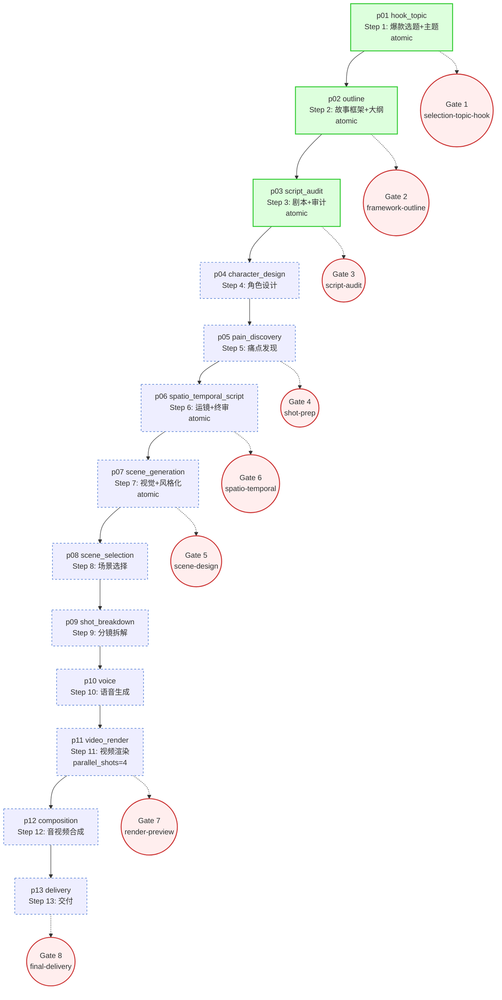

# Kais-Movie-Pipeline Orchestration Skill (短剧管线编排)

The top-level orchestration skill that turns the kais-movie-agent V8.6 13-step short-drama pipeline into a single native hermes-agent skill. Phase 35 delivers the keystone vertical slice (p01 hook+topic, p02 outline, p03 script+audit); Phase 36 fills p04–p13 using the template established here.

**Trigger words:** `movie agent`, `短片制作`, `AI短片`, `视频管线`, `film pipeline`, `movie-wuji`, `AI视频制作`, `短视频管线`, `AI电影`, `影片制作`, `AI短剧`, `短剧制作`, `视频自动化`, `一键生成视频`, `AI拍片`, `kais-movie`, `movie pipeline`, `kais-movie-pipeline`, `V8`, `V8.6`

## When to use this skill

Invoke `/kais-movie-pipeline` when the operator wants one of the following:

- **End-to-end short-drama / 微电影 episode production** — from a free-form operator requirement to a delivered master.mp4, running all 13 V8.6 Steps with the 15 movie-experts doing the creative work
- **Resume an interrupted run** — checkpoint/resume semantics pick up at the next phase after the latest checkpoint (no replay of completed phases)
- **Vertical-slice validation** — run p01→p02→p03 only to validate the orchestration glue before committing to a full 13-step run (Phase 35 default scope)
- **Pipeline migration from Node.js** — operator wants the native Python hermes-agent path instead of the legacy `lib/phases/index.js` subprocess bridge

**Do NOT confuse with the 15 movie-experts** (hook_retention / creative_source / screenplay / etc.): those are CREATIVE skills invoked BY this orchestration skill via `delegate_task`. This skill contains ZERO creative logic — it is pure glue (load inputs → delegate to expert → write asset bus → trigger gate). See `## What NOT to do`.

**Pipeline form:** Chinese-market 短剧 / 微电影 (vertical 9:16, 60–180s per episode, 10–30 episodes typical). All 15 movie-experts assume this form; this orchestration skill does not override form-level assumptions.

## References

This skill ships with 7 reference docs under `references/` (created by sub-plan 35-04 + quick task 260626-vzl). All numeric thresholds / canonical mappings live in refs; this SKILL.md body only links to them.

| Ref | When to Read | Contents |
|-----|--------------|----------|
| `references/pipeline-dag.md` | Before invoking the pipeline or adding a new phase | Full 13-step dependency graph (Mermaid + ASCII), atomic-operation annotations, Phase 35 vs Phase 36 scope split |
| `references/review-gates.md` | Before configuring gates or debugging a blocked run | 8-gate V8.6 review structure: gate_id / trigger phase / reviewer role / mode (sync vs async) |
| `references/asset-bus-schema.md` | Before adding a phase-output slot | Slot lifecycle (write → read → append), slot format (JSON vs JSONL), envelope wrapping rules |
| `references/expert-mapping.md` | Before wiring a phase to its expert | 13-row Step ↔ expert_id mapping table (canonical source: `_shared/v86-pipeline-mapping.md`) |
| `references/platform-specs.md` | Before per-platform 分发 / duration / hook placement decisions | V1 hard-spec matrix (竖屏滑动 vs 横屏主动, 10-row 硬性规格) + 12-row 刚性约束 by layer + per-expert consultation guide |
| `references/creative-redlines.md` | Before any single-episode compliance review or A/B convergence loop | 7 cross-platform creative invariants (5 per-episode: 情绪脱敏/信息分层/零背景铺垫/结尾未完成/差异化识别 + 2 process: 控制变量/统计显著) |
| `references/genre-anchor-urban-fantasy.md` | Before any v1 production (default genre unless operator overrides) | V1 题材锚定 都市奇幻·轻喜剧:核心 DNA + per-platform content form + 3-month 启动方案 + 变现逻辑 + 题材禁忌 |

External canonical source: [`skills/movie-experts/_shared/v86-pipeline-mapping.md`](../movie-experts/_shared/v86-pipeline-mapping.md) (Phase 27 v5.0 — frozen).

## Pipeline DAG

The pipeline runs 13 Steps. Steps 1–3 are the **Phase 35 vertical slice** (implemented by sub-plan 35-03); Steps 4–13 are **Phase 36 scope** (registered as stubs but not implemented in Phase 35).



ASCII fallback (for renderers without Mermaid):

```
[p01 hook_topic]  →  [p02 outline]  →  [p03 script_audit]   ← Phase 35 vertical slice
        ↓                  ↓                  ↓
      Gate 1            Gate 2            Gate 3

[p03] → [p04 character] → [p05 pain] → [p06 spatio_temporal]  ← Phase 36
                                   ↓                  ↓
                                 Gate 4            Gate 6
[p06] → [p07 scene_gen] → [p08 scene_select] → [p09 shot_break]
              ↓                                    ↓
           Gate 5                                Gate 4 (re-fire option)
[p09] → [p10 voice] → [p11 video_render] → [p12 composition] → [p13 delivery]
                            ↓                                          ↓
                         Gate 7                                     Gate 8
```

**Topology notes:**
- 6 atomic operations collapse V8.4-era 25 Steps into V8.6 13 Steps (see `_shared/v86-pipeline-mapping.md` §V8.6 Atomic Merges)
- Gates fire AFTER the named phase completes; runner.py blocks until each gate is resolved (sync) or skips if `enable_gates=False`
- `parallel_shots=4` is plumbed at the RunnerConfig level (D-35-06); actual parallel dispatch exercised in p11 (Phase 36)

## Phase ↔ Expert Mapping

The 13-phase ↔ expert mapping is sourced verbatim from [`_shared/v86-pipeline-mapping.md`](../movie-experts/_shared/v86-pipeline-mapping.md) (Phase 27 v5.0 — canonical). The `Scope` column indicates which sub-plan implements the phase module.

| Phase ID | V8.6 Step | Atomic Op | Primary Expert(s) | Asset-Bus Slots (out) | Gate | Scope |
|----------|-----------|-----------|--------------------|------------------------|------|-------|
| `p01_hook_topic` | Step 1 | 爆款选题+主题 (kais-topic-radar 10-dim + Topic Kernel) | hook_retention | topic-kernel, hook-design | Gate 1 selection-topic-hook | **Phase 35** |
| `p02_outline` | Step 2 | 故事框架+大纲 (Snowflake Method) | creative_source + screenplay | story-framework, outline-beats | Gate 2 framework-outline | **Phase 35** |
| `p03_script_audit` | Step 3 | 剧本+审计 (5-dim quantitative) | screenplay + script_auditor | script-draft, audit-report | Gate 3 script-audit | **Phase 35** |
| `p04_character_design` | Step 4 | Character Bible 2.0 (4D-Anchor) | character_designer + visual_executor (drawer sub-step) | character-bible, character-assets | — | Phase 36 |
| `p05_pain_discovery` | Step 5 | Pain point mining (L1–L6 strata) | creative_source (re-invoked) + theory_critic | pain-points, escalation-ladder | Gate 4 shot-prep | Phase 36 |
| `p06_spatio_temporal_script` | Step 6 | 运镜+终审 (spatio-temporal script + final audit) | screenplay + cinematographer + script_auditor | spatio-temporal-script, final-audit | Gate 6 spatio-temporal | Phase 36 |
| `p07_scene_generation` | Step 7 | 视觉+风格化 (scene image gen + style genome + color intent) | visual_executor + prompt_injector + style_genome + colorist | scene-images, style-vector, color-intent | Gate 5 scene-design | Phase 36 |
| `p08_scene_selection` | Step 8 | 场景选择 (geometry-bed consistency check) | cinematographer + editor | scene-selection, geometry-bed | — | Phase 36 |
| `p09_shot_breakdown` | Step 9 | 分镜拆解 (E-Konte 5-layer) | cinematographer + continuity_auditor | shot-list, e-konte-sheets | — | Phase 36 |
| `p10_voice` | Step 10 | 语音生成 (TTS + emotion prosody) | audio_pipeline (voicer sub-step) | voice-clips, voice-timeline | — | Phase 36 |
| `p11_video_render` | Step 11 | 视频渲染 (multimodal2video / multiframe2video / frames2video) | visual_executor (animator sub-step) + audio_pipeline (lip_sync sub-step) | video-clips, lip-sync-reports | Gate 7 render-preview | Phase 36 |
| `p12_composition` | Step 12 | 音视频合成 (BGM + foley + mix + spatial) | audio_pipeline (composer + foley + mixer + spatial_audio sub-steps) + editor | master-timeline, audio-stems | — | Phase 36 |
| `p13_delivery` | Step 13 | 交付 (color grade + compliance + delivery package) | colorist + compliance_gate + editor | master-mp4, delivery-package | Gate 8 final-delivery | Phase 36 |

**15 active movie-experts** (per [`movie-experts/README.md`](../movie-experts/README.md) Bucket 1): `creative_source`, `style_genome`, `screenplay`, `script_auditor`, `character_designer`, `cinematographer`, `prompt_injector`, `visual_executor`, `continuity_auditor`, `audio_pipeline`, `editor`, `colorist`, `hook_retention`, `compliance_gate`, `theory_critic`.

## Review Gates

The 8-gate V8.6 review structure reduces V8.4-era 12 gates to 8 (per `_shared/v86-pipeline-mapping.md` §V8.6 8-Gate Review Structure). The gate framework itself shipped in Phase 34 (`plugins/review_gates/`); Phase 35-02 wires phase modules to trigger gates via `runner_hooks.pause_for_review`.

| # | Gate ID | Trigger Phase | Reviewer Role | Mode | Purpose |
|---|---------|---------------|---------------|------|---------|
| 1 | `selection-topic-hook` | p01 (Step 1 后) | Operator | Sync (<5 min) | Confirm topic + hook candidate before story framework |
| 2 | `framework-outline` | p02 (Step 2 后) | Operator | Sync (<5 min) | Confirm story framework + Snowflake outline beats |
| 3 | `script-audit` | p03 (Step 3 后) | Operator + script_auditor | Sync (<5 min) | Confirm script draft passes 5-dim audit (score ≥ 0.75) |
| 4 | `shot-prep` | p05 (Step 5 后) | Operator | Sync (<5 min) | Confirm pain points + escalation ladder before visual design |
| 5 | `scene-design` | p07 (Step 7 后) | Operator + continuity_auditor | Sync (<5 min) | Confirm scene images pass 4-dim consistency (face/wardrobe/color/object) |
| 6 | `spatio-temporal` | p06 (Step 6 后) | Operator + cinematographer | Sync (<5 min) | Confirm spatio-temporal script (shot intent + axis + composition_lock) |
| 7 | `render-preview` | p11 (Step 11 后) | Operator | Async (background) | Confirm rendered video clips meet quality bar before final mix |
| 8 | `final-delivery` | p13 (Step 13 后) | Operator + compliance_gate | Sync (<5 min) | Confirm master.mp4 passes CN content-rules + AIGC labeling before release |

**Gate triggering contract:**
- Phase modules call `runner_hooks.pause_for_review(gate_id, episode_id, payload, mode=None)` if the phase has a configured gate (per `references/review-gates.md`)
- Sync gates block the runner until resolved; async gates return immediately and the runner polls resolution status
- `RunnerConfig.enable_gates=False` disables all gates (used in CI / batch mode)
- Gate resolution outcomes are written to the AssetBus `review-outcomes` slot (JSONL append — preserves full history)

## Asset Bus Schema

Phase outputs flow through the AssetBus (Phase 33 plugin, extended in 35-02 per D-35-05). Each slot is JSON format (envelope-wrapped, atomic write) unless explicitly marked JSONL (append-only history).

| Slot | Format | Writer Phase | Reader Phase(s) | Lifecycle |
|------|--------|--------------|-------------------|-----------|
| `requirement` | JSON | (operator inject) | p01 | write-once |
| `topic-kernel` | JSON | p01 | p02 | write-once |
| `hook-design` | JSON | p01 | p02, p07 | write-once |
| `story-framework` | JSON | p02 | p03 | write-once |
| `outline-beats` | JSON | p02 | p03 | write-once |
| `script-draft` | JSON | p03 | p06 | write-once |
| `audit-report` | JSON | p03 | (gate 3) | write-once |
| `character-bible` | JSON | p04 | p07, p09 | write-once |
| `character-assets` | JSON | p04 | p07, p11 | write-once |
| `scene-images` | JSON | p07 | p08, p11 | write-once |
| `style-vector` | JSON | p07 | p11, p12 | write-once |
| `shot-list` | JSON | p09 | p11 | write-once |
| `voice-timeline` | JSON | p10 | p11, p12 | write-once |
| `video-clips` | JSON | p11 | p12 | write-once |
| `audio-stems` | JSON | p12 | p13 | write-once |
| `master-mp4` | JSON | p13 | (delivery) | write-once |
| `creative-history` | JSONL | (all phases) | (audit) | append-only |
| `failed-shots` | JSONL | p11 | (finetune loop) | append-only |
| `review-outcomes` | JSONL | (gate framework) | (audit) | append-only |

Phase 35-02 task 1 extends `ASSET_SCHEMA` in `plugins/pipeline_state/asset_bus.py` with the phase-output slots above. The 4 Phase-33 slots (`creative-history` / `failed-shots` / `finetune-dataset` / `review-outcomes`) are preserved unchanged.

## Runner

The runner (`pipeline/runner.py`, created by sub-plan 35-02) is the single entry point. It is sync-by-default (delegate_task blocks — CRITICAL-FINDING-35-02).

**Invocation:**
```bash
python -m skills.kais-movie-pipeline.pipeline.runner --episode ep-001 [--workdir ./runs] [--no-gates]
```

**Resume semantics:**
- The runner calls `PipelineStateStore.load_latest_checkpoint(episode_id)` at start; if a checkpoint exists, it computes the resume index via `_compute_start_index` and continues from the next phase
- After each phase completes, the runner calls `save_checkpoint(episode_id, phase_id, payload)` — checkpoint is for RESUME STATE (phase cursor + small intermediate), NOT for phase artifacts (those go to AssetBus per D-35-05)
- Re-running a completed episode replays from phase 0 unless `--resume` is passed (default behavior is resume)

**parallel_shots=4 (D-35-06):**
- `RunnerConfig.parallel_shots: int = 4` preserves V8.6 / v2.0 episode-level shot parallelism
- Phase 35 only plumbs the config; actual parallel shot dispatch is exercised in p11 video_render (Phase 36)
- Tests verify `RunnerConfig().parallel_shots == 4` (unit assertion), not real parallelism in p01–p03

**Phase iteration order:**
The runner iterates `PHASE_REGISTRY` (defined in `pipeline/phases/__init__.py`) in declaration order. Phase 35 registers p01–p03; Phase 36 appends p04–p13. Resume skips already-checkpointed phases by index.

## Operator Setup

**Skill discovery (CRITICAL-FINDING-35-01):** Skills are discovered by recursive scan of skills directories for `SKILL.md` files. No plugin registration is needed. To make this skill discoverable without installing to `~/.hermes/skills/`, add the hermes-agent skills tree to `skills.external_dirs` in `~/.hermes/config.yaml`:

```yaml
skills:
  external_dirs:
    - /data/workspace/hermes-agent/skills
```

After saving, verify discovery:
```bash
# In hermes-agent runtime:
skill_view(name="kais-movie-pipeline")  # should return this SKILL.md
skills_list()                            # should include kais-movie-pipeline
```

Alternative: symlink `~/.hermes/skills/kais-movie-pipeline → /data/workspace/hermes-agent/skills/kais-movie-pipeline`.

**Environment variables (degrade-tolerant):** The underlying plugins consume these env vars. Services unreachable → warn + fallback (not crash), per GPU-DIRECT-05 (Phase 32):

| Env Var | Plugin | Purpose | Fallback |
|---------|--------|---------|----------|
| `KAIS_GOLD_TEAM_URL` | kais_aigc | Gold-team model routing | Skip gold-team, use primary |
| `KAIS_REVIEW_URL` | kais_aigc | Review platform submission | Skip async review (sync gates only) |
| `KAIS_CANVAS_URL` | kais_aigc | Canvas event sync | Skip canvas sync |
| `KAIS_JIMENG_URL` | kais_aigc | Dreamina CLI gateway | Hard fail in p07/p11 (no fallback) |
| `KAIS_API_KEY` | kais_aigc | Service authentication | Hard fail at startup |
| `KAIS_JWT_SECRET` | pipeline_state | State store encryption | Warn + unencrypted (dev only) |

**Checkpoint directory:** Defaults to `./runs/<episode_id>/`. Override via `RunnerConfig.workdir`. The AssetBus + PipelineStateStore share the workdir.

## What NOT to do

- **Do NOT call `skill_view` in the parent (orchestration) context.** Phase modules do not load expert SKILL.md themselves; they instruct the subagent (via `delegate_task(goal=...)`) to call `skill_view(name="<expert>")` first, then apply the expert. Loading in parent would burn parent context (expert SKILL.md is 5–15 KB each × 15 experts = parent context exhaustion).
- **Do NOT write phase-specific business logic in phase modules.** If you are tempted to write a prompt template or call an LLM directly in a phase module, that logic belongs in an EXPERT skill, not the orchestration. Phase 35 phase modules are GLUE ONLY (D-35-04).
- **Do NOT dynamically import phase modules by string.** Use direct imports in `PHASE_REGISTRY` — simpler, no `importlib` juggling, and tests can patch easily.
- **Do NOT make phase `run()` async.** hermes-agent tool dispatch is sync (delegate_task blocks — CRITICAL-FINDING-35-02). Sync `run()` is correct.
- **Do NOT store phase outputs in PipelineStateStore checkpoint payload.** Checkpoint is for RESUME state (phase cursor + small intermediate); phase artifacts are FIRST-CLASS and go in AssetBus slots (D-35-05). Mixing them violates single-responsibility.
- **Do NOT skip the operator setup section.** Operators need to know how to make the skill discoverable (external_dirs config or symlink). SC#4 depends on this.
- **Do NOT introduce Node.js bridges.** Per D-35-03, all orchestration code is Python. The Node.js `lib/phases/index.js` is a REFERENCE PORT TARGET, not a runtime dependency. `subprocess.run(["node", ...])` is forbidden anywhere in `kais-movie-pipeline/`.
- **Do NOT parallelize p01–p03.** These are script-stage phases with strict linear dependencies (p01 → p02 → p03). `parallel_shots=4` applies to p11 video_render only (Phase 36).
