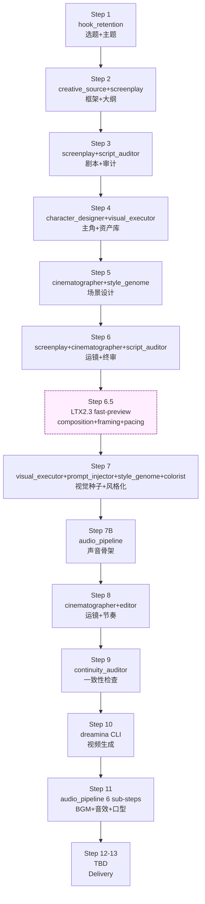

# Pipeline DAG — V8.6 13-Step Dependency Graph

**Source:** `_shared/v86-pipeline-mapping.md` (canonical V8.6 mapping ref, Phase 27) — which itself cites `kais-movie-agent/SKILL.md` @ commit `e41fa68`.
**Copyright:** Fair Use — Step dependency structure is factual integration architecture; brief verbatim quotations attributed.
**Last-verified:** 2026-06-27 (Phase 41 Step 6.5 additive annotation — preview slot inserted mid-edge p06→p07)

---

## Summary

This document is the **dependency graph** for the V8.6 13-step short-drama pipeline. It answers "what runs after what, and what depends on what" for the `kais-movie-pipeline` orchestration skill. All Step numbering, atomic-merge annotations, and expert assignments are sourced verbatim from `_shared/v86-pipeline-mapping.md` — the single source of truth for V8.6.

**Phase 36-05 Wave 2 refinement:** Slot flow per edge + cross-cutting reads + side outputs are now documented from actual Wave 1 implementation data (see §"Slot Flow Per Edge" below).

---

## The 13 Steps

> Reproduced from `_shared/v86-pipeline-mapping.md` §"The 13-Step V8.6 Pipeline → expert_id Mapping".



**ASCII fallback table:**

| V8.6 Step | Purpose | Primary expert_id | Collaborating expert_id | Atomic § |
|-----------|---------|-------------------|-------------------------|----------|
| **Step 1** | 爆款选题雷达 + 主题生成 (atomic) | `hook_retention` | — | §1 |
| **Step 2** | 故事框架 + 大纲 (atomic) | `creative_source` + `screenplay` | — | §2 |
| **Step 3** | 剧本 + 审计 (atomic) | `screenplay` + `script_auditor` | — | §3 |
| **Step 4** | 主角设计 + 资产库 | `character_designer` + `visual_executor` (drawer) | — | — |
| **Step 5** | 场景设计 | `cinematographer` + `style_genome` + `visual_executor` (drawer) | — | — |
| **Step 6** | 运镜 + 终审 (atomic) | `screenplay` + `cinematographer` + `script_auditor` | — | §5 (V8.4 前置) |
| **Step 6.5** | LTX2.3 fast-preview (composition+framing+pacing check) | `visual_executor` (animator) + `cinematographer` (audit) | — | (Phase 41 additive) |
| **Step 7** | 视觉种子 + 风格化 (atomic) | `visual_executor` + `prompt_injector` + `style_genome` + `colorist` | — | §4 |
| **Step 7B** | 声音骨架 | `audio_pipeline` (voicer + composer + foley sub-steps) | — | — |
| **Step 8** | 运镜 + 节奏 | `cinematographer` + `editor` | — | — |
| **Step 9** | 一致性检查 | `continuity_auditor` | — | — |
| **Step 10** | 视频生成 | (dreamina CLI 执行, no expert_id call) | `visual_executor` (animator 监督) | — |
| **Step 11** | BGM + 音效 + 口型统一 (atomic) | `audio_pipeline` (全 6 sub-steps) | — | §6 |
| **Step 12-13** | (预留扩展 — delivery, Phase 36 defines) | TBD | — | — |

**Step 2.5 style_genome 前置:** style_genome fires after Step 2 story framework confirmed (positioned at Step 2.5), output 5D vector 贯穿下游. Not an independent Step — insertion slot between Step 2 and Step 4.

**Step 6.5 (Phase 41 additive):** Inserted between Step 6 (storyboard) and Step 7 (visual production). Not part of the original V8.6 13-Step numbering — additive extension per Phase 41 PREVIEW. Runs LTX2.3 ~5s fast-preview to catch composition / framing / pacing problems before committing GPU budget to Step 7+. See [`ltx2-preview-loop.md`](./ltx2-preview-loop.md) for baseline + 3-dim thresholds + fallback policy (max 2 retries → BLOCKING gate).

**Conditional branches:**
- **Shot-level parallelism** (Step 10): `parallel_shots: 4` preserved per V8.6 / v2.0 behavior — episode-level shot generation dispatches concurrently (runner.py config plumbing lands in Phase 35-02; actual parallel dispatch exercised in p11/Phase 36).
- **theory_critic consultative** (any Step): creator-pulled advisory node, no linear position.

---

## Atomic Operations

V8.6 collapses the original 25 steps to 13 via **6 atomic operations** — each completes multi-expert collaboration in a single ACP call. Reproduced verbatim from `_shared/v86-pipeline-mapping.md` §"Atomic Operations".

| V8.6 § | Atomic Step | Original Steps Merged | Collaborating Experts | Why Atomic |
|--------|-------------|-----------------------|----------------------|------------|
| §1 | Step 1 共鸣+主题 | Step 1 + Step 2 | `hook_retention` | 选题与主题一步到位,避免 hook 与主题脱节 |
| §2 | Step 2 框架+大纲 | Step 2.5 + Step 3 | `creative_source` + `screenplay` | 故事框架与大纲并行,避免 Snowflake 与 Snyder 不匹配 |
| §3 | Step 3 剧本+审计 | Step 5 + 5B + 6 | `screenplay` + `script_auditor` | 剧本与审计原子循环,审计驱动剧本选择 |
| §4 | Step 7 视觉+风格化 | Step 13A + 15 | `visual_executor` + `prompt_injector` + `style_genome` + `colorist` | 4 专家一次协同,避免 style 与 visual 脱节 |
| §5 | Step 6 运镜+终审 | Step 11 + 12 | `screenplay` + `cinematographer` + `script_auditor` | 运镜 + 终审双门一次确认 (V8.4 §5 前置的延伸) |
| §6 | Step 11 声音+口型 | Step 17B + 18 | `audio_pipeline` (6 sub-steps) | audio master 6 sub-steps 一次原子操作,lip_sync 与 mix 完全对齐 |

---

## Phase 35 vs Phase 36 Scope

The 13-Step DAG is the FULL V8.6 pipeline. Phase 35 ships only the **vertical slice** needed to prove the orchestration template; Phase 36 fills the rest.

| Phase Scope | Steps Covered | Phase Modules | Status |
|-------------|---------------|---------------|--------|
| **Phase 35 (vertical slice)** | Step 1, Step 2, Step 3 | `p01_hook_topic`, `p02_outline`, `p03_script_audit` | **Complete** (53 Phase 35 tests) |
| **Phase 36 (full port)** | Step 4 — Step 13 | `p04_character_design` … `p13_delivery` | **Complete** (36-01..36-04 Wave 1 + 36-05 Wave 2) |

Phase 35's 3 phases exercise the full orchestration lifecycle (load expert → gather inputs → delegate → write slot → trigger gate) end-to-end. Phase 36 ports p04-p13 using the established template.

---

## Slot Flow Per Edge

> Refined in Phase 36-05 from Wave 1 implementation data. Slot names are the actual ASSET_SCHEMA keys written to / read from the asset bus per phase transition. All slots are JSON format (atomic write / read).

| Edge | Slot(s) Flowing | Producer Phase → Module | Consumer Phase → Module |
|------|-----------------|--------------------------|--------------------------|
| p01 → p02 | `topic-kernel`, `hook-design` | p01 → `p01_hook_topic` | p02 → `p02_outline` |
| p02 → p03 | `story-framework` | p02 → `p02_outline` | p03 → `p03_script_audit` |
| p03 → p04 | `script-draft` (+ `audit-report` for review) | p03 → `p03_script_audit` | p04 → `p04_character_design` |
| p04 → p05 | `character-bible`, `character-assets` | p04 → `p04_character_design` | p05 → `p05_pain_discovery` |
| p05 → p06 | `pain-points`, `escalation-ladder` | p05 → `p05_pain_discovery` | p06 → `p06_spatio_temporal_script` (Gate 4 `shot-prep` review boundary) |
| p06 → p07 | `spatio-temporal-script`, `final-audit` | p06 → `p06_spatio_temporal_script` (Gate 6 `spatio-temporal` review boundary) | p07 → `p07_scene_generation` |
| p06 → p06.5 | `spatio-temporal-script`, `final-audit` | p06 → `p06_spatio_temporal_script` (Gate 6 boundary) | p06.5 → `p06_5_ltx2_preview` (Phase 41) |
| p06.5 → p07 | `preview-clips`, `preview-audit` (+ pass-through `spatio-temporal-script`) | p06.5 → `p06_5_ltx2_preview` (Phase 41) | p07 → `p07_scene_generation` (Gate 5 boundary) |
| p07 → p08 | `scene-images`, `style-vector`, `color-intent` | p07 → `p07_scene_generation` (Gate 5 `scene-design` review boundary) | p08 → `p08_scene_selection` |
| p08 → p09 | `scene-selection`, `geometry-bed` | p08 → `p08_scene_selection` | p09 → `p09_shot_breakdown` |
| p09 → p10 | `shot-list`, `e-konte-sheets` | p09 → `p09_shot_breakdown` | p10 → `p10_voice` |
| p10 → p11 | `voice-clips`, `voice-timeline` | p10 → `p10_voice` | p11 → `p11_video_render` |
| p11 → p12 | `video-clips`, `lip-sync-reports` | p11 → `p11_video_render` (Gate 7 `render-preview` review boundary) | p12 → `p12_composition` |
| p12 → p13 | `master-timeline`, `audio-stems` | p12 → `p12_composition` | p13 → `p13_delivery` |
| p13 → delivery | `master-mp4`, `delivery-package` | p13 → `p13_delivery` (Gate 8 `final-delivery` review boundary) | (operator — release artifact) |

**Cross-cutting slot flows (not direct neighbors):**
- `script-draft` (p03) is re-read by p05, p10 (voicer needs original script for narration/dialogue) — long-range read.
- `character-bible` (p04) is re-read by p09 (continuity_auditor cross-references character anchors).
- `character-assets` (p04) is re-read by p07 (drawer needs L1-L4 assets) and p11 (animator needs L1-L4 anchors).
- `scene-images` (p07) is re-read by p11 (animator seeds shot video from scene keyframes).
- `spatio-temporal-script` (p06) is re-read by p08, p09 (cinematographer decomposes spatio-temporal beats into shots/E-Konte).
- `color-intent` (p07) is re-read by p13 (colorist applies CxSxZ LUT in final grade).
- `style-vector` (p07) is re-read by p12 (audio_pipeline tunes BGM/SFX to 5D mood vector).

**Slots not on the DAG spine (side outputs):**
- `topic-kernel`, `hook-design`, `story-framework`, `audit-report`, `pain-points`, `escalation-ladder`, `final-audit`, `e-konte-sheets`, `geometry-bed`, `voice-clips`, `lip-sync-reports` — written once, consumed by review gates or downstream analytics, not re-read by later phase modules.
- `preview-clips`, `preview-audit` (Phase 41) — written by p06.5, consumed by review_gates escalation path (only on retry exhaustion, max_retries=2) and operator audit. Envelope-wrapped with `derived_from: spatio-temporal-script` per Phase 33 AssetBus V3 pattern.

---

## Step 14 — Additive Extension (Phase 38 v9.0)

> Added in Phase 38 (v9.0). Step 14 is ADDITIVE — the V8.6 13-step numbering is preserved (Step 1–13 unchanged, `step_count: 13` in frontmatter unchanged). Step 14 fires AFTER Step 13 delivery completes.

**Purpose:** Platform master slicing — turn 1 master.mp4 into 7 platform-specific variants (抖音竖屏 / 抖音横屏 / 快手竖屏 / B 站横屏 5-10min / 小红书竖屏 3min / 视频号横屏 / 红果或快手极短). Algorithm + 4 decision points: [`platform-master-slicing.md`](./platform-master-slicing.md).

**DAG position (ASCII):**

```
[Step 13 delivery] ──(writes master-mp4)──▶ [Step 14 platform slicing] ──(writes variants[])──▶ (Phase 42 DATA consumes)
                                                  │
                                                  └── READS: master-mp4, hook-design, spatio-temporal-script, scene-images
```

**Step 14 does NOT:**
- Modify any of the 13 V8.6 Steps or their slot writes
- Add a new gate (the existing 8-gate V8.6 review structure is unchanged; per-variant compliance sign-off happens via the existing `final-delivery` Gate 8 + per-variant AIGC labeling)
- Appear in the frontmatter `pipeline.step_count` (stays 13) or `pipeline.gate_count` (stays 8)

**Phase 42 contract:** variants[] is the data contract Phase 42 DATA consumes to attach per-platform metrics. See [`asset-bus-schema.md`](./asset-bus-schema.md) §Phase 38 Slots for schema.

---

## Refresh Cadence

This ref is **re-verified quarterly** per `_shared/` convention. Drift triggers (from `_shared/v86-pipeline-mapping.md` §"Refresh Cadence"):

1. **kais-movie-agent V-number upgrade** (V8.6 → V8.7+) — Step numbering / atomic merges may shift
2. **Review-gate count change** (V8.6 8-gate → future simplification or expansion)
3. **dreamina CLI new sub-command** (may add Step 10 variant)
4. **New expert_id joining V8.6 mainline** (e.g. `production` graduating from FUTURE-09 deferred)

Re-verification action: re-read latest `kais-movie-agent/SKILL.md`, diff against this table, update `Last-verified:` stamp, trigger per-expert `V8.6 Pipeline Sync` section refresh.

---

## See Also

- [`review-gates.md`](./review-gates.md) — which gates fire when, reviewer role, mode
- [`asset-bus-schema.md`](./asset-bus-schema.md) — slot types + read/write contracts per edge
- [`expert-mapping.md`](./expert-mapping.md) — 13 phase ↔ 15 expert mapping detail
- [`ltx2-preview-loop.md`](./ltx2-preview-loop.md) — Step 6.5 baseline + 3-dim thresholds + fallback policy (Phase 41)
- `_shared/v86-pipeline-mapping.md` (in `movie-experts/_shared/`) — canonical source ref
