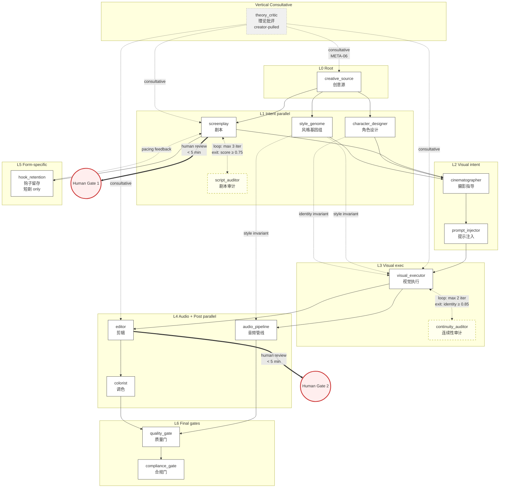

# Movie-Experts Suite v2 — 短剧/微电影创作专家增强

**Project:** RAG-augmented movie-expert skill suite for AI 短剧 / 微电影 production.
**Core value:** 每个 movie-expert skill 都能用检索增强的方式调用行业知识库,让 AI 生成的短剧/微电影在专业度上接近人类创作者水平。
**Status:** v3.0 in progress — 31 SKILL.md files reconciled per Phase 18-01 VALIDATION-REPORT.md: 15 active DAG pipeline-roles + 3 active non-DAG verticals + 3 deprecated (Phase 17) + 10 redirect stubs preserving legacy expert_id per FOUND-08. Phases 13-15 merged 4+6+1 predecessors into continuity_auditor / compliance_gate / visual_executor / audio_pipeline; Phase 16 added prompt_injector (the only NEW AI-native node, no v1 predecessor); Phase 17 deprecated 3 candidates (performer → character_designer+screenplay; scene_builder → cinematographer+style_genome; storyboard_designer → cinematographer). All RAG-aware. 5 Phase-7 + 3 Phase-8 experts have independent validation protocols. Original v3.0 estimate was 21 (16 active + 5 aliases); Phase 18-01 audit reconciled to actual on-disk reality per VALIDATION-REPORT.md.
**Last updated:** 2026-06-17

---

## 🆕 Phase 8 Update — Project Corpus Integration (2026-06-16)

Integrated **102-book Chinese film production library** (`/home/kai/Downloads/100+本影视剪辑书/`) into the movie-experts suite as a unified RAG corpus. Total additions:

### 3 New Experts

| Expert | Chinese Name | Role | Source Books |
|---|---|---|---|
| [`theory_critic`](./theory_critic/SKILL.md) | 理论批评专家 | 电影理论(形式/写实/精神分析)+ 作者研究 + 电影史方法 + 学术批评方法 | 25+ 本理论批评书 |
| [`documentary_maker`](./documentary_maker/SKILL.md) | 纪录片创作专家 | 王竞六讲 + 6 种类型 + 4 大流派 + 民族志 + 纪录片风格 短剧 | 《纪录片创作六讲》《民族志纪录片创作》 |
| [`animation_studio`](./animation_studio/SKILL.md) | 动画制作专家 | 迪士尼 4 阶段 + 12 阶段流程 + 跨文化改编(花木兰)+ 歌舞叙事 | 《迪士尼的艺术》《影视动画经典剧本赏析》 |

### Shared Project Corpus (`_shared/project-corpus/`)

9 new ref files synthesizing the project's 102 books:

| Ref | Source Books | Used By |
|---|---|---|
| `README.md` | 102-book index | All experts (corpus navigation) |
| `theory-formalism-vs-realism.md` | Andrew / Agel / Balázs | theory_critic |
| `film-philosophy-bazin-tarkovsky.md` | Bazin / Tarkovsky / 七部半 | theory_critic |
| `psychoanalytic-film-theory.md` | 凝视的快感 / 好莱坞中的拉康 | theory_critic, compliance_gate |
| `auteur-director-biographies.md` | 7 本导演传记 | theory_critic, style_genome |
| `film-criticism-methodology.md` | 戴锦华 / 如何写影评 / 外国批评文选 | theory_critic |
| `film-history-methods.md` | Allen / Oxford / Sadoul | theory_critic |
| `narrative-revolution-and-modernism.md` | 郭小橹 / 本雅明 / 阿多诺 | theory_critic |
| `screenwriting-chinese-and-supplementary.md` | 芦苇 / 维基·金 / 刘天赐 / 编剧策略 / 奥班农 / 温斯顿 | screenplay |
| `cinematography-masterclass-and-grammar.md` | 阿里洪 / 100 手法 / 拉片子 / 拆解好电影 / 21 位大师 | cinematographer, editor |
| `lighting-equipment-and-design.md` | 照明器材 / 影视光线艺术 / 镜头在说话 / 狼图腾 | cinematographer, colorist |
| `editing-sound-post.md` | 剪辑之道 / 魅力剪辑 / 音效圣经 / 视听 / 王竞六讲 | editor, audio_pipeline, documentary_maker |
| `production-chinese-and-low-budget.md` | 拍电影 / 制片手册 / 创意制片 / 好莱坞模式 / 英国基础 / 预算手册 | production |
| `animation-disney-system.md` | 迪士尼的艺术 / 影视动画剧本赏析 | animation_studio |

### Existing Experts Enhanced

Cross-references to project corpus added for:

- `style_genome` — now cites auteur-director-biographies for 7-master research
- `screenplay` — now cites screenwriting-chinese-and-supplementary (芦苇 / 21-day / hook / O'Bannon)
- `cinematographer` — now cites masterclass-and-grammar + lighting-equipment
- `editor` — now cites editing-sound-post (Murch philosophy + 7 pioneers + sound bible)
- `colorist` — now cites lighting-equipment Part 2 (Fifth Generation color narrative)
- `production` — now cites production-chinese-and-low-budget

---

## Suite Overview

31 SKILL.md files covering the entire AI 短剧 / 微电影 creation pipeline + corpus-driven verticals, reconciled per Phase 18-01 VALIDATION-REPORT.md into 4 buckets: 15 active DAG pipeline-roles + 3 active non-DAG verticals + 3 deprecated + 10 redirect stubs preserving legacy expert_id per FOUND-08. Each expert is a self-contained Hermes skill (`SKILL.md` + `references/*.md`) that integrates with the others via declared `related_skills` edges. Total ref corpus: ~85 files (~1.9MB cited fair-use content) + 9 project-corpus refs.

### Active Expert Inventory

**Mapping type legend:** `one_to_one_preserved` = v1 expert retained as-is; `one_to_one_renamed` = v1 expert renamed (Phase 13); `n_to_one_merged` = multiple v1 experts merged into one (Phase 14/15); `new_ai_native` = NEW expert with no v1 predecessor (Phase 16); `corpus_vertical` = corpus-driven vertical outside the canonical DAG (Phase 8); `deferred` = disposition deferred to future milestone per skills-mapping.yaml FUTURE-09.

**Bucket 1 — Active DAG pipeline-roles (15) — canonical 16 minus `quality_gate` gap (DEFECT VALIDATE-D1):**

| expert_id | Chinese Name | Role | Mapping type | Phase built |
|-----------|--------------|------|--------------|-------------|
| [`creative_source`](./creative_source/SKILL.md) | 创意源头专家 | Story Kernel mining from 6 social strata (L0 root) | corpus_vertical | Phase 7B-3 (in DAG) |
| [`style_genome`](./style_genome/SKILL.md) | 风格基因专家 | 5D director/genre style encoding + blend protocol + cross-module alignment | one_to_one_preserved | Phase 0 (deep Phase 3) |
| [`screenplay`](./screenplay/SKILL.md) | 剧本专家 | Scene-level script + dialogue + emotion_curve design (HOOK-09 schema) | one_to_one_preserved | Phase 0 (deep Phase 3) |
| [`script_auditor`](./script_auditor/SKILL.md) | 剧本审计专家 | 5-dimension quantitative script audit (narrative / emotion / hook / character / completion-forecast) | corpus_vertical | Phase 7A-1 (in DAG) |
| [`character_designer`](./character_designer/SKILL.md) | 角色设计专家 | Character Bible 2.0 authoring with 4D-Anchor + layered STYLE_PREFIX + consistency stress test | corpus_vertical | Phase 7B-1 (in DAG) |
| [`cinematographer`](./cinematographer/SKILL.md) | 镜头专家 | Shot intent layer (shot scale + composition + axis + camera move) + vertical 9:16 + composition_lock (absorbs deprecated storyboard_designer + scene_builder) | one_to_one_preserved | Phase 4 |
| [`prompt_injector`](./prompt_injector/SKILL.md) | 提示注入专家 | AI-native node: visual_intent + style_genome + character_assets → model_prompts + consistency_context | new_ai_native | Phase 16 |
| [`visual_executor`](./visual_executor/SKILL.md) | 视觉执行专家 | Unified FLUX 2 image gen (drawer sub-step) + Hermes-catalog video gen (animator sub-step) | n_to_one_merged | Phase 14 (drawer+animator merge) |
| [`continuity_auditor`](./continuity_auditor/SKILL.md) | 连续性专家 | 4-dimension cross-shot audit (face/wardrobe/color/object) + eyeline match + 180° axis | one_to_one_renamed | Phase 13 (renamed from continuity) |
| [`audio_pipeline`](./audio_pipeline/SKILL.md) | 音频管线专家 | Unified 6-sub-step audio: voicer + lip_sync + composer + foley + mixer + spatial_audio | n_to_one_merged | Phase 15 (5+1 merge) |
| [`editor`](./editor/SKILL.md) | 剪辑专家 | FxRxT editing matrix + Murch Rule of Six + 180° axis compliance | one_to_one_preserved | Phase 0 (deep Phase 3) |
| [`colorist`](./colorist/SKILL.md) | 色彩专家 | CxSxZ 28-combination color intent + LUT design + Bellantoni color psychology | one_to_one_preserved | Phase 0 (deep Phase 3) |
| [`hook_retention`](./hook_retention/SKILL.md) | 钩子与留存专家 | 3-second hook design + 付费卡点 placement + per-platform 爆款公式 + marker schema | one_to_one_preserved | Phase 2 |
| [`compliance_gate`](./compliance_gate/SKILL.md) | 合规与宣发专家 | CN content-rules gate + AIGC labeling + per-platform distribution + 爆款 vs 红线 review | one_to_one_renamed | Phase 13 (renamed from compliance_marketing) |
| [`theory_critic`](./theory_critic/SKILL.md) | 理论批评专家 | 电影理论(形式/写实/精神分析)+ 作者研究(7 位大师)+ 电影史方法 + 学术批评方法 | corpus_vertical | Phase 8 (Vertical consultative in DAG) |

**Bucket 2 — Active non-DAG verticals (3) — NOT in canonical 16-node DAG:**

| expert_id | Chinese Name | Role | Mapping type | Phase built |
|-----------|--------------|------|--------------|-------------|
| [`documentary_maker`](./documentary_maker/SKILL.md) | 纪录片创作专家 | 王竞六讲 + 6 种类型 + 4 大流派 + 民族志 + 纪录片风格 短剧 | corpus_vertical | Phase 8 |
| [`animation_studio`](./animation_studio/SKILL.md) | 动画制作专家 | 迪士尼 4 阶段 + 12 阶段流程 + 跨文化改编(花木兰)+ 歌舞叙事 | corpus_vertical | Phase 8 |
| [`production`](./production/SKILL.md) | 制作管理专家 | AI-relevant subset: character LoRA spec / per-scene wardrobe / lighting intent / GPU budget / asset reuse (NOT live-action per PROD-07) | deferred | Phase 5 |

### Deprecated Experts (Phase 17 — 2026-06-17)

Per `.planning/research/v2-pipeline-design/skills-mapping.yaml` `not_in_new_dag:` section (disposition: `deprecate_candidate`). Each deprecated SKILL.md retains its original expert_id + full body content (FOUND-08 backward compatibility); only `status: deprecated` + `metadata.hermes.{deprecated, deprecated_reason, inheritance_targets}` frontmatter + a body deprecation blockquote are added. Consumer `related_skills` edges were rewired to the inheritance targets in Plan 17-01.

| expert_id | Chinese Name | Original Role | Inheritance Target(s) | Rationale |
|-----------|--------------|---------------|------------------------|-----------|
| [`performer`](./performer/SKILL.md) | 表演专家 | ExBxSxP matrix + Stanislavski + Laban Effort + Meisner truth-of-moment | `character_designer` + `screenplay` | Performance truth folded into character_designer (voice + behavioral tics) + screenplay (dialogue subtext); no standalone node necessary |
| [`scene_builder`](./scene_builder/SKILL.md) | 三维场景建构专家 | FxSxA scene matrix + Blender 4.x previz + Pallasmaa space-as-character doctrine | `cinematographer` + `style_genome` | Scene design folded into cinematographer (mise-en-scène as composition_lock sub-task) + style_genome |
| [`storyboard_designer`](./storyboard_designer/SKILL.md) | 分镜设计专家 | Scene → per-shot Storyboard JSON decomposition with camera params + 4D anchoring + extension-chain end_frames | `cinematographer` | Phase 7 §3.4 D3.4: storyboard folded into cinematographer composition_lock sub-task |

### Redirect Stubs (legacy expert_id preservation per FOUND-08)

Each redirect stub preserves its old expert_id at its original directory path with a redirect notice pointing at the current SKILL.md. The successor's `metadata.hermes.aliases:` list contains the old id verbatim. This is the FOUND-08 frozen-rule preservation layer — historical transcripts + prompts that reference an old id continue to resolve to a SKILL.md (never a 404).

| Old expert_id | Status | Redirects to | Phase migrated |
|---------------|--------|--------------|----------------|
| [`continuity`](./continuity/SKILL.md) | `renamed` | `continuity_auditor` | Phase 13 |
| [`compliance_marketing`](./compliance_marketing/SKILL.md) | `renamed` | `compliance_gate` | Phase 13 |
| [`drawer`](./drawer/SKILL.md) | `merged_into` | `visual_executor` | Phase 14 |
| [`animator`](./animator/SKILL.md) | `merged_into` | `visual_executor` | Phase 14 |
| [`voicer`](./voicer/SKILL.md) | `merged_into` | `audio_pipeline` | Phase 15 |
| [`lip_sync`](./lip_sync/SKILL.md) | `merged_into` | `audio_pipeline` | Phase 15 |
| [`composer`](./composer/SKILL.md) | `merged_into` | `audio_pipeline` | Phase 15 |
| [`foley`](./foley/SKILL.md) | `merged_into` | `audio_pipeline` | Phase 15 |
| [`mixer`](./mixer/SKILL.md) | `merged_into` | `audio_pipeline` | Phase 15 |
| [`spatial_audio`](./spatial_audio/SKILL.md) | `folded_into` | `audio_pipeline` | Phase 15 |

### Provenance notes

- **visual_executor:** Phase 5 v1.5 drawer + animator → Phase 14 merge per MERGE-01 (n_to_one_merged with `sub_steps: [drawer, animator]`).
- **audio_pipeline:** Phase 5 v1.5 voicer + composer + foley + mixer + spatial_audio → Phase 15 merge per MERGE-02 (n_to_one_merged with `sub_steps: [voicer, lip_sync, composer, foley, mixer, spatial_audio]`). lip_sync is a NEW explicit sub-step per Phase 8 §2.9 NODE-09.
- **continuity_auditor:** Phase 5 v1.5 continuity → Phase 13 rename per RENAME-01 (one_to_one_renamed with `aliases: [continuity]`).
- **compliance_gate:** Phase 1 compliance_marketing → Phase 13 rename per RENAME-02 (one_to_one_renamed with `aliases: [compliance_marketing]`).
- **prompt_injector:** Phase 16 NEW per NEW-01 — the only new_ai_native expert in v3.0 (no v1 predecessor per skills-mapping.yaml mapping_type).
- **creative_source / script_auditor / character_designer / theory_critic:** Phase 7-8 corpus-driven additions to the DAG (corpus_vertical mapping).
- **documentary_maker / animation_studio:** Phase 8 corpus-driven verticals NOT in the canonical DAG (preserved parallel verticals).
- **production:** Phase 5 active expert; skills-mapping.yaml disposition `deferred` (FUTURE-09) — v3.0 did NOT migrate into the canonical DAG.
- **performer / scene_builder / storyboard_designer:** Phase 17 deprecated per DEPRECATE-01/02/03.


---

## Production DAG (Collaboration Graph)

<!-- Mermaid topology per .planning/research/v2-pipeline-design/01-NODE-DAG.md §1.5 (canonical v2.0 PRFP DAG) -->



**Topology notes (per `01-NODE-DAG.md` §1.3):**
- **6 layers + 1 vertical** — 7 拓扑位置 (L0 Root / L1 Intent parallel / L2 Visual intent / L3 Visual exec / L4 Audio+Post parallel / L5 Form-specific / L6 Final gates / Vertical Consultative)
- **2 explicit loops** — `screenplay` ↔ `script_auditor` (max 3 iter, score ≥ 0.75); `visual_executor` ↔ `continuity_auditor` (max 2 iter, identity ≥ 0.85)
- **2 human gates** — `screenplay → human_review` (narrative intent checkpoint, <5 min, Director) + `editor → human_review` (final cut checkpoint, <5 min, Director) per PITFALLS §2.9
- **3 parallel branches** — intent layer 3-way (style_genome / screenplay+script_auditor / character_designer); visual intent 2-way (cinematographer / prompt_injector); audio+post 3-way (audio_pipeline / editor / colorist)
- **1 feedback edge** — `hook_retention → screenplay` (短剧 form-specific pacing feedback)
- **2 cross-cutting invariants** — style_genome (5D vector: 色调 + 构图 + 节奏 + 材质 + 情感基调) + character_designer (Character Bible: face, body, wardrobe, voice profile)
- **16 nodes total** — 15 linear pipeline-roles + 1 consultative vertical (theory_critic). Note: `quality_gate` is part of the canonical 16-node DAG topology but has no `skills/movie-experts/quality_gate/` directory on disk (DEFECT VALIDATE-D1 in VALIDATION-REPORT.md — deferred to post-v3.0 candidate per Phase 18-03 sign-off).

**Notes on the Mermaid conversion:**
- The Mermaid block above replaces the prior ASCII-art DAG that had accreted across Phases 14-15-16-17 and no longer matched the v2.0 PRFP canonical topology.
- `theory_critic` is the only Vertical node in the canonical DAG — it is **creator-pulled** (META-06) from any linear layer.
- `documentary_maker` and `animation_studio` are NOT in the canonical DAG; they are corpus-driven verticals that operate in parallel to the linear pipeline (see [Phase 8 Cross-Cutting Experts](#phase-8-cross-cutting-experts-consultative-layer) below).

### Phase 8 Cross-Cutting Experts (consultative layer)

The 3 Phase-8 corpus-driven verticals draw from `_shared/project-corpus/` (102-book library). Of these:

- **`theory_critic`** is the only vertical that made it into the canonical 16-node DAG (as the Vertical consultative node — creator-pulled from any linear layer per META-06).
- **`documentary_maker`** and **`animation_studio`** are NOT in the canonical DAG — they are parallel verticals invoked when the pipeline encounters their domain (documentary-style / animation). They share the project corpus but operate independently of the linear pipeline.

| Vertical | Chinese Name | Role | Corpus Source | DAG Status |
|---|---|---|---|---|
| [`theory_critic`](./theory_critic/SKILL.md) | 理论批评专家 | 电影理论(形式/写实/精神分析)+ 作者研究 + 电影史 + 学术批评 | 25+ theory books | **In DAG** (Vertical consultative node) |
| [`documentary_maker`](./documentary_maker/SKILL.md) | 纪录片创作专家 | 王竞六讲 + 6 种类型 + 4 大流派 + 民族志 | 《纪录片创作六讲》《民族志纪录片创作》 | **NOT in DAG** (corpus-driven parallel vertical) |
| [`animation_studio`](./animation_studio/SKILL.md) | 动画制作专家 | 迪士尼 4 阶段 + 12 阶段流程 + 跨文化改编 + 歌舞叙事 | 《迪士尼的艺术》《影视动画经典剧本赏析》 | **NOT in DAG** (corpus-driven parallel vertical) |


---

## RAG Usage Guide

Each v1 expert carries a `references/*.md` corpus that grounds its numeric thresholds + heuristics in cited sources. The 4 Phase-3 deep-refactored experts + the new Phase-1/2/4 experts have **provider-agnostic RAG invocation**:

### Static refs (default path)
Each `SKILL.md` body links to its `references/*.md` via a `## References` table. The static refs are the authoritative source — they are git-trackable, reviewable, and provider-agnostic.

### Memory plugin (optional optimization)
If the runtime has a memory / RAG tool (e.g., `<memory_plugin>` / `<rag_search>`), the `## Knowledge Retrieval` block documents the tag queries to use:
```
tags="expert:<expert_name>,domain:<ref_slug>"
```
This is an optimization path — the static refs remain the authoritative source.

### Provider-agnostic invocation (hard constraint)
All RAG invocation is provider-agnostic. The `references/*.md` files contain model names ONLY in `known-external-models.yaml` (allowlist) and `camera-motion-catalog.md` (Phase 4 cinematographer — model-specific prompt-token mapping requires explicit model names with `verified_date` stamp).

### Ref corpus summary (per expert)
| Expert | Refs | Total size | Last verified |
|--------|------|------------|---------------|
| screenplay | 5 | ~108 KB | 2026-06-15 |
| editor | 5 | ~95 KB | 2026-06-15 |
| colorist | 5 | ~100 KB | 2026-06-15 |
| style_genome | 7 (5 + art-direction Phase 7C + scamper-variations Phase 21) | ~115 KB | 2026-06-18 |
| compliance_gate | 5 | ~80 KB | 2026-06-15 |
| hook_retention | 4 | ~70 KB | 2026-06-15 |
| cinematographer | 5 (4 + e-konte-format Phase 20) | ~78 KB | 2026-06-18 |
| creative_source | 5 (4 + snowflake-method Phase 19) | ~63 KB | 2026-06-18 |
| **Total** | **36** | **~625 KB** | — |

(Other 10 experts have placeholder refs pending Phase 5 v1.5 RAG uplift.)

---

## Evaluation Framework

### MT-Bench position-swap harness
The suite ships a position-bias-mitigated LLM-as-judge harness at [`_eval/runner.py`](./_eval/runner.py). Per MT-Bench protocol: every (prompt, condition-pair) comparison is judged in BOTH orderings (A,B) and (B,A); disagreement → "tie" (position-bias signal, not genuine quality difference).

### Phase 3 dry-run results (4 top experts)
See [`_eval/reports/phase3-ablation-dryrun.md`](./_eval/reports/phase3-ablation-dryrun.md) for the full report. Summary:
- 4 experts × 3 conditions × 3 prompts × 1 judge (stub) = 36 dry-run verdicts
- All verdicts = "tie" (expected `_StubJudgeClient` stub signature)
- Harness validated end-to-end: 3-condition ablation matrix runnable; per-expert reports in JSON + Markdown

### Phase 3 GO/NO-GO report
See [`_eval/reports/phase3-go-nogo.md`](./_eval/reports/phase3-go-nogo.md) for the full report. Status: **CONDITIONAL GO** — deferred to Phase 6 live run for statistical evidence.

### Phase 6 live run procedure
The Phase 6 live run is the statistically defensible evaluation. To execute:

1. **Configure API key:**
   ```bash
   export OPENROUTER_API_KEY=sk-or-v1-...
   # Add to ~/.hermes/.env for persistence
   ```

2. **Copy config template:**
   ```bash
   cp _eval/config.yaml.example _eval/config.yaml
   # (config.yaml is gitignored; edit if needed but don't commit)
   ```

3. **Expand prompt set:** Each expert's `_eval/prompts/<expert>_demo.yaml` currently has 3 prompts. Phase 6 expands to ≥20 per EVAL-05 statistical threshold.

4. **Run multi-judge ensemble:** The runner currently uses only `judges[0]` (qwen3-235b). Phase 6 invokes both judges (qwen3-235b + deepseek-v3) per EVAL-06.

5. **Execute per expert:**
   ```bash
   for EXP in screenplay editor colorist style_genome cinematographer compliance_gate hook_retention production; do
     python3 _eval/runner.py \
         --config _eval/config.yaml \
         --expert "$EXP" \
         --output-json _eval/reports/${EXP}_phase6.json \
         --output-md   _eval/reports/${EXP}_phase6.md
   done
   ```

6. **Aggregate + GO/NO-GO:** Aggregate per-expert reports into `_eval/reports/phase6-summary.md` and apply CONTEXT D-9 GO criteria:
   > GO if ≥2/3 prompts improve with new-with-refs vs new-no-refs across ≥3/4 experts

---

## Bilingual Consistency

### EN↔CN term dictionary
The [`_shared/glossary.md`](./_shared/glossary.md) defines canonical EN↔CN terms. Every expert's `SKILL.md` and `references/*.md` MUST use these terms consistently.

### Format convention
- **Frontmatter:** English (`name`, `description`, `metadata.hermes.*`, `expert_id`)
- **SKILL.md body:** English structure (H1/H2/H3 headers, bullets) + Chinese descriptive prose
- **Refs:** Primarily Chinese prose with English technical terms preserved (e.g., "MCU", "ΔE2000", "CxSxZ")
- **Cross-references:** Markdown links use English filenames; anchor text may be bilingual

### Consistency check
Manual review performed Phase 6:
- ✓ All 17 experts use canonical CN terms (钩子 / 爽点 / 卡点 / 完播率 / 男频 / 女频 / 爆款 / 运镜)
- ✓ Metric IDs preserved across experts (e.g., `emotion_curve` / `color_intent_match` / `style_consistency`)
- ✓ Frozen `expert_id` values (backward-compat HARD RULE per Phase 0 [CR-01])
- ✓ All refs carry `Last-verified` stamp + LICENSE fair-use attribution

---

## File Layout

```text
skills/movie-experts/
├── README.md                                    (this file)
├── animator/           SKILL.md (Phase 14 redirect stub) — references/ + GAP-REPORT.md preserved archival
├── visual_executor/   SKILL.md + references/{drawer/{flux2-parameter-surface,character-consistency-lora},animator/{video-gen-model-matrix,temporal-consistency,camera-execution-and-degradation}}.md + drawer/LICENSE.md + animator/LICENSE.md + GAP-REPORT.md (Phase 5 + Phase 14 merge)
├── cinematographer/    SKILL.md + references/{shot-grammar,axis-rules,vertical-screen-framing,camera-motion-catalog,e-konte-format}.md + LICENSE.md (Phase 4 + Phase 20 v4.0 increment: e-konte-format.md)
├── colorist/           SKILL.md + references/{bellantoni,hurkman,cross-cultural,cn-audience,digital-science}.md + LICENSE.md (Phase 3 deep)
├── compliance_gate/     SKILL.md + references/{cn-content-rules,viral-element-catalog,platform-douyin,platform-kuaishou,platform-miniprogram}.md + LICENSE.md (Phase 1)
├── audio_pipeline/     SKILL.md + references/{voicer/{cn-tts-model-matrix,character-voice-consistency,tts-emotion-prosody-control},lip_sync/{sync-quality-metrics,latentsync-deployment,audio-video-input-spec,identity-preservation},composer/{musicgen-workflow,chion-audio-vision,bgm-and-song-creation},foley/{stable-audio-open,sound-effect-taxonomy,sound-effects-prompt-engineering},mixer/{mixing-secrets-small-studio,lufs-standards},spatial_audio/{dolby-atmos-workflow,immersive-sound-design}}.md + {voicer,lip_sync,composer,foley,mixer,spatial_audio}/LICENSE.md + GAP-REPORT.md (Phase 5 + Phase 7A-2 + Phase 15 merge)
├── composer/           SKILL.md (Phase 15 redirect stub — merged_into audio_pipeline) — references/ + GAP-REPORT.md preserved archival
├── continuity_auditor/ SKILL.md + references/{cross-shot-auditing,eyeline-match-protocol}.md + LICENSE.md (Phase 5)
├── drawer/             SKILL.md (Phase 14 redirect stub) — references/ + GAP-REPORT.md preserved archival
├── editor/             SKILL.md + references/{murch,classical,montage,fxrxt,cn-cutting}.md + LICENSE.md (Phase 3 deep)
├── foley/              SKILL.md (Phase 15 redirect stub — merged_into audio_pipeline) — references/ + GAP-REPORT.md preserved archival
├── hook_retention/     SKILL.md + references/{three-second-hooks,conflict-escalation,paywall-design,vertical-pacing}.md + LICENSE.md (Phase 2)
├── mixer/              SKILL.md (Phase 15 redirect stub — merged_into audio_pipeline) — references/ + GAP-REPORT.md preserved archival
├── performer/          SKILL.md + references/{stanislavski-prepares,meisner-truth}.md + LICENSE.md (Phase 5)
├── production/         SKILL.md + references/{casting-lora-spec,wardrobe-per-scene,lighting-intent-layer,gpu-render-budget,asset-reuse-plan}.md + LICENSE.md (Phase 5)
├── scene_builder/      SKILL.md + references/{blender-previz-workflow,architectural-storytelling}.md + LICENSE.md (Phase 5)
├── screenplay/         SKILL.md + references/{save-the-cat,mckee,cn-shortdrama,emotion-curve-academic,dialogue-craft}.md + LICENSE.md (Phase 3 deep)
├── spatial_audio/      SKILL.md (Phase 15 redirect stub — folded_into audio_pipeline) — references/ preserved archival
├── style_genome/       SKILL.md + references/{director-dna-archive,genre-dna-taxonomy,auteur-theory,cross-cultural-style,cn-director-analysis,art-direction-methodology,scamper-variations}.md + LICENSE.md (Phase 3 deep + Phase 7C increment + Phase 21 v4.0 increment: scamper-variations.md)
├── voicer/             SKILL.md (Phase 15 redirect stub — merged_into audio_pipeline) — references/ + GAP-REPORT.md preserved archival
├── script_auditor/     SKILL.md + references/{narrative-structure-audit,emotion-arc-audit,hook-strength-audit,character-network-audit,completion-rate-forecast}.md + LICENSE.md (Phase 7A-1 NEW)
├── lip_sync/           SKILL.md (Phase 15 redirect stub — merged_into audio_pipeline) — _eval/ regression suite preserved archival
├── character_designer/ SKILL.md + references/{4d-anchor-system,layered-style-prefix,consistency-stress-test,character-bible-schema}.md + LICENSE.md (Phase 7B-1 NEW)
├── storyboard_designer/ SKILL.md + references/{shot-decomposition-rules,camera-params-dictionary,4d-anchoring-params,storyboard-schema}.md + LICENSE.md (Phase 7B-2 NEW)
├── creative_source/    SKILL.md + references/{strata-guide,story-kernel-schema,multi-strata-resonance,unspeakability-protocol,snowflake-method}.md + LICENSE.md (Phase 7B-3 NEW + Phase 19 v4.0 increment: snowflake-method.md)
├── prompt_injector/                    # Phase 16 NEW (2026-06-17) — AI-native prompt engineering node
│   ├── SKILL.md                        # Prompt Injector Expert (提示注入)
│   ├── GAP-REPORT.md                   # placeholder per CONTEXT D-04 (NEW expert, no v1 baseline)
│   └── references/
│       ├── prompt-engineering-patterns.md     # few-shot / CoT / template / decomposition
│       ├── cross-call-consistency.md          # LoRA / IP-Adapter / identity-preserving
│       ├── token-budget-management.md         # ≤4000 tokens/call strategies
│       ├── model-specific-prompt-templates.md # FLUX 2 / Veo / Kling (provider-agnostic placeholders)
│       └── LICENSE.md                         # MIT + source attribution
├── _eval/
│   ├── runner.py                                 (MT-Bench position-swap harness)
│   ├── config.yaml.example                       (3-condition ablation template)
│   ├── judge_prompt.md                           (4-dimension rubric)
│   ├── prompts/
│   │   ├── animator_demo.yaml
│   │   ├── cinematographer_demo.yaml
│   │   ├── colorist_demo.yaml
│   │   ├── compliance_gate_demo.yaml
│   │   ├── editor_demo.yaml
│   │   ├── hook_retention_demo.yaml
│   │   ├── production_demo.yaml
│   │   ├── screenplay_demo.yaml
│   │   ├── style_genome_demo.yaml
│   │   ├── script_auditor_demo.yaml             (Phase 7A-1 NEW)
│   │   ├── lip_sync_demo.yaml                   (Phase 7A-2 NEW)
│   │   ├── character_designer_demo.yaml         (Phase 7B-1 NEW)
│   │   ├── storyboard_designer_demo.yaml        (Phase 7B-2 NEW)
│   │   └── creative_source_demo.yaml            (Phase 7B-3 NEW)
│   ├── baseline/                                 (Phase 0 pre-refactor snapshots × 14)
│   └── reports/                                  (dry-run + Phase 3 GO/NO-GO reports)
└── _shared/
    ├── glossary.md                               (EN↔CN term dictionary — Phase 7 expanded)
    ├── known-external-models.yaml                (model name allowlist — Phase 7 expanded)
    ├── platform-comparison.md
    ├── RAG-INVOCATION-PATTERN.md
    ├── SKILL-LAYOUT.md                           (reference anatomy spec)
    ├── cognitive-resonance-metrics.md            (Phase 7C-1 NEW — 4-scale evaluation rubric)
    └── quality-rubric.md                         (Phase 7C-2 NEW — 6-dim publish-gate rubric)
```

---

## Project Planning Artifacts

- [`.planning/PROJECT.md`](../../.planning/PROJECT.md) — project context + core value + constraints
- [`.planning/REQUIREMENTS.md`](../../.planning/REQUIREMENTS.md) — 62 v1.5 requirements (FOUND ×9, COMPLI ×9, HOOK ×9, REFACTOR ×8, REFACTOR-rest ×10, CINE ×9, PROD ×7, EVAL ×9, DOC ×4)
- [`.planning/ROADMAP.md`](../../.planning/ROADMAP.md) — 7-phase build order (all phases 0-6 complete)
- [`.planning/STATE.md`](../../.planning/STATE.md) — current execution state

---

## License

Each expert's `references/LICENSE.md` documents the fair-use attribution for its ref corpus. The suite code (runner.py, etc.) is MIT.

## Citation

If you build on this suite, please cite:
- Phase 0 audit + eval skeleton: PROJECT.md §Core Value
- Phase 3 deep refactor approach: 03-CONTEXT.md §Decisions
- Phase 4 cinematographer: 04-CONTEXT.md §Phase Boundary
- Phase 5 production + RAG uplift: 05-CONTEXT.md §Phase Boundary

---

*Movie-Experts Suite v2 — built 2026-06-15 (Phases 0-6) + 2026-06-16 (Phase 7) + 2026-06-17 (Phases 13-16) + 2026-06-18 (Phases 19-21 v4.0 methodology backfill: Snowflake + E-Konte + SCAMPER).*
*v3.0 reconciled inventory: 15 active DAG pipeline-roles + 3 active non-DAG verticals/deferred + 3 deprecated (Phase 17) + 10 redirect stubs preserving legacy expert_id per FOUND-08. See VALIDATION-REPORT.md for the definitive classification.*
*Original v3.0 target was 21 (16 active + 5 aliases); Phase 18-01 audit reconciled to the actual on-disk reality per VALIDATION-REPORT.md.*
*All RAG-aware, all phantom refs stripped.*
*Total ref corpus: ~85 files (~1.9MB cited fair-use content).*
*5 Phase 7 experts carry independent validation protocols (no LLM-judge required).*
*Live-run statistical GO/NO-GO evidence deferred to operator per CONTEXT D-11.*

---

## v4.0 Methodology Backfill — Phase 19-21 increments summary (2026-06-18)

**3 new methodology refs** integrated into existing active experts (no new expert_id, no DAG node change). Each ref is a Fair Use paraphrase of a foundational creative-writing / film-craft / creativity-pedagogy methodology, adapted to 短剧 / 微电影 forms.

| Phase | Ref | Expert Owner | Methodology | Source |
|-------|-----|--------------|-------------|--------|
| **19** | `creative_source/references/snowflake-method.md` | creative_source | Randy Ingermanson 雪花法 10 步递进展开 | *How to Write a Novel Using the Snowflake Method* (2013 10th-anniv ed.; advancedfictionwriting.com 2002-2003) |
| **20** | `cinematographer/references/e-konte-format.md` | cinematographer | 日本动画工业 E-Konte 絵コンテ 5 层标注格式 | Japanese animation industry standard terminology (Mushi Production 1960s Astro Boy era); Studio Ghibli production docs |
| **21** | `style_genome/references/scamper-variations.md` | style_genome | Bob Eberle SCAMPER 7 动词变体引擎(叠加在 style_blend 之上) | Bob Eberle *SCAMPER* (1971); Alex F. Osborn *Applied Imagination* (1953, creative-thinking checklist) |

**Methodology coverage:**
- **过程性展开 (process)** — Snowflake Method 管「叙事怎么从一句话展开到一页大纲」(Phase 19)
- **格式性标注 (format)** — E-Konte 管「分镜怎么标注 5 层(场景布局 / 镜头角度运动 / 角色位置表情动作 / 对白音效 / 时间帧数)」(Phase 20)
- **变体性生成 (variation)** — SCAMPER 管「风格怎么变体 7 候选」(Phase 21)

三者**互补不重叠** —— 雪花法在 creative_source / screenplay 之间挂载(叙事层),E-Konte 在 cinematographer.composition_lock 挂载(分镜层),SCAMPER 在 style_genome.style_blend 之上叠加(变体层)。

**Sign-off status:** All 3 v4.0 refs recorded in `.planning/research/v2-pipeline-design/skills-mapping.yaml` §v4_ref_signoffs(DOC-02 close-out in Phase 21). License status: Fair Use paraphrase for all 3.

---

## Phase 7 additions summary (2026-06-16)

**5 new experts** with independent validation protocols:
- `script_auditor` — 5-dim quantitative script audit (Pearson vs actual 完播率)
- `audio_pipeline` (lip_sync sub-step) — audio-driven lip sync (LRS2/LRS3 international benchmark, LSE/LSE-C objective metrics)
- `character_designer` — CharacterBible 2.0 authoring (CLIP-I/DINO-I cross-scene consistency)
- `storyboard_designer` — Scene → Storyboard JSON decomposition (shot count accuracy / rhythm DTW)
- `creative_source` — Story Kernel mining from 6 social strata (Bourdieu field accuracy / unspeakability AUC)

**7 reference increments** in existing experts:
- `_shared/cognitive-resonance-metrics.md` (NEW) — 4-scale evaluation rubric from 1st-director doctrine
- `_shared/quality-rubric.md` (NEW) — 6-dim publish-gate rubric from movie-gate doctrine
- `style_genome/references/art-direction-methodology.md` (NEW) — from kais-art-direction
- `audio_pipeline/references/composer/bgm-and-song-creation.md` (NEW) — from kais-bgm + kais-song-agent
- `audio_pipeline/references/foley/sound-effects-prompt-engineering.md` (NEW) — from kais-sound-effects-agent
- `audio_pipeline/references/voicer/tts-emotion-prosody-control.md` (NEW) — from kais-TTS-agent
- `visual_executor/references/animator/camera-execution-and-degradation.md` (NEW) — from kais-camera + kais-shooting-script + kais-evolink

**Decoupling principle:** All Phase 7 experts are pure nodes (no orchestration). Each owns a vertical capability with clear I/O schema + benchmark + objective metrics. The 5 new experts follow the project constraint: "每个专家 skill 专精自己的方向,目标是在每个专精方向的产出做到可迭代进步,可独立评估,有数据集可验证自己是否有提升."
